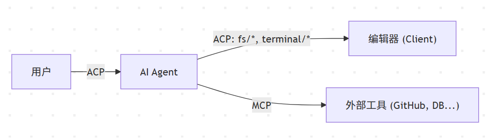
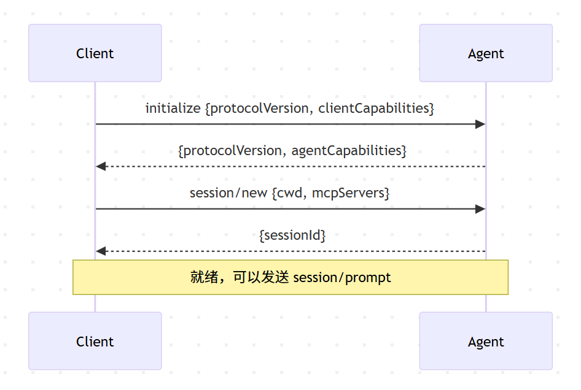
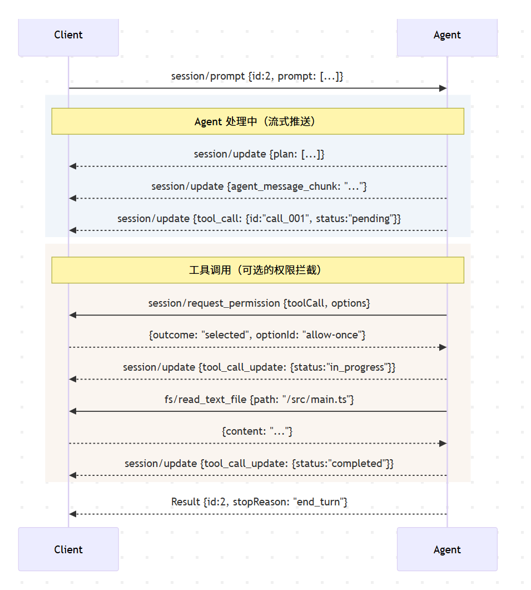
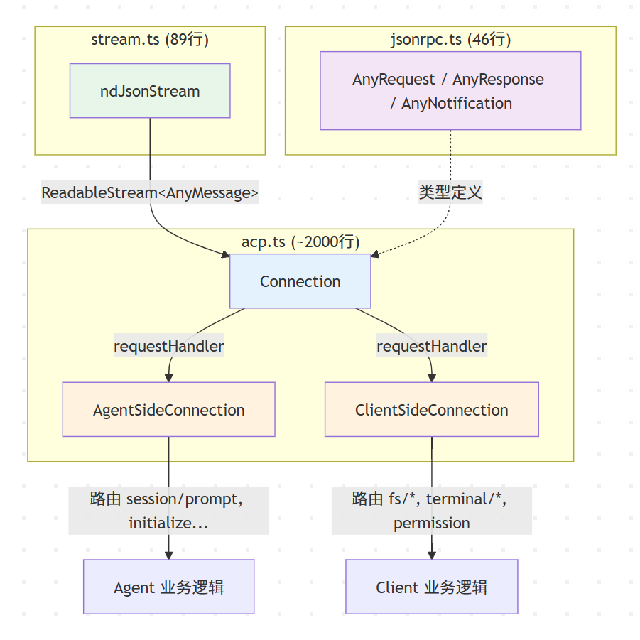

## 1. 为什么需要 ACP

AI 编码助手（Agent）正在快速发展，但生态存在一个结构性问题：**N 款编辑器 × M 款 Agent = N×M 套适配方案**。每一款 Agent 都需要为 VS Code、JetBrains、Zed 等编辑器分别开发插件，反之亦然。除了重复劳动，还有更深层的矛盾——Agent 若要修改文件或执行终端命令，要么由各编辑器自行实现一套私有 API，要么直接调用系统原生接口，绕过了编辑器的安全管控。

Agent Client Protocol (ACP) 的定位是为这一问题提供标准答案：一套开放的 JSON-RPC 契约，将**编辑器（Client）**与 **AI 助手（Agent）**解耦为独立的两端。Client 专注于 UI 渲染与本地资源管控，Agent 专注于 LLM 推理与任务编排，二者通过协议通信，互不侵入。

## 2. ACP 与 MCP 的边界



ACP 与 Model Context Protocol (MCP) 并非竞品，而是互补。ACP 规范的是 Client 与 Agent 之间的**交互边界**（任务下发、流式渲染、权限管控），MCP 规范的是 Agent 与外部数据源之间的**工具边界**（调用 GitHub API、查询数据库）。在 ACP 的初始化协商中，Agent 可以通过 `mcpCapabilities` 声明自身支持的 MCP 传输类型，由 Client 在创建会话时传入 MCP Server 配置，Agent 据此自行建立与外部工具的连接。

## 3. 通信模型

### 3.1 传输层：stdio

ACP 的传输层设计刻意保持极简。官方规范目前定义的主要传输机制是 **stdio**：Client 将 Agent 作为子进程启动，随即接管其 `stdin` / `stdout` 作为双向通信管道，消息采用 NDJSON 格式（每条 JSON-RPC 消息占一行，以 `\n` 分隔）。不需要端口分配，不需要 HTTP 握手，进程存活即连接存活。

这一选择的工程意义在于：Agent 可以用任意语言实现（Rust、Python、TypeScript），只要能读写标准流即可接入协议。

### 3.2 消息类型：Method 与 Notification

ACP 遵循 JSON-RPC 2.0 规范，将消息分为两类：

- **Method（请求-响应）**：携带唯一 `id`，调用方挂起等待，对端必须返回 `result` 或 `error`。适用于需要确认结果的操作，如 `session/prompt`、`fs/read_text_file`、`terminal/create`。
- **Notification（单向通知）**：不携带 `id`，发出即完成，无需响应。适用于高频的状态推送，如 `session/update`（流式输出）和 `session/cancel`（取消操作）。

这两类消息的区分，是理解 ACP 并发模型的关键。一次 Prompt Turn 中，Agent 可能同时挂起多个 Method 等待 Client 响应（如并发读取多个文件），同时持续发出 Notification 推送思考过程。Client 通过 `id` 将响应路由回对应的挂起请求，互不干扰。

## 4. 协议生命周期

一次完整的 ACP 交互从进程启动到对话结束，按时间线分为四个阶段：

### 4.1 初始化（Initialization）



Client 启动 Agent 子进程后，首先发送 `initialize` 请求，携带自身支持的协议版本和能力清单（Capabilities）。Agent 响应确认协议版本，并返回自身能力。

双方据此约束后续交互的边界。例如 Client 通过 `fs.readTextFile` / `terminal` 等字段声明可用的沙箱资源，Agent 通过 `promptCapabilities`（输入模态）、`mcpCapabilities`（MCP 传输类型）等字段声明自身能力。任何未声明的能力，对端必须视为不支持。

### 4.2 会话建立（Session Setup）

初始化完成后，Client 通过 `session/new` 创建会话，传入工作目录 `cwd` 和可选的 MCP Server 配置。Agent 返回一个 `sessionId`，后续所有交互都以此 ID 为上下文锚点。

### 4.3 Prompt Turn

Prompt Turn 是 ACP 中最核心的交互循环，其流程如下：



> 上图为简化版流程，完整的 Prompt Turn 时序图（含取消、多轮工具调用等分支）见官方文档 Prompt Turn 章节。

梳理一下上图中涉及的几个关键机制：

**流式推送**。Agent 通过 `session/update` Notification 持续向 Client 推送中间状态：思考过程（`agent_message_chunk`）、执行计划（`plan`）、工具调用声明（`tool_call`）。Client 据此实时渲染 UI，无需等待最终结果。

**权限拦截**。当 Agent 需要执行敏感操作时，可通过 `session/request_permission` 向 Client 发起反向请求。Client 向用户弹出确认界面，将用户决策（`allow_once` / `reject_once` 等）序列化为响应返回。若被拒绝，Agent 应中断该工具调用并向用户说明原因。

**沙箱资源调用**。Agent 不直接操作文件系统或终端，而是通过 ACP 向 Client 借调：

- `fs/read_text_file`：读取文件内容（包括编辑器中未保存的修改）
- `fs/write_text_file`：写入文件
- `terminal/create`：创建终端并执行命令，返回 `terminalId`
- `terminal/output` / `terminal/wait_for_exit`：获取输出或等待命令完成
- `terminal/kill` / `terminal/release`：终止命令并释放资源

终端的设计尤其值得注意：`terminal/create` 立即返回句柄（`terminalId`），命令在后台异步执行。Agent 可以并发创建多个终端，按需轮询输出，超时后通过 `terminal/kill` 强制终止。协议要求 Agent 在使用完毕后必须调用 `terminal/release` 释放资源。

**Turn 结束**。当 Agent 完成所有处理，对初始的 `session/prompt` 返回 Result，携带 `stopReason`（`end_turn` / `max_tokens` / `cancelled` 等），Turn 正式闭环。Client 可随即发起下一轮 `session/prompt`。

### 4.4 取消（Cancellation）

Client 可随时通过 `session/cancel` Notification 中断当前 Turn。Agent 收到后应尽快停止所有进行中的操作，并以 `stopReason: "cancelled"` 响应原始的 `session/prompt` 请求。协议明确要求 Agent 不得将取消作为错误返回——这是一个正常的业务语义，而非异常。

## 5. SDK 源码解析

ACP 官方提供了一个 TypeScript SDK（`@agentclientprotocol/sdk`），整个核心实现仅由三个文件构成，结构极为精简：



- **`jsonrpc.ts`**（46 行）：定义 `AnyRequest`、`AnyResponse`、`AnyNotification` 三种 JSON-RPC 消息类型。
- **`stream.ts`**（89 行）：实现 `ndJsonStream` 函数——将原始的 `stdin`/`stdout` 字节流转换为结构化的 `ReadableStream<AnyMessage>` / `WritableStream<AnyMessage>`，即逐行按 `\n` 分割并 `JSON.parse`。
- **`acp.ts`**（约 2000 行）：协议的核心调度层，包含 `Connection`、`AgentSideConnection`、`ClientSideConnection` 三个类。

其中 `Connection` 类是整个 SDK 的调度中枢，其核心机制可以归纳为以下几点：

**Pending Map 多路复用**。`Connection` 内部维护了一个 `#pendingResponses: Map<id, {resolve, reject}>`，每次通过 `sendRequest` 发出请求时，自增 `#nextRequestId` 分配 ID，将对应的 Promise 回调挂入 Map 后写入管道。当 `#receive` 循环从流中读到响应时，通过 `#handleResponse` 按 `id` 匹配并唤醒对应的 Promise——这正是第 3.2 节所述的多路复用模型的落地实现。

**消息三路分发**。`#processMessage` 对收到的每条消息进行三路判定：
- 同时包含 `method` 和 `id` → 对方发来的 **Request**，调用 `#requestHandler` 处理后回传结果
- 仅包含 `method` → 对方发来的 **Notification**，调用 `#notificationHandler` 处理，不回传
- 仅包含 `id` → 对方回传的 **Response**，通过 `#handleResponse` 唤醒挂起的 Promise

**方法路由**。`AgentSideConnection` 在构造时注入一个 `requestHandler`，内部通过 `switch(method)` 将 `session/prompt`、`session/new`、`initialize` 等协议方法路由到 Agent 实现的对应函数。`ClientSideConnection` 则对称地路由 `fs/read_text_file`、`terminal/create`、`session/request_permission` 等 Client 侧方法。

**断连清理**。当底层流关闭或发生异常时，`#close` 方法会遍历 `#pendingResponses` 中所有未完成的 Promise 并 `reject`，确保不会出现永久挂起的请求泄漏。

## 6. 微内核实现

剥离所有业务逻辑后，ACP 的通信内核可以用不到 40 行 TypeScript 还原。其本质是一个基于 `id` 映射的异步多路复用器：

```typescript
import { EventEmitter } from 'events';

const pending = new Map<number, { resolve: Function; reject: Function }>();
let nextId = 1;
const bus = new EventEmitter();

// 发送 Request：挂起 Promise，等待对端按 id 回调
function sendRequest(method: string, params: any): Promise<any> {
  return new Promise((resolve, reject) => {
    const id = nextId++;
    pending.set(id, { resolve, reject });
    process.stdout.write(JSON.stringify({ jsonrpc: '2.0', id, method, params }) + '\n');
  });
}

// 接收：按 id 路由 Response，按 method 分发 Notification/Request
process.stdin.on('data', (chunk) => {
  for (const line of chunk.toString().split('\n').filter(Boolean)) {
    try {
      const msg = JSON.parse(line);
      if (msg.id != null && (msg.result !== undefined || msg.error)) {
        const p = pending.get(msg.id);
        if (p) {
          msg.error ? p.reject(msg.error) : p.resolve(msg.result);
          pending.delete(msg.id);
        }
      } else if (msg.method) {
        bus.emit(msg.method, msg);
      }
    } catch {}
  }
});
```

无论官方 SDK 如何封装，底层的调度模型都是这个结构：发送端通过自增 `id` 挂起 Promise，接收端按 `id` 匹配并唤醒。Notification 因为没有 `id`，直接走事件分发，不占用挂起队列。这就是 ACP 能在单条 stdio 管道上实现全双工、多路复用的根本原因。

## 7. 结语

ACP 用一套简洁的 JSON-RPC 契约，解决了 AI 编码助手生态中编辑器与 Agent 之间的标准化通信问题。协议的核心设计可以归纳为三点：通过 Method/Notification 的二元消息模型实现无阻塞的异步流控；通过 `fs/*` 和 `terminal/*` 将系统资源的控制权收归 Client（沙箱化）；通过 `session/request_permission` 在工具调用前插入人工审批节点（安全拦截）。这三者共同构成了一个在性能、安全与可扩展性之间取得平衡的协议架构。

## 参考资料

- ACP TypeScript SDK：https://github.com/agentclientprotocol/typescript-sdk
- ACP 官方网站：https://agentclientprotocol.com/
- ACP GitHub 仓库：https://github.com/agentclientprotocol/agent-client-protocol
- 协议概览：https://agentclientprotocol.com/protocol/
- 架构设计：https://agentclientprotocol.com/get-started/architecture
- 初始化规范：https://agentclientprotocol.com/protocol/initialization
- 会话建立：https://agentclientprotocol.com/protocol/session-setup
- Prompt Turn 生命周期：https://agentclientprotocol.com/protocol/prompt-turn
- 工具调用与权限：https://agentclientprotocol.com/protocol/tool-calls
- 文件系统接口：https://agentclientprotocol.com/protocol/file-system
- 终端接口：https://agentclientprotocol.com/protocol/terminals
- 传输层规范：https://agentclientprotocol.com/protocol/transports
