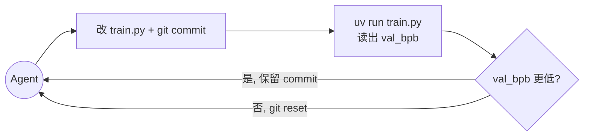

之前提到过 karpathy 大神的 autoresearch 这个项目，仓库本身只有几个文件，但它要解决的问题挺有意思：
> 如何让 Agent 在固定预算下连续运行几十上百轮神经网络训练实验，同时控制上下文规模。

## 一、架构

### 1.1 项目定位

autoresearch 不是一个完整的训练框架。研究流程主要围绕三个文件展开：

- `prepare.py`：固定数据、tokenizer 和评测函数，相当于「裁判规则」，不应改动。
- `train.py`：模型、优化器、训练循环、超参数都写在这一个文件里，是允许修改的地方。
- `program.md`：写给 Agent 的流程规则：开分支、跑 baseline、每次实验都 commit、结果变好保留、变差 `git reset` 回退、进入循环后不需要手动参与。

项目把训练实现集中在 `train.py`，把研究流程写进 `program.md`。Agent 围绕单文件持续修改，由 git 和 `results.tsv` 记录状态与历史。

### 1.2 主链路



流程是：Agent 修改 `train.py` 并 commit，运行实验，根据 val_bpb 决定保留 commit 或 `git reset` 回退。实验边界由 `prepare.py` 和 `program.md` 限定，实验记录写入 `results.tsv`，事后复盘使用 `analysis.ipynb`。

## 二、上下文管理机制

如果要连续跑几十上百轮实验，上下文窗口是稀缺资源。autoresearch 怎么控制上下文规模？

它没有引入上下文压缩或外部向量库。它的路线可以概括为：**能不进上下文的东西，就不进上下文。**

### 2.1 训练日志不进上下文

`program.md` 在执行命令上明确要求：

```
uv run train.py > run.log 2>&1
```

用 `>` 重定向，不用 `tee`，并明确要求不要让输出进入上下文。那些每步几百字符、滚动刷屏几千步的 `step / loss / lrm / tok/sec / mfu`，落在磁盘上，不直接进入对话上下文。

### 2.2 只用 grep 取关键指标

```
grep "^val_bpb:\|^peak_vram_mb:" run.log
```

一次 run 进入上下文的内容被压到只有两行。出错时也只看 `tail -n 50 run.log`，不全量读。每一轮实验进入上下文的 token 数几乎是常数，不会随训练步数增长。

### 2.3 结果写入 TSV，不进对话历史

每次实验的记录是 `results.tsv` 的一行：`commit / val_bpb / memory_gb / status / description`。Agent 要回忆过去实验时直接读这个文件，不翻对话历史。每行都短，并按固定字段保存。

`program.md` 规定 `results.tsv` 不 commit，只作为日志文件。它可以增长而不污染 git 历史，也不依赖模型记忆。

### 2.4 状态全落在 git上，不靠上下文记忆

Agent 不需要在脑子里记「当前基线是哪份 train.py」：
- 保留就 `git commit`，分支 HEAD 就是当前最佳；
- 丢弃就 `git reset --hard` 回到上一个保留 commit。
- 下一轮开始时，Agent 只要 `git log -1` 或直接读 `train.py` 就能拿到当前状态。即使会话重启，新会话读一遍分支和 TSV 就能续跑。

### 2.5 必读文件只有三个

上下文管理上，文件面被限制在少数文件：`README.md`、`prepare.py`、`train.py`。可改的只有 `train.py`，差异集中在一处。`prepare.py` 只读，Agent 不需要在上下文里重建其实现细节。每轮需要保留的上下文基本是固定规模：`program.md` 协议、`train.py` 当前版本、少量 TSV 片段，不随实验数量线性增长。

### 2.6 实验想法写成短描述

`results.tsv` 的 description 字段有硬规则：用 tab 分隔、禁止逗号、要短、要能说清楚这一轮试了什么。这个字段把实验想法限制为一句短描述，不把完整讨论放进对话。

### 2.7 上下文预算的结构化视图

| 资源 | 进不进上下文 | 存在哪 | 怎么访问 |
| --- | --- | --- | --- |
| 每步训练指标 | 否 | `run.log` | 不访问 |
| val_bpb / peak_vram | 是（2 行） | `run.log` | `grep` |
| 崩溃 traceback | 是（约 50 行） | `run.log` | `tail -n 50` |
| 实验结论 | 否 | `results.tsv` | 按需读 |
| 当前代码状态 | 是（单文件） | `train.py` | 直接读 |
| 历史代码状态 | 否 | git commit | 需要时 `git show` |
| 协议规则 | 是（短） | `program.md` | 常驻 |

这张表体现的是同一条规则：高频或高量信息存在上下文外，低频或低量信息才进入上下文。

### 2.8 它没解决的部分

这套方案没有处理所有问题：

- 会话超长时，需要由框架本身处理上下文压缩或截断；这个仓库没有处理。
- 它假设会话能连续或能无损续跑；对会话硬重启后如何恢复实验方向没有额外设计，需要依赖 TSV 和 git 中的状态信息。
- 没有历史实验向量检索，主要依靠结构化文本和 grep。

## 三、结尾

回到一开始的问题：如何让 Agent 长期自治运行，同时控制上下文规模。autoresearch 的做法是把上下文限制写进流程：日志进磁盘、状态进 git、结论进 TSV、可改文件集中到 `train.py`。

对我们来说，可以借鉴的有：

1. 大量输出先落文件，再用 `grep`、`tail` 读取必要片段。
2. 状态放进 git、TSV、数据库或其他可检查记录。
3. 可改范围收窄，主要修改集中在少数文件。
4. 流程规则写清楚运行、记录、保留和回退方式。
5. Agent loop 写清楚每轮输入、动作、观测、判定和状态更新。

放到其他 Agent 项目里，重点是减少模型必须记住的内容。上下文只放当前决策需要的信息；日志、历史、状态和中间产物留在可查询的位置。

## 仓库地址

> https://github.com/karpathy/autoresearch




