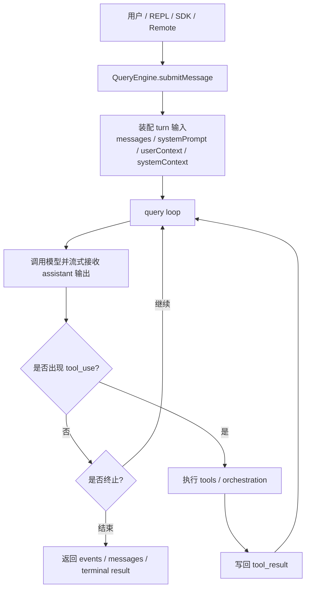

## 本章目标

这一章研究 Claude Code 的核心 runtime，也就是：

- `src/QueryEngine.ts`
- `src/query.ts`

目标是回答：

1. Claude Code 的 agent 会话是如何建模的？
2. 单轮到多轮 assistant/tool 交互是如何循环的？
3. 为什么 `QueryEngine` 和 `query` 被拆成两个层次？

## 核心结论

Claude Code 的 agent 内核采用了明显的“两级执行模型”：

1. **`QueryEngine`**：会话级 owner，管理 conversation 的持久状态。
2. **`query`**：单次查询/单轮执行循环，负责 assistant 输出、tool use、继续执行、压缩、预算恢复等过程。

这套拆分非常合理：

- `QueryEngine` 负责“长期状态”
- `query` 负责“本轮推进”

如果把 Claude Code 看作一个状态机，那么：

- `QueryEngine` 是外层 conversation state machine
- `query` 是内层 iteration loop

## 一、`QueryEngine.ts`：会话级 owner

### 1. 文件注释已经定义了角色

`QueryEngine.ts` 自己写得很直接：

> QueryEngine owns the query lifecycle and session state for a conversation.

也就是说，这里不是一个简单 helper，而是整段会话的持有者。

### 2. `QueryEngineConfig` 暴露了它的作用域

`QueryEngineConfig` 中包含：

- `cwd`
- `tools`
- `commands`
- `mcpClients`
- `agents`
- `canUseTool`
- `getAppState` / `setAppState`
- `initialMessages`
- `readFileCache`
- `customSystemPrompt`
- `thinkingConfig`
- `maxTurns`
- `maxBudgetUsd`
- `taskBudget`
- `jsonSchema`
- `handleElicitation`
- `setSDKStatus`

这说明 `QueryEngine` 的关注点非常广，至少涵盖：

- 模型上下文
- 工具与权限
- UI 状态桥接
- 预算与 thinking
- MCP / agent / structured output

换句话说，它并不是“API caller”，而是 **conversation runtime coordinator**。

### 3. 内部持有的持久状态

`QueryEngine` 类内部保存了：

- `mutableMessages`
- `abortController`
- `permissionDenials`
- `totalUsage`
- `readFileState`
- `discoveredSkillNames`
- `loadedNestedMemoryPaths`

这里很能说明问题：会话过程中，Claude Code 不只是积累消息，还在积累：

- 文件读取状态
- skill 发现信息
- memory 路径信息
- 权限拒绝记录
- token / cost usage

这正是“长生命周期 agent”与“单次 API 调用”的区别。

### 4. `submitMessage()` 是 turn 的入口

`submitMessage()` 接受：

- `prompt: string | ContentBlockParam[]`
- 可选 `uuid` / `isMeta`

然后以 `AsyncGenerator<SDKMessage>` 形式往外 yield。这个返回形态说明：

- 执行过程是流式的
- 外部消费者（REPL / SDK / remote）可以边收边处理
- QueryEngine 不要求所有结果一次性落地后再交给 UI

## 二、`query.ts`：单轮执行循环

### 1. 这是执行 pipeline 的核心

`query.ts` 导入了大量与单轮推进直接相关的模块：

- auto compact / reactive compact
- tool orchestration
- post-sampling hooks
- stop hooks
- token budget
- tool result summary
- attachments / memory prefetch
- message queue manager
- context prepend/append
- model runtime resolution

这意味着 `query.ts` 是真正负责“这一轮 assistant 如何推进”的地方。

### 2. `QueryParams` 暴露了执行所需的完整上下文

`QueryParams` 包含：

- `messages`
- `systemPrompt`
- `userContext`
- `systemContext`
- `canUseTool`
- `toolUseContext`
- `fallbackModel`
- `querySource`
- `maxOutputTokensOverride`
- `maxTurns`
- `taskBudget`
- `deps`

可以看出，进入 query loop 之前，外层已经把：

- 对话历史
- 系统/用户上下文
- 工具权限与上下文
- token / task 预算
- 回退模型

全部准备好。

### 3. query 是生成器式循环

`query()` 返回：

- `StreamEvent`
- `RequestStartEvent`
- `Message`
- `TombstoneMessage`
- `ToolUseSummaryMessage`

并最终返回 `Terminal`。

这说明 query loop 本质是一个 **事件流驱动的异步状态机**，而不是一个“call API -> 拿结果”函数。

## 三、消息与工具执行的核心流转

可以把 `QueryEngine` 与 `query.ts` 的关系先压成下面这张图：



也可以把 `query.ts` 概括成下面这条主线：

```text
输入消息列表
  -> 规范化并拼接 system/user context
  -> 发送模型请求
  -> 流式接收 assistant 输出
  -> 若包含 tool_use，执行工具
  -> 把 tool_result 重新注入消息历史
  -> 再次进入模型
  -> 直到达到终止条件
```

### 1. assistant trajectory 是连续轨迹

文件中有一段关于 thinking block 的长注释，强调：

- thinking / redacted_thinking block 有严格规则
- 包含 tool_use 的 assistant trajectory 必须整体保留

这表明 Claude Code 不把“一条 assistant 消息”视为最终单位，而是把一段 tool-use 前后连续轨迹视为一致性单元。

### 2. tool use 是 loop 中心

`query.ts` 直接导入：

- `StreamingToolExecutor`
- `runTools`
- `applyToolResultBudget`
- `generateToolUseSummary`

说明 tool execution 不是外插逻辑，而是 query loop 的中心组成部分。

Claude Code 的核心交互不是“模型回答一次”，而是“模型持续思考并借助工具推进任务”。

### 3. command queue 也嵌在消息循环中

`messageQueueManager` 与 `notifyCommandLifecycle` 的存在说明，用户命令与 query 循环不是完全分离的。命令可被注入并参与当前消息推进。

这体现出：

- command 是高层产品入口
- query loop 是底层统一执行平面

## 四、压缩、恢复与预算控制

### 1. auto compact / reactive compact

`query.ts` 里直接处理：

- `isAutoCompactEnabled`
- `buildPostCompactMessages`
- `reactiveCompact`
- `snipCompact`
- token warning state

这说明上下文压缩不是单独的 maintenance task，而是 query loop 的一部分。

当上下文过长、输出过大、历史膨胀时，执行循环会主动进入压缩与恢复路径。

### 2. max output tokens 恢复

文件里有 `MAX_OUTPUT_TOKENS_RECOVERY_LIMIT = 3`，并专门处理 withheld max_output_tokens 错误。这说明 Claude Code 在 runtime 层显式支持“输出截断后恢复继续跑”。

换句话说，单轮失败不必然意味着整个任务失败。

### 3. token budget 与 task budget

`query.ts` 中使用：

- `getCurrentTurnTokenBudget`
- `createBudgetTracker`
- `checkTokenBudget`
- `taskBudget`

这里可以看出 Claude Code 有两类预算观念：

- token 级预算
- agent turn / task 级预算

这使得系统可以对“模型输出多少”和“整个任务能走多久”做不同层次的限制。

## 五、上下文拼装不是静态字符串拼接

### 1. userContext / systemContext 独立建模

在 `QueryParams` 中，用户上下文和系统上下文都是 map，而不是单一字符串。说明系统提示词是分块构造的。

### 2. prepend / append 的结构化处理

`query.ts` 使用：

- `prependUserContext`
- `appendSystemContext`
- `fetchSystemPromptParts`

结合 `QueryEngine` 的 `customSystemPrompt` / `appendSystemPrompt` 等配置，可以判断：

Claude Code 的 system prompt 不是固定模板，而是由多来源片段拼装而成：

- 静态系统提示
- 工具提示
- memory
- skills
- 环境状态
- 模式附加内容

### 3. attachment 与 memory 预取进入 query loop

`query.ts` 中还有：

- `getAttachmentMessages`
- `filterDuplicateMemoryAttachments`
- `startRelevantMemoryPrefetch`

这说明 memory / attachment 也不是外部系统“提前灌好”的，而是在 query 过程中动态参与。

## 六、为什么要把 `QueryEngine` 和 `query` 分开

### 1. 避免单个巨型函数承担所有职责

如果把所有逻辑都塞进一个 `ask()` 风格函数里，会同时承担：

- 会话状态保存
- turn 级推进
- 消息流式输出
- 工具编排
- UI 状态回传
- budget / compact / permissions

这会极难维护。

### 2. 让会话状态与轮次状态分离

`QueryEngine` 更适合持有：

- 历史消息
- 累计 usage
- read file cache
- permission denial 记录

而 `query.ts` 更适合持有：

- 当前循环的 mutable state
- 当前 turn 的 compact 状态
- 当前循环的恢复次数
- 本轮 transition 原因

这正是源码里的 `State` 类型所表达的内容。

### 3. 方便多前端复用

由于 `QueryEngine.submitMessage()` 是 AsyncGenerator，理论上它可以被：

- REPL
- SDK/headless path
- remote viewer
- IDE bridge

共同消费。

因此外层 engine / 内层 query loop 的拆分，也是在为多消费者架构服务。

## 七、调用关系总结

可以用一个略简化的图来表示：

```text
REPL / SDK / Remote consumer
  -> QueryEngine.submitMessage()
     -> 处理当前 prompt
     -> 组装 QueryParams
     -> 调用 query()
        -> 请求模型
        -> 接收 assistant stream
        -> 如有 tool_use 则执行 tools
        -> 记录 tool_result
        -> 必要时 compact / recover / continue
        -> 直到终止
     -> 更新会话级状态
     -> 持续向外 yield SDKMessage / events
```

## 八、设计取舍分析

### 1. 为什么用 AsyncGenerator

因为系统天然是流式的：

- assistant token 流
- tool progress
- 中间消息
- UI 更新
- remote transport

AsyncGenerator 比“最终返回一个大对象”更匹配这个场景。

### 2. 为什么 query loop 中直接处理 compact

因为 compact 是否发生，取决于：

- 当前消息长度
- 当前 assistant 输出
- 当前 tool loop 历史
- 当前预算状态

这些都属于执行时事实，只能放在 runtime 层处理。

### 3. 为什么 QueryEngine 还要持有 AppState getter/setter

这说明 Claude Code 的 agent runtime 不是独立后端，它与交互式 UI 是耦合但分层的：

- QueryEngine 不渲染 UI
- 但它需要能观察和更新 UI 所依赖的 session state

## 关键文件

- `src/QueryEngine.ts`
- `src/query.ts`
- `src/query/config.ts`
- `src/query/tokenBudget.ts`
- `src/services/tools/toolOrchestration.ts`
- `src/services/tools/StreamingToolExecutor.ts`

## 本章小结

Claude Code 的核心运行时可以概括为：

- **`QueryEngine` 管会话**
- **`query` 管轮次**
- **tool loop 是执行中心**
- **compact / budget / recovery 是一等公民**

这使 Claude Code 具备了真正 agent runtime 的几个关键特征：持续状态、流式执行、工具循环、上下文治理，以及失败后的恢复能力。

## Harness 视角

从 harness engineering 角度，这一章是 Claude Code 的“心脏”。`src/QueryEngine.ts` 持有会话级状态，`src/query.ts` 驱动 turn 级循环，二者一起把 assistant、tool_use、tool_result、compact、budget、recovery 组织成一个状态化 runtime。这里最值得注意的不是某次模型调用，而是“如何继续”“何时压缩”“何时恢复”“何时终止”都进入了主循环。

这正是 harness 和普通 API wrapper 的根本差异：失败恢复、上下文治理、tool orchestration 不是外围逻辑，而是执行内核本身。

## 工程化启发

第一条经验是把 runtime 当成一级系统，而不是把它写成薄胶水。真正的 agent 产品难点通常不在 prompt 本身，而在执行循环怎样保持连续性、可恢复性和可观测性。

第二条经验是区分 session owner 和 turn loop。Claude Code 用 `QueryEngine` 管长期状态、用 `query` 管本轮推进，这让代码更容易扩展到 REPL、SDK、remote viewer 等多消费者场景，也更容易把 compact、budget、hooks 等能力稳定接进来。




