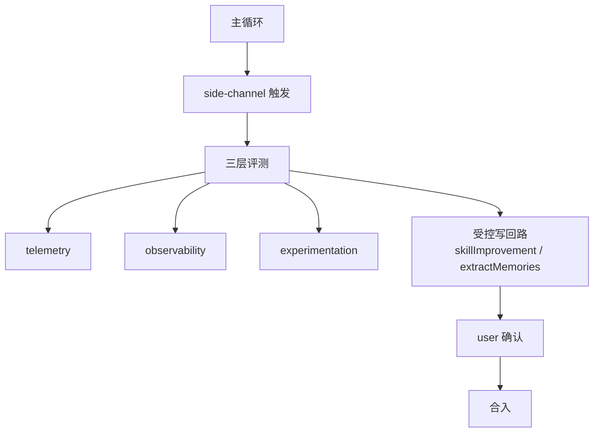

## 这一章要回答什么

当谈到 agent 的「自我改进」时，业界的讨论很容易滑向两个极端：要么是「它会自动进化」的修辞，要么是「它只是 prompt 而已」的贬低。两种说法都不准确，也都不 actionable。

这一章从 Claude Code 的源码出发，试图给出一个更工程化的中间立场：

1. **Claude Code 里到底有哪些「改进」能力？**（按证据列）
2. **这些能力为什么不是「自治进化」？**（按边界列）
3. **真正值得学的是什么？**（按可迁移判断列）

关于 memory 的结构化分层本身——durable memory、session memory、extraction——会在 [第 17 章](/claude-code-architecture/17-memory-system-and-persistence/) 完整展开。本章**只在 memory 作为「受控改进的载体」这个角度上**涉及它。



---

## 一、先给出总体判断

基于源码，Claude Code 的「自改进」能力可以分成三层：

### 层 1：执行层自修复（可信度高）

- `query.ts` 里的 `max_output_tokens` 恢复
- auto compact / reactive compact
- tool result budget 裁剪
- stop hook 介入主路径

这一层不依赖任何 LLM 自治能力，只依赖 runtime 自己的状态机。**它之所以可信，是因为它不问模型「你该怎么办」，而是由 harness 自己决定。**

### 层 2：认知连续性修复（中等可信度）

- session memory 通过 forked subagent 提取会话要点
- durable memory 通过 post-turn stop hook + forked agent 做 extraction
- compact 后的 effective history 维持会话可继续

这一层依赖 LLM 做摘要和提炼，但是**在受控边界内**——forked agent、共享 prompt cache、极窄工具集、只能写入特定路径。

### 层 3：受控自改进（最接近「自进化」，但边界非常窄）

- `src/utils/hooks/skillImprovement.ts`：检测最近几轮消息中用户对 skill 的偏好/纠正，抽取潜在 skill update，在特定路径下自动改写 skill 文件
- 严格 gate、批量阈值（每 `TURN_BATCH_SIZE` 轮才分析一次）
- 目标只限 project skill 这一类边界清楚的对象
- 不改系统代码、不改其它 agent 行为

**关键观察**：即使是 Claude Code 里「最像自改进」的 skillImprovement，也是一个**受限、可解释、可关闭**的机制。它改的是 skill 文件，不是任意系统代码。

### 不存在的能力（重要）

源码里**没有**证据表明 Claude Code 做下面这些事：

- 不会自动重写自己的核心代码
- 不会自动拓宽工具权限
- 不会自动修改 managed settings 或 policy
- 不会自动绕开 permission pipeline

如果你读到的任何「Claude Code 会自己进化」的描述超出了前三层的边界，那要么是误读，要么是对未来能力的猜测。

---

## 二、评测基础设施：没有它，改进就是盲改

Claude Code 的受控自改进之所以成立，关键在于它建立在一套**足够扎实的评测基础设施**上。这一节拆解这套基础设施。

### 1. Analytics 是「能被早期使用的」基础设施

**源码证据**：`src/services/analytics/index.ts`

这个文件的设计有几个值得学的细节：

- **低依赖**：公共 API 极薄，避免 import cycle
- **Sink 延迟 attach**：启动时 sink 可能还没准备好，但事件不会丢
- **早期事件排队**：sink attach 前产生的事件进入队列
- **Metadata 强类型约束**：避免把敏感路径、代码片段误记进遥测

**工程意义**：如果 observability 层做成了「业务代码硬依赖」，它就只能在系统完全启动后才能用。Claude Code 把它做成「基础设施」——这意味着从启动第一秒就能用，也意味着可以随时替换 sink（开发/测试/生产不同）。

### 2. Compact 自带可测性

**源码证据**：`src/services/compact/autoCompact.ts`

值得注意的工程细节：

- 明确的 token threshold（warning / error / blocking）
- Consecutive failure circuit breaker
- Env override 方便测试
- 与 reactive compact / context collapse 联动

**工程意义**：这个模块不是「写死逻辑」，而是**可调、可试验、可观察**。这让 compact 的效果能被系统性评估，而不是靠感觉。

### 3. Feature gates + dynamic config = 渐进实验平台

**源码证据**：仓库里大量使用 feature gate 和 dynamic config 控制功能启用。

session memory、skill improvement 等特性都是这种模式：

- 先 gated
- 再 rollout（部分用户、部分场景）
- 根据观测逐步调整

**工程意义**：这本质上是 agent 系统里的**线上实验基础设施**。没有它，任何新特性要么不敢发布，要么发布后无法回滚。

### 4. 评测基础设施的三个层次

综合起来，Claude Code 的评测基础设施分三层：

| 层 | 作用 | 关键模块 |
|---|---|---|
| **遥测层** | 收集运行时事件 | `analytics/index.ts` |
| **可观察性层** | 让关键机制自带指标 | `autoCompact.ts`、`stopHooks.ts` |
| **实验层** | Gate + rollout + config | Feature gates、dynamic config |

**缺一不可**。没有遥测层就没有数据，没有可观察性就没有信号，没有实验层就没有安全推进的手段。

---

## 三、受控自改进的机制拆解

现在回到层 3——skillImprovement 这个最接近「自进化」的机制。把它拆开看，每个设计点都在解决一个具体问题。

**源码证据**：`src/utils/hooks/skillImprovement.ts` + `src/utils/hooks/postSamplingHooks.ts`

### 1. 它通过 side-channel 触发，不侵入主 turn

skillImprovement 挂在 post-sampling hook 上——模型输出完成后触发，**fire-and-forget**。它的失败不会让主 turn 失败。

这解决的问题是：**分析工作不能阻塞任务推进**。如果自改进机制会让用户感知到卡顿，它就不可接受。

### 2. 它有批量阈值，不是每轮都跑

```
每 TURN_BATCH_SIZE 轮才分析一次
```

这解决的问题是：**自改进是低频任务，不值得每轮付出开销**。它需要足够的样本才能给出有意义的改进建议。

### 3. 它的写入面极窄

只能写入 project skill 文件路径下的 skill 定义。不能：

- 改系统代码
- 改其它 skill 目录（user / managed / plugin）
- 改 memory、settings、permissions

这解决的问题是：**自改进的爆炸半径必须小**。如果失控，影响范围必须能控制在一个可回滚的小区域。

### 4. 它受 gate 控制，可以完全关闭

这解决的问题是：**自改进功能必须能一键关闭**。这是所有非确定性功能的底线。

### 5. 它的结果最终由用户验证

改写发生在 project skill 文件里，用户下次使用这个 skill 时会自然感受到差异。如果改写不合适，用户可以直接编辑文件或删除改动。

这解决的问题是：**自改进不是闭环自治，它的最后一环是人**。

### 综合：这是「受控自改进」的一个完整样本

把上面五点放在一起，skillImprovement 是一个相当完整的受控自改进样本：

```text
触发方式：post-sampling side-channel（fire-and-forget）
触发频率：批量阈值（低频）
写入面：  project skill 文件（最窄）
控制面：  feature gate（可关闭）
验证面：  用户自然感知 + 可编辑
```

这五个维度**全部受控**，才叫受控自改进。

---

## 四、可迁移的工程判断

如果你要在自己的系统里做类似能力，下面是从 Claude Code 能稳妥带走的判断。

### 1. 不要把自改进理解成无限自治

更现实也更安全的做法：

- 有边界的写回面
- 有 gate 的启用方式
- 有观测支撑的渐进 rollout
- 有 side-channel 隔离的反思流程

任何一个维度没有做到位，自改进都会从「功能」变成「风险」。

### 2. 没有评测基础设施，就不要做自改进

顺序是：

```text
先做 telemetry 基础设施
再做 feature gate 基础设施
再做可观察性的核心机制
最后才加自改进功能
```

跳过前三步直接做自改进，本质上是盲改。

### 3. 把「反思」放到 side-channel，不要污染主路径

memory extraction、session memory、skill improvement 都遵循这个模式：

- 主 turn 完成后触发
- 用 forked agent 执行
- 工具权限收窄
- 尽量复用 prompt cache

这是非常成熟的工程化方式，也几乎是受控自改进的唯一正确切入点。

### 4. Memory、summary、compact、eval 不能混成一团

这是长期协作系统里最危险的认知混乱之一。至少要区分：

- prompt 内即时上下文
- session memory（工作记忆）
- durable memory（长期背景）
- compact / context collapse
- telemetry / evaluation
- UI / runtime state

混在一起，系统会很快失控。详细分层见 [第 17 章](/claude-code-architecture/17-memory-system-and-persistence/) 和 [第 24 章](/claude-code-architecture/24-compact-context-collapse-and-recovery-boundary/)。

### 5. 自改进的第一个目标应该是「工作流定义」，不是系统代码

Claude Code 选择从 skill 文件开始，是一个很对的路线。因为：

- skill 定义是纯文本、边界清楚
- 改错了不会破坏系统功能
- 用户可以直接编辑回来
- 效果可以在下次使用时立刻看到

如果你要做类似能力，建议也从**边界清楚、爆炸半径小、可由用户验证**的对象开始，而不是上来就做「让系统自己改自己」。

---

## 五、一个克制的结论

关于「agent 自改进」的讨论，外界经常过度浪漫化。Claude Code 给出的答案，反而更像一个成熟工程团队会给的答案：

> **不追求「系统自己进化成什么」，只追求「系统能基于自己的使用情况，在受控边界内做出小幅、可观测、可回滚的改进」。**

这不是一个让人兴奋的目标。但它是一个**能真正交付产品**的目标。

从这个角度看，Claude Code 的 memory + evaluation + self-improvement，不是某种「让 agent 更聪明」的机制，而是**让 agent 能长期运行、长期可观测、长期可改进**的基础设施。

这恰好也是这本书对 harness engineering 的核心理解。

---

## 继续阅读

- 想看 memory 的完整分层：[第 17 章 Memory 系统与持久化](/claude-code-architecture/17-memory-system-and-persistence/)
- 想看 compact 的恢复边界：[第 24 章 会话压缩、上下文收缩与恢复边界深挖](/claude-code-architecture/24-compact-context-collapse-and-recovery-boundary/)
- 想看 hooks / side-channels 的完整 taxonomy：[第 15 章 Hooks 与 Side-Channels 深挖](/claude-code-architecture/15-hooks-and-side-channels-deep-dive/)
- 想看 harness 工程的整体观察框架：[第 09 章 Harness 工程经验综合](/claude-code-architecture/09-harness-engineering-lens/)

## 源码证据索引

- `src/memdir/memdir.ts` — durable memory 目录与 typed memory
- `src/services/extractMemories/extractMemories.ts` — post-turn durable memory 提取
- `src/services/SessionMemory/sessionMemory.ts` — session memory 与工作记忆
- `src/services/compact/sessionMemoryCompact.ts` — session memory compact 路径
- `src/services/compact/autoCompact.ts` — 自动 compact 与阈值
- `src/utils/hooks/postSamplingHooks.ts` — post-sampling side-channel 插槽
- `src/query/stopHooks.ts` — stop hook 执行面
- `src/utils/hooks/skillImprovement.ts` — 受控 skill 自改进
- `src/services/analytics/index.ts` — telemetry / observability 基础设施
- `src/query.ts` — runtime recovery、budget、stop-hook integration

## 相关章节

- [第 09 章：Harness 工程经验综合](/claude-code-architecture/09-harness-engineering-lens/)
- [第 15 章：Hooks 与 Side-Channels 深挖](/claude-code-architecture/15-hooks-and-side-channels-deep-dive/)
- [第 17 章：Memory 系统与持久化](/claude-code-architecture/17-memory-system-and-persistence/)
- [第 24 章：会话压缩、上下文收缩与恢复边界深挖](/claude-code-architecture/24-compact-context-collapse-and-recovery-boundary/)
- [第 30 章：运行时综合与设计原则](/claude-code-architecture/30-runtime-synthesis-and-design-principles/)


