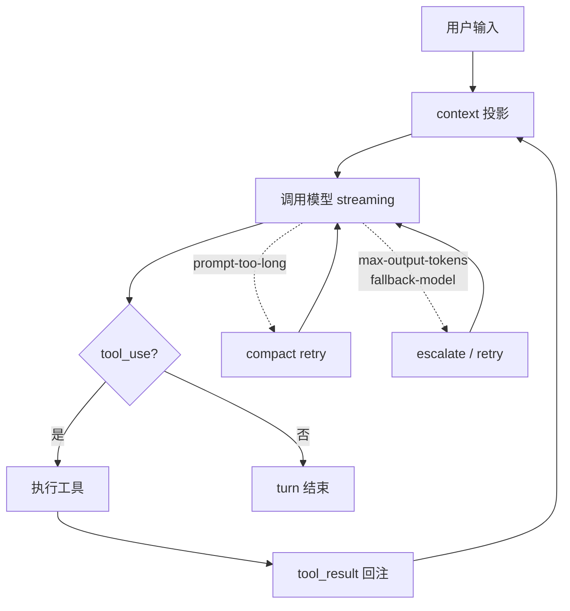

## 本章目标

这一章不再只做高层总结，而是沿着源码链路，尽量客观地回答：Claude Code 的 agent loop 到底是怎样组织起来的。

重点问题：

1. loop 的入口在哪里，边界怎么划分？
2. 一次 assistant -> tool -> tool_result -> continue 的循环到底怎样推进？
3. compact、budget、hooks、memory、queued commands 这些机制是怎样挂进 loop 的？
4. 从源码能得出的最稳妥判断是什么？



## 一、先给出总体判断

如果只基于当前源码做判断，我会把 Claude Code 的 agent loop 概括成：

> 一个以 `QueryEngine` 为会话 owner、以 `query.ts` 为 turn loop、以 tool execution 为中心、把 compact / recovery / hooks / attachments / queued commands 一并纳入主路径的状态化 runtime。

它和 `03-query-engine-and-execution-loop.md` 的关系是：

- `03` 更偏总览，解释 QueryEngine / query 的两级分工
- 本章更偏 turn loop 深挖，追踪一次 assistant -> tool -> tool_result -> continue 是怎样推进的

这里最重要的不是“调用了一次模型”，而是它明确处理了：

- 会话状态如何跨 turn 保留
- 当前 turn 如何循环推进
- tool_use 后如何继续
- prompt-too-long / max_output_tokens / fallback / interrupt 如何恢复或终止
- turn 结束后哪些 side-channel 工作异步触发

这超出了普通 prompt wrapper 的范畴。

## 二、loop 的入口与边界

## 1. `QueryEngine` 是会话级 owner

`src/QueryEngine.ts` 文件注释已经直接说明：

> QueryEngine owns the query lifecycle and session state for a conversation.

从 `QueryEngineConfig` 可以看出它持有的不是单一 API 参数，而是一整套会话环境：

- `cwd`
- `tools`
- `commands`
- `mcpClients`
- `agents`
- `canUseTool`
- `getAppState` / `setAppState`
- `readFileCache`
- `customSystemPrompt` / `appendSystemPrompt`
- `thinkingConfig`
- `maxTurns` / `maxBudgetUsd` / `taskBudget`
- `jsonSchema`

这说明 `QueryEngine` 的角色不是“帮忙发请求”，而是把一次会话需要的控制面、能力面和状态面汇总起来。

它内部还持有：

- `mutableMessages`
- `permissionDenials`
- `totalUsage`
- `readFileState`
- `discoveredSkillNames`
- `loadedNestedMemoryPaths`

这些字段能说明它真正保留的是 **conversation state**，而不是只保留 transcript。

## 2. `submitMessage()` 是 turn 入口

`submitMessage()` 做了几件关键事情：

1. 包装 `canUseTool`，顺手累计 permission denials
2. 读取并拼装 system prompt parts
3. 通过 `processUserInput()` 处理 slash command / 用户输入 / 附件 / allowedTools 更新
4. 构造 `processUserInputContext`
5. 加载 skills 与 plugins cache-only 结果
6. yield system init message
7. 把准备好的状态交给 `query()`

也就是说，`QueryEngine.submitMessage()` 负责的是：

- 把“用户发来一个新 turn”转成 runtime 能执行的形态
- 维护会话内跨 turn 的状态积累
- 管 SDK/headless consumer 看到的事件流

## 3. `query()` 是 turn 级 loop

`src/query.ts` 的 `query()` / `queryLoop()` 则是真正的执行回路。

它接收的 `QueryParams` 已经包含：

- `messages`
- `systemPrompt`
- `userContext`
- `systemContext`
- `canUseTool`
- `toolUseContext`
- `fallbackModel`
- `querySource`
- `maxTurns`
- `taskBudget`

`query()` 自己并不“拥有会话”，而是拿到这一轮所需上下文，然后在 `while (true)` 中持续推进，直到：

- 完成
- 触发 max turns / budget / prompt too long / aborted 等终止条件
- 或进入某种恢复后继续下一轮

因此，两层边界很清楚：

- `QueryEngine` 管会话
- `queryLoop` 管当前 turn 的推进与递归继续

## 三、一次 turn 是怎样推进的

## 1. 先把 query 输入投影成当前可发送视图

进入 `queryLoop()` 后，并不是直接把全部消息丢给模型，而是逐层处理：

1. `getMessagesAfterCompactBoundary(messages)`
2. `applyToolResultBudget(...)`
3. 可选 `snipCompactIfNeeded(...)`
4. 可选 `deps.microcompact(...)`
5. 可选 `contextCollapse.applyCollapsesIfNeeded(...)`
6. `deps.autocompact(...)`

这说明发送给模型的上下文不是“原始 transcript”，而是经过治理后的 **messagesForQuery**。

## 2. context 不是单一字符串

`query.ts` 会把：

- `systemPrompt`
- `systemContext`
- `userContext`

分别组织，再通过：

- `appendSystemContext(systemPrompt, systemContext)`
- `prependUserContext(messagesForQuery, userContext)`

组合进本轮请求。

这意味着 Claude Code 的 loop 不是围绕一个固定 prompt 模板，而是围绕一套结构化 context assembly 在工作。

## 3. assistant streaming 是 loop 中心事件流

模型调用在 `deps.callModel(...)` 中发生，`queryLoop()` 对其进行 `for await` 消费。

streaming 过程中会不断处理：

- `assistant` message
- `stream_event`
- `tool_use` blocks
- partial usage / stop_reason

同时还要处理特殊分支：

- streaming fallback
- prompt-too-long withholding
- media-size withholding
- max_output_tokens withholding

这部分很关键，因为 Claude Code 不是等模型整轮结束后再决定怎么做，而是在 streaming 期间就逐步形成：

- `assistantMessages`
- `toolUseBlocks`
- `needsFollowUp`
- `toolResults`

## 4. tool_use 是 loop 的继续条件

源码里真正决定是否要继续的，不是 stop_reason，而是 streaming 过程中是否收到了 `tool_use` block。

`query.ts` 里有一句非常重要的注释：

- `stop_reason === 'tool_use' is unreliable`
- 真正的 loop-exit signal 是 streaming 中是否收到 tool_use

这说明 Claude Code 的循环推进是围绕 **实际消息结构**，而不是完全依赖 API 的高层状态字段。

## 四、工具执行怎么接进 loop

## 1. 工具执行不是附属逻辑，而是主路径

在 `query.ts` 中，收到 tool blocks 之后，会走：

- `StreamingToolExecutor`
- 或 `runTools(...)`

两条路径。

如果启用了 streaming tool execution，就边 stream 边启动工具；否则在 assistant 结束后统一跑工具。

## 2. `toolOrchestration.ts` 说明工具批次有明确策略

`runTools()` 先通过 `partitionToolCalls()` 把工具调用切成两类批次：

1. 单个非并发安全工具
2. 连续的并发安全工具组

判断依据是 tool definition 的 `isConcurrencySafe(input)`。

也就是说，Claude Code 没有简单地“所有工具一起跑”或“所有工具串行跑”，而是按工具语义决定并发粒度。

## 3. `StreamingToolExecutor` 说明 streaming tool 模式更复杂

`StreamingToolExecutor` 的职责包括：

- 接收 streaming 到达的 tool block
- 维护 `queued / executing / completed / yielded` 状态
- 对 progress message 立即向外 yield
- 对 final results 按工具接收顺序输出
- 在 sibling Bash error 时取消其他兄弟工具
- 在 streaming fallback 时丢弃整批 pending tool execution

这里特别值得注意的是：

- Bash error 会触发 sibling cancellation
- 但一般读类工具失败不会取消整个并发批次

这说明 Claude Code 在工具并发上已经开始做“语义化取消策略”，而不只是技术并发控制。

## 4. tool result 必须回流为下一轮输入

工具执行后的消息会被：

- `normalizeMessagesForAPI(...)`
- push 进 `toolResults`
- 再和 `messagesForQuery + assistantMessages` 拼成下一轮 `state.messages`

于是 loop 形成：

```text
assistant messages
  -> tool_use blocks
  -> run tools
  -> tool_result / attachment / progress
  -> next state.messages
  -> next model call
```

这就是 Claude Code 的主循环核心。

## 五、loop 里挂了哪些辅助机制

## 1. compact 与 context collapse 在 API 调用前就参与

在每次 API 请求前，loop 都会先尝试：

- tool result budget 裁剪
- history snip
- microcompact
- context collapse
- autocompact

并且 autocompact 一旦成功，会直接生成 `postCompactMessages`，再继续当前 query，而不是等待下一次用户输入。

这说明 compact 不是“后台保洁”，而是同步参与 turn 推进。

## 2. prompt-too-long / media / max_output_tokens 恢复都是 loop 内生的

`query.ts` 明确内建了几类恢复路径：

- context collapse drain retry
- reactive compact retry
- max_output_tokens escalation
- max_output_tokens recovery message 注入
- fallback model retry

这几类恢复的共同点是：

- 先暂时 withheld 错误
- 判断能否恢复
- 能恢复就修改 state 后 `continue`
- 无法恢复再把错误真正暴露出来

所以“错误处理”在这里不是异常收尾，而是 loop transition 的一部分。

## 3. hooks 不是外围插件，而是 turn 尾部机制

在没有 `needsFollowUp` 时，loop 会进入 `handleStopHooks(...)`。

`src/query/stopHooks.ts` 可以看到这里还会做：

- 保存 cache-safe params
- 模板 job classification
- prompt suggestion
- extract memories
- auto dream
- chicago MCP cleanup
- stop hooks / teammate hooks / task completed hooks

也就是说，turn 结束后的 side-channel 工作被统一收口在 stop hooks 阶段，而不是散落在 UI 或外层。

## 4. post-sampling hooks 比 stop hooks 更早

在 assistant messages 完成后、但工具流和终止判断之后，`query.ts` 还会 fire-and-forget：

- `executePostSamplingHooks(...)`

这给系统留出了另一个插槽：

- 不阻塞主 turn 完成
- 但可以基于刚完成的一轮输出做分析

`skillImprovement.ts` 就是挂在这条 side-channel 上的。

## 5. queued commands 会在 turn 内重新作为附件注入

loop 在工具结束后还会：

- 从 `messageQueueManager` 取 snapshot
- 调用 `getAttachmentMessages(...)`
- 把 queued commands / task notifications 重新注入到当前 turn 的 tool results 区

这意味着 Claude Code 的 loop 不只是“用户输入一次 -> 跑完结束”，而是会主动吸收中途排队进入的通知与命令。

## 6. memory prefetch / skill prefetch 也是 turn 内注入

在 `queryLoop()` 开头有：

- `startRelevantMemoryPrefetch(...)`
- `skillPrefetch?.startSkillDiscoveryPrefetch(...)`

在工具执行后又会把 prefetched results 转成 attachments 注入。

这说明：

- memory 不是完全静态前置上下文
- skills 也不只是启动时加载完就结束
- loop 本身会在 turn 内动态吸收新上下文

## 六、终止条件也被工程化建模了

从 `QueryEngine.submitMessage()` 最终消费 `query()` 的逻辑可以看出，Claude Code 会系统性地产生结果类型：

- `success`
- `error_max_turns`
- `error_max_budget_usd`
- `error_max_structured_output_retries`
- `error_during_execution`

并且在过程中不断累计：

- `totalUsage`
- `permissionDenials`
- `structured_output`
- `stop_reason`

这使得 loop 最终返回的不是“最后一句文本”，而是一份更接近 runtime result object 的东西。

## 七、从源码能得出的最稳妥判断

## 1. 它确实不是简单 API wrapper

这一点证据很充分，因为主循环里已经原生包含：

- 多轮递归继续
- tool orchestration
- compact
- overflow recovery
- fallback handling
- queued command injection
- memory / skill prefetch attachments
- stop hooks / side-channel integration

这些都不是“外围 glue code”能轻松承载的。

## 2. 它也不是完全自治的大闭环系统

虽然 loop 很厚，但当前源码里仍能清楚看到边界：

- side-channel 工作通常异步、受限、可跳过
- stop hooks 和 post-sampling hooks 是插槽，不是任意自改写闭环
- `QueryEngine` 和 `query()` 仍然围绕单次会话推进组织，而不是无终止自治

所以更准确的说法是：

> Claude Code 实现的是一个工程化很强的 agent runtime，而不是科幻式自治系统。

## 3. 其核心抽象不是 prompt，而是 transition

如果抽象层次再提一层，`query.ts` 真正反复在做的事情其实是：

- 构建当前 query view
- 调用模型
- 观察结果
- 根据结果决定 next transition

这些 transition 包括：

- `next_turn`
- `reactive_compact_retry`
- `collapse_drain_retry`
- `max_output_tokens_escalate`
- `max_output_tokens_recovery`
- `stop_hook_blocking`
- `token_budget_continuation`

这说明 Claude Code 的 runtime 更像一个带恢复策略的状态机。

## 八、和已有文档的边界

与 `03-query-engine-and-execution-loop.md` 相比，本章新增的重点主要是：

- 把 `tool_use` 视为 loop 的真实继续信号，而不是只看 `stop_reason`
- 拆开 streaming tool execution 与普通 tool orchestration 的区别
- 追踪 queued commands、memory prefetch、skill prefetch 怎样在 turn 内重新注入
- 更明确地把 compact / fallback / max_output_tokens 恢复看成 transition，而不是错误收尾

因此这章不是对 `03` 的重复，而是把 `03` 中相对压缩的 runtime 主路径再展开一层。

## 本章小结

如果把这一章压缩成一句话，就是：

> Claude Code 的 agent loop，本质上是一个围绕 assistant/tool/result/recovery 反复推进的状态机式 runtime，而不是一次性模型调用外面套几层辅助逻辑。

也正因为如此，它更适合作为 agent runtime engineering 的学习样本，而不只是“Claude API 调用示例”。

## 源码证据索引

- `src/QueryEngine.ts` — 会话 owner、turn 入口、`submitMessage()` 与 query 结果汇总
- `src/query.ts` — turn loop 主体、tool follow-up、compact/recovery、hooks、queued commands、prefetch
- `src/services/tools/toolOrchestration.ts` — 非流式工具批次执行与并发安全切分
- `src/services/tools/StreamingToolExecutor.ts` — 流式工具执行、顺序控制、取消传播与 sibling Bash cancellation
- `src/utils/messages.ts` — compact boundary 之后的历史视图与消息投影
- `src/utils/attachments.ts` — relevant memory 与 skill prefetch 的 attachment 注入

## 相关章节

- [第 03 章：QueryEngine 与 query 的总体分工](/claude-code-architecture/03-query-engine-and-execution-loop/)
- [第 15 章：hooks 与 side-channels 怎样挂进 loop](/claude-code-architecture/15-hooks-and-side-channels-deep-dive/)
- [第 16 章：工具编排与并发执行子系统细节](/claude-code-architecture/16-tool-orchestration-and-concurrency/)
- [第 19 章：recovery / fallback / stop failure 如何反馈进状态机](/claude-code-architecture/19-recovery-and-error-handling-deep-dive/)
- [第 20 章：message/context assembly 如何塑造当前 query view](/claude-code-architecture/20-message-and-context-assembly-deep-dive/)
- [第 27 章：agent loop 在总体运行时架构图中的位置](/claude-code-architecture/27-runtime-architecture-map/)


