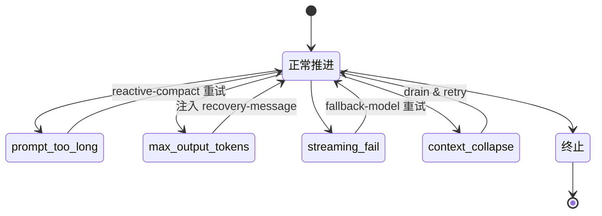

## 本章目标

这一章聚焦 Claude Code 运行时里的恢复与错误处理机制，尽量沿着源码链路回答几个更具体的问题：

1. Claude Code 的 recovery、retry、fallback 分别挂在什么层？
2. 哪些错误会被暂时 withheld，为什么不能立刻向外最终暴露？
3. prompt-too-long、media-size error、max_output_tokens、model fallback 分别怎么恢复？
4. stop hooks、stop failure hooks 与主状态机之间的边界是什么？
5. 这套机制是如何同时避免消息轨迹损坏与恢复死循环的？

这里有一个明确边界：

- 本章讨论的是 **runtime 里的恢复与错误处理控制流**；
- 不重新展开第 13 章对完整 agent loop 的总分析；
- 不重复第 15 章对 hooks taxonomy 的专题划分；
- 不重讲第 16 章工具执行子系统本体；
- 也不把第 17 章的 memory 写回链路再讲一遍。

因此，本文会尽量把“错误长什么样”与“系统如何恢复、继续或安全终止”分开，重点放在后者。

## 一、先给出总体判断

如果只基于当前源码做判断，我会把 Claude Code 的恢复与错误处理概括成：

> 一套分层的 runtime recovery system：底层 API retry 负责连接、限流、认证与模型 fallback；turn 级 query loop 负责 withheld error、上下文恢复、stop failure 与 continuation；而 stop-hook / failure-hook 机制则在 turn 收口阶段区分“正常终点”和“失败终点”，避免错误处理反向污染主状态机。

这里最关键的不是“会重试”，而是至少有四层同时成立：

1. **API-layer retry** 和 **turn-layer recovery** 是两套不同机制。
2. **有些错误会先被 withheld**，因为系统要先尝试恢复，而不是把中间失败态立刻暴露给上层。
3. **恢复不是统一 retry**，而是通过 `transition.reason` 推进到下一轮状态转移。
4. **错误路径也要维护消息一致性**，否则会出现 orphaned tool results、损坏的 thinking blocks、或 error → hook → retry 的死循环。

所以，更准确的说法不是“Claude Code 遇错会自动重试”，而是：

> Claude Code 为错误处理建立了一层显式的恢复状态机，用来区分什么错误属于 API transport 问题，什么错误属于当前 turn 的上下文溢出，什么错误应该先恢复再暴露，以及什么失败终点绝不能进入正常 stop hooks。

## 二、先把几类机制分开

## 1. API-layer retry：连接、认证、限流与 fallback

`src/services/api/withRetry.ts` 代表的是最底层、也最靠近 API client 的重试层。

这一层关心的问题包括：

- 429 / 529 是否值得重试
- stale connection（如 `ECONNRESET` / `EPIPE`）如何恢复
- OAuth / Bedrock / Vertex 认证失败后是否要刷新 client
- fast mode 被拒绝后如何降级
- 什么时候要触发 model fallback

也就是说，这一层主要处理的是：

- **请求还没真正稳定完成之前的 transport / provider / capacity 问题**

它不关心当前 turn 已经形成了怎样的消息历史，也不直接决定 stop hooks 是否运行。

## 2. turn-layer recovery：query loop 内的恢复分支

`src/query.ts` 中的恢复层则完全不同。这里关心的不是“HTTP 请求要不要再发一次”，而是：

- 当前 assistant message 是否应该暂时 withheld
- prompt-too-long 后是先 collapse 还是先 reactive compact
- max_output_tokens 是先扩大上限还是插 recovery message
- stop-hook blocking error 是否应该重新注入并继续一轮
- token budget 是否要求继续一轮还是直接结束

所以这一层处理的是：

- **当前 turn 已经进入 runtime 主状态机之后的恢复与继续**

它和 `withRetry.ts` 的区别非常重要：

- `withRetry.ts` 更像 request lifecycle retry
- `query.ts` 更像 turn state machine recovery

## 3. failure epilogue：失败终点和正常 stop 终点分开治理

在 `query.ts` 和 `src/query/stopHooks.ts` 之间，还存在第三类机制：

- 正常 stop hooks
- stop failure hooks

`query.ts:1258` 附近已经明确写出：

- 如果最后一条 message 是 API error，就跳过正常 stop hooks
- 改走 `executeStopFailureHooks(...)`

这说明 Claude Code 并没有把“turn 结束”视为单一阶段，而是区分：

- **有真实 assistant 终点的正常收口**
- **以 API error 结束的失败收口**

这个边界对避免恢复死循环非常关键。

## 三、API retry 和 turn recovery 为什么不能混成一层

## 1. `withRetry.ts` 处理的是 provider / transport 级失败

`withRetry.ts` 的控制流很清楚：

- 获取或刷新 client
- 执行 operation
- 遇到 error 后按错误种类判断是否 retry
- 某些路径进入 fast mode cooldown
- 某些路径抛出 `FallbackTriggeredError`
- 某些 query source 的 529 直接放弃，避免 retry amplification

这说明它处理的是“请求如何成功打出去并得到响应”。

例如：

- 401 可能触发 OAuth token refresh
- stale connection 会禁用 keep-alive 再连
- 429 / 529 可能 sleep 后 retry
- 高负载下可能切到 fallback model

这些决策与当前 turn 的消息历史还没有深度耦合。

## 2. `query.ts` 处理的是“响应已经进入 turn 之后怎么办”

而 `query.ts` 关心的是另一个问题：

- assistant 输出流里已经出现了 error-shaped message
- tool_use blocks 可能已经发出了一部分
- thinking blocks 可能已经部分进入 transcript
- 旧 attempt 的 `tool_use_id` 不能泄漏到新 attempt
- stop hooks 是否还应该运行

这显然已经不是 request retry 层能独立解决的问题。

也就是说，到了 `query.ts` 这一层，系统要维护的是：

- **message history consistency**
- **tool_result completeness**
- **turn-level continuation semantics**

## 3. `FallbackTriggeredError` 正好暴露了这两层的分工

`FallbackTriggeredError` 是最典型的桥接点。

在 `withRetry.ts` 里，它不是普通字符串错误，而是一个结构化控制信号，用来表达：

- 当前模型不可继续
- 应切到 fallback model

到了 `query.ts:894-950`，这条信号被 turn loop 消费后，系统会做一串明显属于 turn recovery 的动作：

- 把当前 attempt 里还缺失结果的 tool use 补成 error tool_result
- 清空 `assistantMessages` / `toolResults` / `toolUseBlocks`
- 重置 `needsFollowUp`
- discard 旧的 `StreamingToolExecutor`
- 必要时去掉 thinking signature block
- 更新 `toolUseContext.options.mainLoopModel`
- 再继续整轮重试

这说明 fallback 不是纯 API retry，而是：

- **API 层发出切换信号**
- **turn 层负责清理状态并重建 attempt**

## 四、withheld errors：为什么有些错误不能立刻向外暴露

这是整个恢复系统里最关键的设计之一。

## 1. streaming 阶段会先 withheld 某些错误

`query.ts:788-823` 很清楚地表明，系统会在 streaming 阶段先判断某些 assistant error message 是否应该 withheld。

主要包括：

- prompt-too-long
- 一部分 media-size error
- `max_output_tokens`

如果命中这些条件，message 会先进入 `assistantMessages`，但不会立刻 `yield` 给外部。

## 2. withheld 的核心目的不是“隐藏错误”，而是“给 recovery 一个机会”

源码注释写得很明确：

- 如果过早把 recoverable error 向外 yield，某些 SDK caller 会把它当成最终失败终点
- 但实际上 recovery loop 还会继续
- 这样就会出现 runtime 仍在跑，而调用方已经放弃监听的情况

因此 withheld 的语义不是：

- 系统不承认错误发生过

而是：

- 系统先把它视为 **intermediate failure state**，只有 recovery 失败后才真正 surface

## 3. withheld 让恢复逻辑和外部可见终点解耦

这个设计最大的价值在于，它把两件事拆开了：

1. **内部是否检测到错误**
2. **外部是否应该把它视为最终失败**

如果不拆开，系统就会很难实现：

- prompt-too-long 后先尝试 collapse drain
- media-size error 后先 strip / compact retry
- max_output_tokens 后先做 escalate 或 continuation

所以 withheld 本质上是 recovery system 的一个 staging layer。

## 五、三类恢复链路：prompt-too-long、media、max_output_tokens

## 1. prompt-too-long：先 collapse，再 reactive compact，再 surface

`query.ts:1065-1183` 把 prompt-too-long 的恢复链路写得很清楚。

顺序大致是：

1. 如果最后一条 assistant message 是 withheld 的 prompt-too-long
2. 先尝试 `contextCollapse.recoverFromOverflow(...)`
3. 如果 drain 成功，就写入新的 `State`，把 `transition.reason` 设为 `collapse_drain_retry`，然后 `continue`
4. 如果 collapse 不够，再尝试 `reactiveCompact.tryReactiveCompact(...)`
5. 如果 compact 成功，生成 post-compact messages，设 `transition.reason = 'reactive_compact_retry'`，继续下一轮
6. 如果还是失败，才真正 `yield lastMessage` 并走 `executeStopFailureHooks(...)`

这说明 prompt-too-long 不是一次裸 retry，而是一条分层恢复链：

- 先用更轻的恢复手段
- 再用更重的摘要恢复
- 最后才向外暴露错误

## 2. media-size error：不走 collapse，直接看 reactive compact

media-size error 的恢复链和 prompt-too-long 有相似之处，但边界不同。

源码注释明确说明：

- media errors 不走 collapse drain
- 因为 collapse 不会 strip images

所以这里更像：

- 如果是可以通过 strip / summarize retry 修复的 media error，就交给 reactive compact
- 否则直接 surface

这个分支很说明问题：Claude Code 的 recovery 不是抽象的“所有 overflow 都一样”，而是按错误语义选恢复器。

## 3. max_output_tokens：先 escalate，再多轮 continuation recovery

`query.ts:1185-1256` 展示了另一条不同的恢复逻辑。

当系统检测到 withheld 的 `max_output_tokens` 错误时，会：

1. 先尝试把 `maxOutputTokensOverride` 提升到 `ESCALATED_MAX_TOKENS`
2. 如果仍然不够，再插入一个 meta user message：
   - “Resume directly — no apology, no recap...”
3. 把这条恢复消息接到当前 `messages` 后面
4. 增加 `maxOutputTokensRecoveryCount`
5. 设置 `transition.reason = 'max_output_tokens_recovery'`
6. 再继续下一轮
7. 超过 `MAX_OUTPUT_TOKENS_RECOVERY_LIMIT` 才真正 surface error

这说明 max_output_tokens 的恢复链路不是“减少上下文”，而是：

- 先扩大一次输出窗口
- 再要求模型把剩余工作拆小、继续生成

也就是说，这里恢复的对象不是“输入太大”，而是“输出一次说不完”。

## 六、transition-based recovery：恢复不是裸 retry，而是状态转移

这是第 19 章最应该强调的结论之一。

## 1. 恢复路径通过 `transition.reason` 被显式记录

`query.ts` 里已经能看到一组很清楚的 transition reason：

- `collapse_drain_retry`
- `reactive_compact_retry`
- `max_output_tokens_escalate`
- `max_output_tokens_recovery`
- `stop_hook_blocking`
- `token_budget_continuation`
- `next_turn`

这说明系统在架构上并没有把恢复看成“同一轮里悄悄再试一次”，而是把它变成：

- **带标签的下一轮状态推进**

## 2. 这种做法让恢复逻辑可约束、可诊断、可防环

一旦 recovery 是显式 transition，就能做很多事情：

- 避免同一种恢复无限重复
- 让后续代码知道上一轮为什么继续
- 在测试中断言恢复路径确实触发
- 对不同恢复原因施加不同 guard

例如 prompt-too-long 的 collapse drain 就明确依赖：

- `state.transition?.reason !== 'collapse_drain_retry'`

这就是典型的“只允许某恢复路径打一次”的防环逻辑。

## 七、消息一致性：恢复系统为什么必须关心 orphaned state

## 1. streaming fallback 会 tombstone 旧消息

`query.ts:712-741` 对 streaming fallback 的处理很说明问题。

如果 fallback 发生在 streaming 中间，系统会：

- 对已经发出的 partial assistant messages 产出 tombstone
- 清空当前 attempt 的 `assistantMessages` / `toolResults` / `toolUseBlocks`
- discard 旧的 `StreamingToolExecutor`

源码注释强调：

- 某些 partial messages，尤其 thinking blocks，可能带着无效 signature
- 如果让这些旧消息继续留在 transcript 里，后面会触发 API-level inconsistency

## 2. fallback / abort / thrown error 都要补 missing tool results

`yieldMissingToolResultBlocks(...)` 的存在也很重要。

无论是：

- fallback triggered
- query 抛出异常
- 非 streaming 模式下被中断

系统都会尽量为已发出的 `tool_use` 补一条 error `tool_result`。

这说明恢复系统的目标不只是“把错误告诉用户”，而是：

- **保持 tool_use / tool_result 配对完整**

否则后续 resume、API replay、message normalization 都会变得不稳定。

## 3. `StreamingToolExecutor.discard()` 是 attempt 隔离的一部分

在 streaming fallback 和 fallback model retry 场景里，都会调用：

- `streamingToolExecutor.discard()`

注释写得很明确：

- 这样做是为了阻止旧 attempt 的 orphan tool_results 带着旧的 `tool_use_id` 泄漏到新 attempt

所以这里的关键不是“重建一个 executor”本身，而是：

- **每个 attempt 都必须拥有自己的 tool result consistency boundary**

## 八、stop hooks、stop failure hooks 与死循环防护

## 1. API error 终点必须跳过正常 stop hooks

`query.ts:1258-1264` 的注释已经把原因说透了：

- 如果最后一条 message 是 API error，就不应该再运行正常 stop hooks
- 因为模型根本没有产出一个真实、可评估的 assistant 终点
- 否则会出现：
  - error → hook blocking → retry → error → ...

这条规则非常关键，因为 stop hooks 本身是可以向主状态机反馈 blocking error 的。

如果在失败终点上误跑 stop hooks，就等于把“失败收口”又重新接回“正常 continuation”。

## 2. failure path 走的是 `executeStopFailureHooks(...)`

Claude Code 没有简单地“跳过一切 hook”，而是把失败路径单独收口为：

- `executeStopFailureHooks(...)`

这说明架构上仍然承认：

- 失败终点也需要 side-channel 处理

但它刻意不用正常 stop hook 流程，以免让失败终点重新获得 continuation 权。

## 3. stop hook blocking 本身也是一种继续信号

`handleStopHooks(...)` 会返回：

- `blockingErrors`
- `preventContinuation`

而 `query.ts:1282-1305` 会在 `blockingErrors.length > 0` 时：

- 把 blocking errors 重新注入 `messages`
- 设置 `transition.reason = 'stop_hook_blocking'`
- 再进入下一轮

这说明 stop hooks 并不只是 turn epilogue；它也能把当前 turn 重新拉回主状态机。

## 4. `hasAttemptedReactiveCompact` 的保留是典型防环措施

这一段注释尤其重要：

- 如果 compact 已经跑过且失败了
- stop hook 又塞了 blocking error
- 然后下一轮再把 `hasAttemptedReactiveCompact` 重置为 false
- 就会出现：
  - compact → still too long → error → stop hook blocking → compact → ...

因此源码刻意在 stop-hook blocking continuation 时保留：

- `hasAttemptedReactiveCompact`

这说明 Claude Code 对“恢复链路会互相干扰”是有明确防御意识的。

## 九、querySource 也是恢复策略的一部分

`withRetry.ts` 里还有一个非常值得注意的点：

- 不是所有 query source 都会对 529 做同样的 retry

源码里专门列出 `FOREGROUND_529_RETRY_SOURCES`，包括：

- `repl_main_thread`
- `sdk`
- 一些 agent source
- `compact`
- `hook_agent`
- `side_question`
- 某些 correctness-sensitive classifier

而其他后台路径在 529 上会直接 bail。

这说明恢复策略并不是纯技术决策，而是和运行时角色绑定：

- 用户正在等待结果的 foreground query，更值得 retry
- 后台 summarizer / suggestion / classifier 在 capacity cascade 时不值得放大重试风暴

因此，Claude Code 的恢复系统还隐含了一条更高层的原则：

- **恢复成本要和 query 的可见性、关键性、放大风险一起评估**

## 十、和已有文档的边界

## 1. 与第 13 章的边界

第 13 章关心的是整个 turn loop 如何推进，包括：

- assistant -> tool -> tool_result -> continue
- compact / stop hooks / queued commands / prefetch 如何挂进主循环

本章不再重述完整 loop，而是只把其中的恢复与错误处理链单独拆出来，聚焦：

- withheld errors
- recovery transitions
- fallback attempt reset
- stop failure vs stop hooks
- 死循环防护

所以可以把关系理解为：

- `13` 讲主状态机怎么跑
- 本章讲主状态机在失败和边界命中时如何自我修复或安全终止

## 2. 与第 15 章的边界

第 15 章讨论的是 hooks / side-channels 的 taxonomy：

- prefetch
- post-sampling hooks
- stop hooks
- skill improvement

本章只在恢复链路需要时讨论 hooks，重点是：

- 正常 stop hooks 与 stop failure hooks 为什么要分开
- stop hooks 的 blocking error 如何反馈回主状态机
- 为什么 API error 终点必须跳过正常 stop hooks

因此，这里不是重新讨论 hooks 分类，而是讨论 hooks 在 error handling 里的控制流边界。

## 3. 与第 16 章的边界

第 16 章关心的是工具执行子系统本身：

- 分批
- 并发安全
- 结果顺序
- sibling cancellation

本章只在“恢复如何保持消息一致性”这个意义上引用工具执行层，例如：

- 为什么要补 missing tool_result
- 为什么要 discard 旧 executor
- 为什么旧 attempt 的 tool results 不能泄漏到新 attempt

所以，本章不是第 16 章的错误分支扩写，而是从 runtime recovery 视角借用它的一小部分。

## 4. 与第 17 章的边界

第 17 章讨论的是 memory lifecycle、retrieval、injection、extraction、persistence。

本章不会把 memory recovery 当成主角，也不重讲 durable write-back 或 relevant memory prefetch。只有在 stop hooks / failure hooks 与 turn 收口有关时，才间接触及相关边界。

也就是说：

- `17` 讲长期上下文系统如何运作
- 本章讲 runtime 遇错时如何恢复、重试、或安全终止

## 1. retry、fallback、recovery 应该分层，不要混成一个 catch

Claude Code 最值得借鉴的一点，是把：

- provider / transport retry
- model fallback
- turn-level recovery
- failure epilogue

分成不同层次处理。

这样做的好处是，每一层只负责自己能稳定判断的事情，不必在一个 catch 块里同时猜连接、上下文、工具状态、hook 反馈。

## 2. recoverable error 最好先 withheld，再决定是否 surface

如果错误一出现就被外部视为最终失败，那后续 recovery loop 容易出现“系统还在跑，但调用方已经退出”的状态。

Claude Code 的做法说明：

- 对 recoverable error，先把它当成 intermediate state
- recovery exhausted 后再正式 surface

这比“先报错，再静默重试”稳定得多，也更不容易污染上层控制流。

## 3. 恢复系统必须显式维护 attempt 边界

一旦存在 streaming、tool_use、tool_result、thinking block、resume，恢复就不能只是重新发请求。

必须明确处理：

- orphaned messages 怎么清
- 缺失的 tool_result 怎么补
- 旧 executor 怎么 discard
- thinking signature 是否还可重放

否则重试越多，轨迹越乱。

## 4. 失败终点与正常终点必须分开治理

Claude Code 把 stop hooks 和 stop failure hooks 分开，是一个非常成熟的设计。

因为“turn 结束”并不代表“收口逻辑可以一样”。

- 正常终点可以评估 stop hooks
- 失败终点只能做 failure-oriented side-channel
- 二者如果混起来，容易把 failure path 重新接回 continuation path

## 5. 防止恢复死循环必须依赖显式状态，而不是隐式猜测

`transition.reason`、`hasAttemptedReactiveCompact`、`maxOutputTokensRecoveryCount` 这些状态并不是实现噪音，而是恢复系统防环的基础。

这说明一条很重要的工程经验：

- 只要恢复链路超过一层，就应该把“已经尝试过什么”显式记下来
- 不要指望靠错误文本或当前消息形状去反推所有历史

## 本章小结

如果把这一章压缩成一句话，可以说：

> Claude Code 的恢复与错误处理不是单一 retry 逻辑，而是一套分层的 runtime recovery system：API 层处理连接、认证、限流与 fallback；query loop 层处理 withheld error、上下文恢复与 continuation；failure epilogue 则把错误终点和正常 stop 终点区分开来，从而在尽量恢复任务推进的同时，保护消息一致性并避免恢复死循环。

从源码可以得出的倾向性结论包括：

- `withRetry.ts` 和 `query.ts` 分别承担 API-layer retry 与 turn-layer recovery，两者不是一回事。
- prompt-too-long、media-size error、max_output_tokens 等 recoverable error 会先 withheld，再按各自语义尝试恢复。
- 恢复链路不是统一 retry，而是通过显式 `transition.reason` 推进到下一轮状态转移。
- fallback 与 streaming retry 都要求清理旧 attempt 的 message / tool state，避免 orphaned result 污染新 attempt。
- 正常 stop hooks 与 stop failure hooks 被刻意分开，以防 API error 终点引发 error → hook → retry 的死循环。
- `hasAttemptedReactiveCompact`、recovery count、transition guard 等显式状态，说明这套系统把“防恢复环”视为一等工程问题。

## 源码证据索引

- `src/services/api/withRetry.ts` — transport/provider retry、认证刷新、529/429 策略、fallback 触发
- `src/query.ts` — withheld errors、transition-based recovery、attempt reset、failure epilogue 分支
- `src/query/stopHooks.ts` — 正常 stop hooks 与 blocking/preventContinuation 反馈
- `src/utils/messages.ts` — tombstone、tool_result 补全与消息一致性相关转换
- `src/services/tools/StreamingToolExecutor.ts` — discard 旧 attempt、避免 orphan tool results 泄漏

## 相关章节

- [第 13 章：主 agent loop 与 transition/state machine 总体结构](/claude-code-architecture/13-agent-loop-deep-dive/)
- [第 15 章：stop hooks / stop failure hooks 在 hooks taxonomy 里的位置](/claude-code-architecture/15-hooks-and-side-channels-deep-dive/)
- [第 16 章：工具执行取消、sibling error 与消息一致性的执行层前提](/claude-code-architecture/16-tool-orchestration-and-concurrency/)
- [第 17 章：memory extraction 只在 stop-path 边界上间接相关](/claude-code-architecture/17-memory-system-and-persistence/)
- [第 20 章：recovery 如何重塑 messagesForQuery 与上下文装配](/claude-code-architecture/20-message-and-context-assembly-deep-dive/)
- [第 24 章：compact / context collapse / recovery boundary 的进一步专题化分析](/claude-code-architecture/24-compact-context-collapse-and-recovery-boundary/)
- [第 27 章：recovery plane 在总体运行时架构图中的位置](/claude-code-architecture/27-runtime-architecture-map/)




