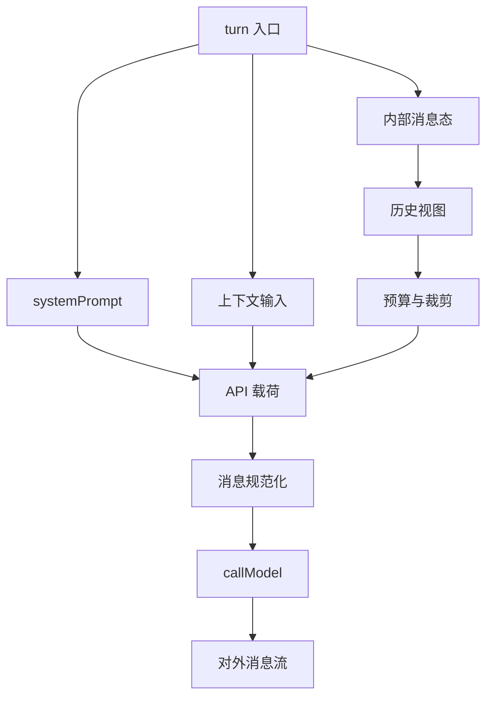

## 本章目标

这一章专门研究 Claude Code 里的 message / context assembly，尽量沿着源码链路回答几个更具体的问题：

1. Claude Code 的上下文到底是在什么地方组装的？
2. `QueryEngine`、`query()`、attachments、normalization 分别负责什么？
3. system prompt、user context、system context、history、tool results、attachments 是怎样汇合到同一轮 API 请求里的？
4. `normalizeMessagesForAPI(...)` 究竟只是整理格式，还是一层更关键的边界转换？
5. SDK 看到的消息流，和真正发给模型的上下文，是什么关系？

这一章的边界也需要先讲清楚：

- 这里主要讨论 **runtime 中消息与上下文如何被分阶段装配、裁剪、补充、转换**；
- 不重新展开第 13 章已经讲过的 QueryEngine / query loop 总体状态机，只在它们直接参与上下文装配时提到；
- 不重讲第 17 章的 memory system 本体，只把 memory 当作一种会进入上下文的来源；
- 也不把重点放在错误恢复，第 19 章已经讨论 recovery，这里只在它会改变 message/context shaping 时顺带提及。

## 一、先给出总体判断

如果只基于当前源码做判断，我会把 Claude Code 的消息与上下文装配概括成：

> 一条跨 `QueryEngine`、`query()`、attachment synthesis、history projection、以及 `normalizeMessagesForAPI(...)` 的分阶段装配流水线；它并不是单次 prompt 拼接，而是 runtime 持续把内部消息状态投影成“当前可发送上下文”的过程。

如果再拆细一点，可以把这条流水线理解成六层：

1. **turn 入口装配层**：`QueryEngine` 构造 `systemPrompt`、`userContext`、`systemContext`
2. **历史投影视图层**：`query()` 从 compact boundary 之后的消息切片开始，再叠加 snip / microcompact / collapse / autocompact
3. **turn 内增量补充层**：tool results、queued commands、memory、skill discovery 等 attachment 在后续节点并入
4. **API 边界转换层**：`normalizeMessagesForAPI(...)` 把内部消息模型转换成 API 可接受的 messages
5. **模型调用层**：`prependUserContext(...)` 与 `appendSystemContext(...)` 分别从 user / system 两边把上下文送进 `callModel(...)`
6. **外部流映射层**：SDK 再收到一条重新映射过的消息流，而不是原始 API payload

这说明 Claude Code 的“上下文”不是某个固定对象，而是一个 runtime 投影结果。

更重要的是，从源码里很容易看出它明确区分了几件经常被混在一起的东西：

- **内部保存的消息状态**
- **当前 turn 的可发送历史视图**
- **额外补充的 attachment 上下文**
- **真正发往 API 的规范化消息**
- **再暴露给 SDK / UI 的外部消息表示**

这也是为什么它的上下文装配看起来不像简单的 prompt concatenation，而更像 runtime message shaping。

## 二、message/context assembly 不是一次拼接，而是 staged pipeline

先把这一章的核心流水线压成一张图：

如果只看 `callModel(...)` 的入口，容易误以为 Claude Code 只是把一堆字符串和消息拼好以后发给 API。

但从 `src/QueryEngine.ts`、`src/query.ts`、`src/utils/api.ts`、`src/utils/messages.ts` 连起来看，更稳妥的说法是：

- turn 开始时先构造 system/user/systemContext 基础框架
- query 入口再基于 compact boundary 生成一份“当前历史视图”
- 在进入 API 前，这份视图还会经历多轮 runtime shaping
- tool 执行完以后，又会把新的 attachments 与 tool results 并回下一轮上下文
- 最终在 API 边界上，再由 `normalizeMessagesForAPI(...)` 做一次更严格的转换

因此上下文装配真正的单位不是：

- “一整段 prompt”

而是：

- **一组不同来源、不同生命周期、不同约束的 message/context fragments**

这些 fragments 在不同阶段被汇合，并且每次汇合后，都还可能继续被裁剪、重排、过滤或转换。

## 三、`QueryEngine` 负责 turn 入口装配

## 1. `QueryEngine` 先取得 system prompt parts 与上下文字典

`QueryEngine.submitMessage()` 在 turn 入口会调用 `fetchSystemPromptParts(...)`，拿到：

- `defaultSystemPrompt`
- `userContext`
- `systemContext`

源码位置：`src/QueryEngine.ts:288-300`

这一步很关键，因为它说明 Claude Code 不是把所有上下文都塞进 history 里，而是从一开始就把：

- system prompt
- user-facing reminder context
- system-side runtime context

分成不同通道准备。

## 2. `systemPrompt` 是多段拼装，而不是单一模板

接着 `QueryEngine` 会构造：

- custom prompt 或 default prompt
- 可选的 memory mechanics prompt
- 可选的 `appendSystemPrompt`

然后通过 `asSystemPrompt([...])` 组成最终的 `systemPrompt`。

源码位置：`src/QueryEngine.ts:310-325`

这里有两个值得强调的判断：

第一，memory mechanics prompt 进入的是 **system prompt 通道**，不是 attachment 通道；这和第 17 章里 memory prompt 的定位一致。

第二，`systemPrompt` 在这里仍然只是 **prompt blocks**，还不是最终带上 `systemContext` 的系统上下文。

也就是说，`QueryEngine` 负责的是：

- **turn 入口基础 prompt 装配**

而不是：

- API 请求最终 payload 的一次性生成

## 3. `processUserInput(...)` 先把用户输入及相关附件写入内部消息状态

`QueryEngine.submitMessage()` 之后会调用 `processUserInput(...)`，拿回：

- `messagesFromUserInput`
- `shouldQuery`
- `allowedTools`
- `modelFromUserInput`
- `resultText`

然后把 `messagesFromUserInput` 推入 `mutableMessages`。

源码位置：`src/QueryEngine.ts:410-434`

这说明用户输入并不是直接拿去调用模型，而是先进入：

- QueryEngine 的内部消息状态

因此 QueryEngine 更像：

- 会话级 message store + turn entry assembler

而不是单次 API wrapper。

## 4. `buildSystemInitMessage(...)` 不是模型上下文，而是 SDK 元数据

在真正进入 query loop 之前，`QueryEngine` 还会 `yield buildSystemInitMessage(...)`，其中包含：

- cwd
- tools
- mcp servers
- model
- permission mode
- slash commands
- skills
- plugins
- output_style
- fast mode state

源码位置：`src/QueryEngine.ts:540-551`, `src/utils/messages/systemInit.ts:53-95`

这里很容易混淆，但必须分清：

- `system/init` 是 **SDK stream 元数据**
- 不是发给模型的 system prompt
- 也不是 conversation history 的一部分

这已经提前暴露出本章的一个核心主题：

- **发给外部消费者的消息流** 与 **发给模型的上下文** 是两套不同表示

## 四、`query()` 负责把内部历史投影成当前 turn 的可发送视图

## 1. API-bound history 从 compact boundary 之后开始

`queryLoop()` 每轮最先做的关键动作之一是：

- `let messagesForQuery = [...getMessagesAfterCompactBoundary(messages)]`

源码位置：`src/query.ts:365`

而 `getMessagesAfterCompactBoundary(...)` 会：

- 找到最后一个 compact boundary
- 从该处切片
- 在启用 snip 时再投影成 `projectSnippedView(...)`

源码位置：`src/utils/messages.ts:4643-4655`

这意味着 Claude Code 发给 API 的历史，从定义上就不是：

- 全量 transcript

而是：

- **compact-aware / snip-aware 的当前历史投影视图**

这点很重要，因为它说明“当前上下文”是 runtime 根据历史状态生成的视图，不等于内部持有的全部消息。

## 2. 历史视图在进入 API 前还会继续被 runtime shaping

`messagesForQuery` 生成后，还会依次经过：

- `applyToolResultBudget(...)`
- snip compact
- microcompact
- context collapse
- autocompact

源码位置：`src/query.ts:379-535`

所以即使已经过了 compact boundary，history 仍然不是稳定不变的。Claude Code 会继续基于：

- token 预算
- cache editing
- collapsed context view
- proactive compaction

把它进一步改造成更适合本轮发送的样子。

这说明 query loop 的一个核心职责并不是“执行模型调用”本身，而是：

- **不断把内部 message state 变形为当前可发送上下文**

## 3. `appendSystemContext(...)` 与 `prependUserContext(...)` 分别从 system / user 两端注入上下文

在真正调用 `callModel(...)` 之前，`query.ts` 会构造：

- `fullSystemPrompt = asSystemPrompt(appendSystemContext(systemPrompt, systemContext))`
- `messages: prependUserContext(messagesForQuery, userContext)`

源码位置：`src/query.ts:449-452`, `src/query.ts:659-707`

而 `appendSystemContext(...)` 会把 `systemContext` 拼成：

- `key: value` 行文本，追加在 system prompt blocks 之后

`prependUserContext(...)` 则会把 `userContext` 变成一条带 `<system-reminder>` 的 meta user message，插到 messages 前面。

源码位置：`src/utils/api.ts:437-474`

这说明 Claude Code 明确把两类上下文分到了不同注入面：

- **systemContext → system prompt side**
- **userContext → user message side**

所以它不是“统一上下文 blob”，而是按 API 语义分层注入。

## 五、attachments 是 turn 内增量上下文，而不是原始 history 的天然组成部分

## 1. attachment 注入发生在 tool 执行之后

`query.ts` 里有一句很关键的注释：

- “Be careful to do this after tool calls are done, because the API will error if we interleave tool_result messages with regular user messages.”

源码位置：`src/query.ts:1535-1537`

随后它才会调用 `getAttachmentMessages(...)`，把 attachments 逐个 yield，并推入 `toolResults`。

源码位置：`src/query.ts:1580-1590`, `src/utils/attachments.ts:2937-2969`

这说明 attachment 的角色不是：

- 原始对话历史的一部分

而是：

- **turn 内在特定收集点并入的补充上下文**

也就是说，attachments 更像 runtime 增量注入层。

## 2. attachment 来源很多，但都通过统一 attachment channel 进入

`getAttachmentMessages(...)` 本身只是壳，真正逻辑在 `getAttachments(...)`。但从当前使用链路已经能稳定看出，它会汇合多类来源，包括：

- queued commands
- dynamic skill attachments
- todo reminders
- 任务/计划相关提醒
- file attachments
- memory attachments
- skill discovery attachments

即便这些来源语义完全不同，最终都被包装成：

- `AttachmentMessage`

再并回下一轮上下文。

因此 attachment 在架构上更像：

- **异构上下文来源的统一并入口**

## 3. relevant memory prefetch 是典型的 turn 内异步补充

第 17 章已经分析过 relevant memory。放到本章语境下，更关键的是它的注入时机。

`startRelevantMemoryPrefetch(...)` 会在 query loop 入口启动：

- 用当前最后一条真实 user message 作为检索输入
- 异步 side-query relevant memories
- 不阻塞主 turn
- 等到 tool 之后的 collect point，如果 ready 再注入

源码位置：`src/query.ts:301-305`, `src/utils/attachments.ts:2361-2424`

之后又会通过 `filterDuplicateMemoryAttachments(...)` 基于 `readFileState` 去重，再转成 attachment messages。

源码位置：`src/query.ts:1592-1614`, `src/utils/attachments.ts:2520-2541`

所以 relevant memory 在这里不是 durable memory 本体，而是：

- **turn 内按相关性补充的一次动态 attachment 注入**

## 4. skill discovery prefetch 也是同一种模式

skill discovery prefetch 与 memory prefetch 非常相似：

- 前面并发启动
- 后面 collect-if-ready
- 再以 attachment 形式注入

源码位置：`src/query.ts:323-335`, `src/query.ts:1617-1628`

这进一步说明 Claude Code 的上下文扩展方式不是只有一种 attachment 来源，而是已经把：

- memory
- skills
- queued commands
- various runtime hints

都统一纳入 turn 内动态补充机制。

## 六、`normalizeMessagesForAPI(...)` 是内部消息模型到 API 消息模型的转换器

## 1. 这不是小整理，而是边界转换层

如果只看函数名，`normalizeMessagesForAPI(...)` 容易被理解为“发请求前顺手整理一下 messages”。

但从实现看，它做的事情远远不止轻量整理。源码位置：`src/utils/messages.ts:1989-2369`

它至少同时做了下面几类工作：

- attachment 重排
- 虚拟消息剔除
- synthetic API error 清理
- 系统 local command 消息改写成 user message
- 连续 user message 合并
- tool reference 过滤/重写
- oversized media/document 相关 block 剥离
- assistant tool_use 输入 API 化
- assistant 同 message id 合并
- attachment 转 user messages
- orphaned thinking / trailing thinking / whitespace assistant 清理
- 最终图像有效性校验

这已经明显不是“格式整理”，而是：

- **把内部 runtime message representation 翻译成 API-compatible message representation**

## 2. internal message model 与 API message model 是分离的

从 `normalizeMessagesForAPI(...)` 的存在及其复杂度，可以稳定推出一个架构判断：

- Claude Code 维护的内部消息模型，比 API 所要求的消息模型更丰富

内部模型里有：

- attachment
- progress
- system local command
- virtual messages
- synthetic api errors
- richer tool metadata
- SDK / transcript 需要保留但 API 不该再看到的痕迹

而 API 侧要求的是更干净、更受限的 `user` / `assistant` 序列。

所以 `normalizeMessagesForAPI(...)` 的真正作用不是“美化”，而是：

- **边界收窄与语义投影**

## 3. attachment 会在这一层被转译成真正的 user messages

`normalizeMessagesForAPI(...)` 里对 `attachment` 的处理很关键：

- `normalizeAttachmentForAPI(...)`
- 再与前面的 user message 合并
- 最后一起进入 API-bound message list

源码位置：`src/utils/messages.ts:2269-2290`

这说明 attachment 在内部是独立 message type，但到了 API 边界，它会被投影成：

- user-side content blocks / user messages

也就是说，attachment channel 是 runtime 的内部结构，而不是 API 的原生结构。

## 4. assistant message merging 说明内部 streaming 痕迹不会原样暴露给 API

`normalizeMessagesForAPI(...)` 会向后查找：

- 同一 `message.id` 的 earlier assistant message
- 然后 merge content blocks

源码位置：`src/utils/messages.ts:2246-2267`

这一步说明内部 runtime 允许 assistant streaming 产生分段消息、交织消息，甚至夹杂不同 agent / teammate 的 interleaving；但 API 历史回放时，需要恢复成一致的 assistant trajectory。

因此 normalization 的另一个职责是：

- **把 streaming-era message fragmentation 收敛成 replay-safe history**

## 七、SDK 看到的是另一条映射后的外部消息流

## 1. QueryEngine 在 query 输出之上再做一次 SDK 映射

`QueryEngine.submitMessage()` 并不是简单把 `query()` yield 的 message 直接透传给 SDK。

相反，它会根据 message.type 分别处理：

- assistant / user / compact boundary 写入 transcript 与 mutableMessages
- progress / attachment 也单独记录与转发
- stream_event 可选对外暴露
- system/api_error 转成 SDK 侧的 `api_retry`
- local command output 转成 synthetic assistant message
- 最后再汇总成 `result`

源码位置：`src/QueryEngine.ts:687-1155`

所以 SDK 看到的是：

- **针对外部消费者重新设计过的流式表示**

而不是 query 内部消息数组原封不动的镜像。

## 2. `system/init` 与 `result` 都属于外部协议层，不属于模型上下文

`system/init` 和最后的 `result` 都是 SDK 协议消息：

- 前者用于暴露 session metadata
- 后者用于封装 stop_reason、usage、cost、permission_denials、structured_output 等结果信息

源码位置：`src/utils/messages/systemInit.ts:41-95`, `src/QueryEngine.ts:1135-1155`

这再次说明 Claude Code 至少维护了三种不同的消息表示：

1. **内部 runtime messages**
2. **发给 API 的 normalized messages**
3. **发给 SDK / client 的 protocol messages**

如果不把这三层分开，很容易误判某个字段究竟是不是“模型真正看见的上下文”。

## 八、这套系统更像 runtime message shaping，而不是 prompt concatenation

## 1. 上下文是投影结果，不是单个对象

从 `QueryEngine` 到 `query()` 再到 normalization，可以看出 Claude Code 没有一个简单的“context object”在全程传递。

更准确地说，它在维护：

- 一份会话级内部消息状态
- 一份当前 turn 的历史投影视图
- 一套 system/user context dictionaries
- 一组可延迟注入的 attachments
- 一份 API-bound normalized message list

因此“当前上下文”其实是这些层共同作用后的投影结果。

## 2. 历史、补充上下文、协议消息被刻意分层

如果只从表面看，这些都叫 messages；但在架构上它们不是同一种东西：

- history messages：会话推进的主历史
- attachments：turn 内补充上下文
- SDK messages：给外部消费者的协议层事件

Claude Code 的可取之处就在于它没有把这三者混成一个数组一路硬传，而是让它们在不同边界上转换。

## 3. system / user 双通道注入是刻意设计，不是 incidental implementation

`appendSystemContext(...)` 与 `prependUserContext(...)` 的分工说明，Claude Code 并不把所有额外上下文都塞成一段 system prompt。

它保留了：

- system 侧权威背景
- user 侧 reminder / contextual note

两种不同语义位置。

这比“一股脑塞进 system prompt”更细，也更容易让后续 normalization、recovery 与协议层保持一致。

## 九、和已有文档的边界

## 1. 与第 13 章的边界

第 13 章讨论的是 QueryEngine 与 query loop 的总体运行时结构：

- turn 怎样推进
- assistant/tool/tool_result 怎样衔接
- compact/recovery/stop hooks 怎样挂进去

本章不重复整个状态机，而是专门追问：

- 这些 runtime 片段最后是怎样组成“当前 API 上下文”的
- 哪些属于 history，哪些属于 attachment，哪些属于 normalization

可以理解为：

- 第 13 章讲 loop 怎样跑
- 本章讲 loop 在跑的过程中怎样不断塑形上下文

## 2. 与第 17 章的边界

第 17 章讨论的是 memory system 本体：

- durable memory
- retrieval / prefetch
- prompt injection
- stop-hook extraction

本章只把 memory 视为一种上下文来源，重点不在 memory 自身，而在：

- memory prompt 怎样进入 `systemPrompt`
- relevant memory 怎样以 attachment 进入当前 turn
- memory 进入 API 前又怎样经过 normalization 体系

所以：

- 第 17 章讲 memory 是什么系统
- 本章讲 memory 怎样成为当前上下文的一部分

## 3. 与第 19 章的边界

第 19 章讨论的是 recovery / error handling：

- prompt-too-long
- media-size
- max_output_tokens
- fallback / stop failure hooks

本章只有在这些机制会改变 message/context shaping 时才提及，例如：

- reactive compact 会重构 `messagesForQuery`
- withheld error 会决定某些消息是否先不暴露

重点仍然不是恢复状态机，而是：

- recovery 怎样影响可发送上下文的形成

## 十、Harness 视角

从 harness engineering 的角度看，这一套设计有几个特别值得学的点。

## 1. 内部消息模型与 API 消息模型最好分开

Claude Code 最值得借鉴的一点是，它没有强迫内部状态直接长成 API 需要的样子。

内部 runtime 可以更丰富：

- attachment
- progress
- synthetic error
- transcript-only state
- protocol metadata

到了 API 边界再收敛成可发送表示。

这比一开始就用 API 数据结构承载所有内部语义，稳定得多。

## 2. “当前上下文”最好是投影视图而不是原始历史

`getMessagesAfterCompactBoundary(...)`、snip、microcompact、collapse、autocompact 连起来说明：

- 当前发送给模型的上下文，最好由 runtime 动态投影
- 而不是把历史原样累积到不能动为止

这样系统才能在长会话里持续做 token、cache、history management。

## 3. 增量上下文补充最好走 attachment channel

Claude Code 没有把 memory、queued commands、skill discovery 全都粗暴塞回主历史，而是让它们先走 attachment 机制，再在 API 边界转译。

这种设计的好处是：

- 来源异构也能统一管理
- 注入时机可控
- 可以在 history 与补充上下文之间保留边界

## 4. 外部协议流不应等同于模型上下文

`system/init`、`result`、`api_retry`、replay user messages 这些都说明：

- 给客户端看的协议层消息
- 和给模型看的上下文

应该明确分层。

否则一旦 UI、SDK、session resume、transcript persistence 开始演化，系统就会很快陷入概念混乱。

## 十一、工程化启发

## 1. 上下文装配要按阶段拆开

如果 prompt、history、attachments、normalization、SDK mapping 全堆在一个函数里，最后很容易出现：

- 某些消息被重复发送
- 某些协议消息误进模型上下文
- 某些内部控制消息残留在 API history 里

Claude Code 当前的分阶段装配虽然复杂，但边界相对清楚。

## 2. attachment 是一种很有价值的中间层

很多系统只有两种对象：

- 历史消息
- 最终 prompt

Claude Code 多出来的 attachment layer 很重要，因为它给了 runtime 一个“先作为内部补充上下文存在，再在 API 边界转译”的缓冲层。

这对 memory、tool diagnostics、queued work、skill discovery 都很有帮助。

## 3. normalization 应被当作架构层，而不是工具函数

`normalizeMessagesForAPI(...)` 的规模和职责已经说明：

- normalization 不是 util 层小函数
- 它其实是 runtime 边界层的一部分

如果把这类函数当成纯后处理，很容易低估它对系统稳定性的影响。

## 4. 最难的是维护多种消息视图的一致性

Claude Code 当前最成熟的地方之一，就是它已经在同时处理：

- 内部运行态
- API 发送态
- SDK 展示态
- transcript/resume 持久态

message assembly 的真正难点从来不只是“怎么拼 prompt”，而是：

- 多种消息视图怎样既分层，又不彼此失真

## 本章小结

如果把这一章压缩成一句话，可以说：

> Claude Code 的消息与上下文装配不是单次 prompt 拼接，而是一条由 `QueryEngine` 入口装配、query loop 历史投影、attachment 增量补充、`normalizeMessagesForAPI(...)` 边界转换、以及 SDK 外部映射共同组成的 staged runtime pipeline。

从源码能稳妥得出的结论包括：

- `QueryEngine` 负责 turn 入口的 prompt/context 基础装配，而不是最终 API payload 一次性构造；
- `query()` 会把内部历史不断投影成 compact-aware、budget-aware、recovery-aware 的当前可发送视图；
- attachments 是 turn 内增量补充上下文的统一通道，而不是原始 history 的天然组成部分；
- `normalizeMessagesForAPI(...)` 是内部消息模型到 API 消息模型的关键转换层，而不只是轻量整理；
- SDK 看到的消息流与模型真正看到的上下文并不相同，它们属于另一层协议映射；
- 因此，Claude Code 的上下文工程更适合被理解成 runtime message shaping，而不是简单 prompt concatenation。

## 源码证据索引

- `src/QueryEngine.ts` — turn 入口的 system prompt / contexts 装配、`processUserInput(...)`、SDK 消息映射
- `src/query.ts` — `messagesForQuery` 形成、attachments collect point、`callModel(...)` 调用前装配
- `src/utils/messages.ts` — compact-aware history projection、`normalizeMessagesForAPI(...)`、assistant merge
- `src/utils/api.ts` — `appendSystemContext(...)` 与 `prependUserContext(...)`
- `src/utils/attachments.ts` — queued commands、memory、skill discovery 等 attachment synthesis
- `src/utils/messages/systemInit.ts` — `system/init` 作为外部协议元数据层

## 相关章节

- [第 13 章：query loop 怎样持续塑形当前 query view](/claude-code-architecture/13-agent-loop-deep-dive/)
- [第 17 章：memory prompt 与 relevant memory attachment 的上下文入口](/claude-code-architecture/17-memory-system-and-persistence/)
- [第 19 章：recovery / compact / withheld errors 如何改变可发送上下文](/claude-code-architecture/19-recovery-and-error-handling-deep-dive/)
- [第 23 章：SDK stream / protocol 与内部消息模型的边界](/claude-code-architecture/23-streaming-output-event-protocol-and-sdk-boundary/)
- [第 24 章：compact boundary / effective history / context collapse](/claude-code-architecture/24-compact-context-collapse-and-recovery-boundary/)
- [第 27 章：Context Plane 在总体运行时架构图中的位置](/claude-code-architecture/27-runtime-architecture-map/)




