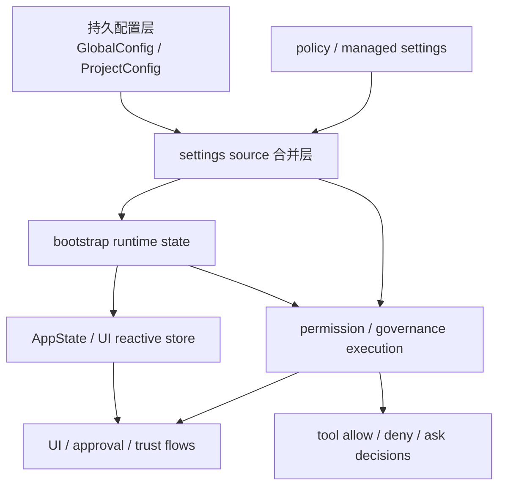

## 本章目标

这一章聚焦 Claude Code 运行时里经常被混在一起、但源码中其实明确分层的几类东西：

1. 什么属于 config，什么属于 state，什么又只是一次会话里的 runtime bookkeeping？
2. `GlobalConfig` / `ProjectConfig`、settings source merge、bootstrap global state、React `AppState` 分别负责什么？
3. 权限、trust、policy、managed settings 是怎样从“配置”一路落到“运行时治理”的？
4. Claude Code 的治理边界究竟画在哪里？

这一章不重复前面章节已经讲过的 query loop、message assembly、memory retrieval 本体，而是把注意力集中在：

- **配置从哪里来**
- **状态存在哪里**
- **治理规则怎样生效**
- **哪些层能影响运行时行为，哪些层只是被动反映运行时行为**

## 一、先给出总体判断

如果只基于当前源码做判断，我会把 Claude Code 的这一块概括成：

> 一套由持久配置层、settings 源合并层、会话级 bootstrap runtime state、UI/AppState 层，以及权限/策略治理层共同组成的分层控制系统；它们彼此连接，但并不混成一个“大一统状态对象”。

更具体地说，可以稳定分出五层：

1. **持久配置层**：`src/utils/config.ts` 中的 `GlobalConfig` / `ProjectConfig`
2. **settings source 合并层**：`src/utils/settings/*`
3. **会话级 runtime state 层**：`src/bootstrap/state.ts`
4. **UI / reactive app state 层**：`src/state/AppState.tsx`
5. **权限与治理执行层**：`src/utils/permissions/permissions.ts` 与 `src/hooks/useCanUseTool.tsx`

这五层最重要的架构意义，不是“代码分文件放了”，而是：

- **持久化** 和 **会话态** 被分开
- **声明式 settings** 和 **运行时操作性 permission context** 被分开
- **UI store** 和 **底层 session global state** 被分开
- **治理规则来源** 和 **治理规则执行** 被分开

因此 Claude Code 的配置/状态系统并不是一个单点 state store，而更像多个边界清楚的控制面叠加。

## 二、先把 config 和 state 分开

## 1. `config.ts` 里的 config 是“可持久化的项目/全局偏好与记录”

从 `src/utils/config.ts` 能直接看出，Claude Code 仍然保留了一层非常传统的 durable config：

- `GlobalConfig`
- `ProjectConfig`
- trust dialog acceptance
- projects map
- 与项目关联的持久记录
- cache / lock / backup / restore 相关逻辑

这层 config 的几个关键特征是：

- 它落盘
- 它有读写与并发保护
- 它是跨会话保留的
- 它不是一次 query 内的临时状态

因此这里的 config 更接近：

- 用户级或项目级持久设置与记录
- 而不是“当前 turn 正在发生什么”

这一点从 `getGlobalConfig()`、`saveGlobalConfig(...)`、`getCurrentProjectConfig()`、`saveCurrentProjectConfig(...)` 这样的接口就很明显。

## 2. `bootstrap/state.ts` 里的 state 是“当前会话 runtime 的全局工作内存”

与 `config.ts` 相对，`src/bootstrap/state.ts` 体现的是另一种完全不同的东西。

源码顶部的注释已经很说明问题：

- `DO NOT ADD MORE STATE HERE - BE JUDICIOUS WITH GLOBAL STATE`
- `THINK THRICE BEFORE MODIFYING`

这说明这里不是“理想化的数据模型”，而是一个被强烈约束的 runtime global state 容器。

其中保存的内容包括：

- cwd / originalCwd / projectRoot
- session id / lineage
- token / cost / duration 统计
- model override
- tracing / telemetry / logging
- cron tasks
- prompt cache latch
- SDK betas
- 会话级 trust / runtime 开关
- setting source allowlist

这些东西共同指向一个很清楚的判断：

- `bootstrap/state.ts` 不是配置文件映射
- 也不是 UI store
- 它是 **session-scoped runtime substrate**

换句话说，这里保存的是 Claude Code 进程为了把一次会话跑起来而必须维护的“底盘状态”。

## 3. `AppState` 不是 bootstrap state 的别名

`src/state/AppState.tsx` 又是第三种状态层。

从 `AppStateProvider(...)`、`useAppState(...)`、`useSetAppState()` 以及 `useSettingsChange(onSettingsChange)`、`applySettingsChange(...)` 这条链路能看出：

- `AppState` 是 React / UI-facing store
- 它会响应 settings 变化
- 它为界面和交互逻辑提供 reactive state
- 它不等于 bootstrap global state

这层状态的核心角色不是“保存所有真相”，而是：

- 把底层系统状态和 settings 变化投影成 UI / 交互可消费的 store

所以如果混淆 `bootstrap/state.ts` 和 `AppState.tsx`，就会误以为 Claude Code 有一个统一的 central state；但源码实际上更接近：

- 底层 session state
- 上层 UI state
- 中间通过事件/更新同步

## 三、settings 系统负责什么

## 1. settings 不是单一文件，而是一套 source merge 体系

`src/utils/settings/constants.ts` 最直接地给出了 settings source 的核心顺序：

- `userSettings`
- `projectSettings`
- `localSettings`
- `flagSettings`
- `policySettings`

这说明 Claude Code 里的 settings 从一开始就不是“读一个 config 文件然后结束”，而是：

- 多来源
- 有优先级
- 可按 source 启停
- 最终合并成 runtime 可见 settings

因此 settings 系统的职责更像：

- **声明式配置输入整合层**

而不是最终执行层。

## 2. `settings.ts` 是 merge / cache / policy 协调中心

从 `src/utils/settings/settings.ts` 里能看到一整条相对完整的 settings pipeline：

- `parseSettingsFile(...)`
- `getSettingsRootPathForSource(...)`
- `getSettingsFilePathForSource(...)`
- `getSettingsForSource(...)`
- `getInitialSettings()`
- `getSettingsWithSources()`
- `getSettingsWithErrors()`
- `updateSettingsForSource(...)`

这说明 settings 子系统主要负责几件事：

1. 找到每个 source 的物理来源
2. 解析与校验
3. 合并不同来源
4. 记录来源与错误
5. 缓存结果，供 runtime 读取

因此 settings 系统本质上解决的是：

- “最终有效设置是什么，以及它来自哪里”

而不是：

- “当前某个工具到底能不能执行”

后者属于 permissions 执行层。

## 3. policy settings 不是普通 source，而是治理优先级更高的输入

`settings.ts` 里一个很关键的地方在于：policy settings 并不是和普通 settings source 完全对称。

源码中明确能看出 policy origin 有自己的优先级链路，大意是：

- remote managed settings
- MDM
- managed file
- HKCU

而且它更接近 “first source wins” 的治理型输入，而不是普通 merge。

这背后的架构含义很强：

- Claude Code 并不是把企业治理策略当作“又一个用户可覆盖的配置文件”
- 它把 policy / managed settings 视为更高阶的控制面

所以 settings 层内部其实也已经分成两类：

- 面向用户/项目的普通配置来源
- 面向治理/组织控制的 managed / policy 来源

## 四、schema 与类型系统体现了什么治理意图

## 1. `types.ts` 是配置与治理边界的契约面

`src/utils/settings/types.ts` 里最重要的不是字段数量，而是它定义了系统承认哪些治理概念存在。

这里可以看到：

- `PermissionsSchema`
- `SettingsSchema`

以及大量明显偏治理的字段，比如：

- `strictPluginOnlyCustomization`
- `allowManagedHooksOnly`
- `allowManagedPermissionRulesOnly`
- `allowManagedMcpServersOnly`
- `skipDangerousModePermissionPrompt`
- `skipAutoPermissionPrompt`
- `useAutoModeDuringPlan`

这说明 Claude Code 的 settings schema 不是单纯“界面偏好设置”。

它直接编码了：

- 哪些可扩展面能开放
- 哪些必须受 managed policy 控制
- 哪些 permission 行为可以被治理层约束
- 哪些自动化行为需要显式 opt-in

因此 `types.ts` 在架构里的地位更接近：

- **治理能力的声明式合同**

而不仅是 JSON 类型定义。

## 2. hooks / permissions / MCP 都被纳入统一治理框架

从 schema 字段分布看，一个重要观察是：

- hooks
- permission rules
- MCP servers
- marketplace / plugin policy

都被放进同一大 settings contract 里。

这说明 Claude Code 并不是分别对这些子系统做零散治理，而是试图建立一个统一的 policy surface，让这些“可扩展且可能有风险”的能力共享治理逻辑。

这对整个架构非常关键，因为它意味着：

- 治理层是横切面的
- 不只是某个工具模块自己的小规则

## 五、`config.ts` 和 `settings.ts` 为什么要并存

这是这部分源码最容易让人困惑的地方：既然已经有 settings merge system，为什么还需要 `config.ts`？

## 1. `settings` 更像输入配置；`config` 更像 durable app/project record

从源码职责看，比较稳妥的区分是：

- `settings.ts` 负责多来源设置汇总与来源治理
- `config.ts` 负责应用/项目级持久记录与读写

前者更像：

- runtime 使用前的声明式输入整合

后者更像：

- Claude Code 自己维护的 durable metadata / preference store

如果把两者混为一谈，就会很难解释为什么：

- settings 有 source precedence
- config 有 file lock / backup / restore / trust acceptance cache

因为这本来就是两套不同问题。

## 2. `config.ts` 明显承担了更强的“应用自有持久层”职责

`config.ts` 中对缓存、写锁、备份恢复、stale write 防护的重视，说明它面对的是：

- Claude Code 自己要长期维护的数据结构

而不是“任意来源都来覆盖”的 settings merge 问题。

所以更准确地说：

- `settings` 是输入治理层
- `config` 是持久记录层

二者互补，而不是重复。

## 六、permission 系统怎样把声明式配置变成可执行治理

## 1. `permissions.ts` 才是真正的执行面

`src/utils/permissions/permissions.ts` 是本章里最关键的治理执行文件之一。

从函数命名就能看出它不是在“描述规则”，而是在“执行规则”：

- `getAllowRules(...)`
- `getDenyRules(...)`
- `getAskRules(...)`
- `getDenyRuleForTool(...)`
- `getAskRuleForTool(...)`
- `checkRuleBasedPermissions(...)`
- `hasPermissionsToUseTool(...)`
- `hasPermissionsToUseToolInner(...)`
- `applyPermissionRulesToPermissionContext(...)`
- `syncPermissionRulesFromDisk(...)`

这说明 Claude Code 的权限系统并不是静态 schema 校验，而是完整的 runtime decision pipeline。

## 2. 原始 settings 不直接拿来判断，先被投影成 operational permission context

从 `applyPermissionRulesToPermissionContext(...)` 以及 `ToolPermissionContext` 的使用方式看，一个非常重要的架构判断是：

- settings 里的 permissions 字段，不会直接等于运行时判断对象
- 它们会先被整理、合并、同步成 runtime-operational context

这意味着 Claude Code 把：

- 配置表达
- 运行时判断输入

区分开了。

这是个很成熟的做法，因为原始 settings 适合“声明”，但不一定适合“高频执行判断”。

## 3. 权限决策是多阶段 pipeline，不是简单 allow/deny 查表

从当前源码链路看，`hasPermissionsToUseTool(...)` 背后不是单一 if/else，而是多阶段处理，大致包括：

1. deny rules
2. ask rules
3. tool-specific checks
4. mode-based handling
5. bypass-permissions fast path
6. auto-mode classifier path
7. headless / async fallback behavior

这说明 Claude Code 的 permission system 并不是一个平面的 ACL，而更像：

- **规则匹配 + 模式判断 + 运行时上下文修正** 的组合治理系统

也因此，权限不是只由某个配置文件决定，而是由：

- settings
- permission mode
- 当前工具
- 当前运行环境
- 当前交互能力

共同决定。

## 七、`useCanUseTool.tsx` 暴露了权限系统的 UI 接缝

## 1. 底层 permission engine 和交互式确认之间有专门桥接层

`src/hooks/useCanUseTool.tsx` 很关键，因为它显示了 Claude Code 没有让 UI 直接调用底层规则函数后就草率结束，而是专门做了一层 hook 桥接。

它的职责包括：

- 构建 permission context
- 调用 `hasPermissionsToUseTool(...)`
- 处理 allow / deny / ask 三类结果
- 管理 tool confirm queue
- 设置 `ToolPermissionContext`
- 接入 classifier approval / coordinator / swarm 等交互流

这说明 permission system 在架构上至少分两层：

- 下层：规则与执行判断
- 上层：交互式授权流程与 UI 状态管理

## 2. “ask” 是 runtime branch，不只是配置值

如果只看 schema，很容易把 `ask` 误以为是某个静态标签；但 `useCanUseTool.tsx` 说明它实际上会触发一整条 runtime 交互分支。

因此：

- `allow` / `deny` 可以更接近最终决策
- `ask` 更像需要 UI / runtime 协调完成的中间态

这进一步证明 Claude Code 的 permission system 不是单层配置解释器，而是 runtime orchestration 的一部分。

## 八、trust、managed settings 与治理边界

## 1. trust 并不是抽象理念，而是代码里实际存在的边界条件

`config.ts` 中的 `checkHasTrustDialogAccepted()` 很重要，因为它说明 trust 在 Claude Code 里不是文档概念，而是实际的 gating condition。

而且它带有：

- 路径相关性
- 缓存
- 父目录遍历语义

这意味着 trust 更像：

- 当前项目/路径是否进入更高信任协作模式的前置条件

而不是普通布尔偏好。

## 2. 某些高风险跳过项明确不完全信任 project settings

`settings.ts` 中对一些高信任 bypass 类行为的处理，能看出 project settings 并不总被当作足够高信任来源。

这背后的治理意图非常明确：

- 项目目录里的配置不应天然拥有和用户级/managed policy 同等的安全控制权

这类设计非常关键，因为 Claude Code 是在代码仓库里运行的工具；如果 project-local config 可以轻易提升危险权限，治理边界会很脆弱。

所以从源码能稳妥得出的判断是：

- **并不是所有 settings source 在安全语义上等价**

## 3. managed / policy controls 体现了“组织控制高于项目局部意志”

无论是 policy precedence，还是 `allowManagedHooksOnly`、`allowManagedPermissionRulesOnly` 这类字段，都在说明一个稳定事实：

- Claude Code 允许企业或受管环境把某些高风险扩展面收紧
- 且这种收紧不是普通项目设置可以轻易推翻的

这说明治理边界的设计目标不是“给一切配置同权”，而是：

- 明确区分谁有资格定义最终规则

## 九、为什么这些层不能合并成一个“大状态对象”

## 1. 因为持久性语义不同

- `config.ts`：跨会话 durable
- `settings.ts`：多来源输入求值结果
- `bootstrap/state.ts`：当前进程/会话 runtime
- `AppState.tsx`：UI reactive projection

这些对象的生命周期明显不同。只要生命周期不同，强行合并就会让语义混乱。

## 2. 因为信任语义不同

settings source 之间就已经有信任差异：

- user / project / local / flag / policy
- managed vs non-managed
- project settings 在某些场景下不算高信任

而 permission context 又是把这些输入加工成运行时决策对象。

所以如果把它们都糊成一个统一 store，会很难维持：

- 数据来源可追踪性
- 信任等级差异
- 治理优先级

## 3. 因为执行频率不同

- durable config 读写相对低频但要求可靠
- settings merge 在 source 变化时更新
- permission checks 在工具执行前高频发生
- AppState 更新要照顾 UI 响应性

这些路径的优化目标完全不同，因此拆层是合理的。

## 十、源码链路下几个更稳的判断

## 1. Claude Code 明确区分了“声明规则”和“执行规则”

- `src/utils/settings/types.ts` / `settings.ts` 负责声明与合并
- `src/utils/permissions/permissions.ts` 负责执行与判断

这点非常关键，因为很多系统会把 schema、配置和 runtime decision 混在一起，最后很难维护。

## 2. bootstrap global state 是受克制的 runtime substrate，而不是万能状态仓库

`src/bootstrap/state.ts` 里的强警告说明团队很清楚这层很危险：它必须存在，但必须尽量克制增长。

这意味着他们把它看成：

- 不可完全避免的底层 runtime 全局面

而不是鼓励大家无限堆字段的 central state。

## 3. AppState 是投影层，不是底层事实源的唯一中心

`AppState.tsx` 更像响应式外观层，把设置变化和运行时状态投射为 UI 可消费形态。它不是整个系统唯一的 canonical state。

## 4. policy / managed settings 明显是治理层，不只是配置来源之一

它们拥有不同的优先级和不同的安全语义，这说明 Claude Code 从架构上承认：

- “谁能配置系统” 本身就是架构问题的一部分。

## 十一、和前面章节的边界

## 1. 与第 15 章的边界

第 15 章讨论的是 hooks、stop hooks、post-sampling hooks、prefetch 等 runtime 挂接点。

本章不讨论这些 runtime side-channel 何时执行，而讨论：

- 是谁决定这些能力能不能被开启
- 哪些 settings / policy / permissions 能约束它们

也就是：

- `15` 更偏执行阶段挂点
- 本章更偏这些挂点背后的治理来源与边界

## 2. 与第 17 章的边界

第 17 章讨论的是 memory system 的 durable storage、retrieval、prompt injection 与 extraction。

本章只在 memory 受 settings / governance 影响时顺带提到，不重讲 memory 生命周期本体。重点仍然是 config/state/governance 的分层。

## 3. 与第 20 章的边界

第 20 章讲 message/context assembly pipeline。

本章不讨论消息怎样进入模型上下文，而讨论：

- 哪些配置与状态层控制 runtime 行为
- 哪些治理规则限制工具、扩展面和权限模式

也就是：

- `20` 讲上下文装配
- 本章讲 runtime 治理底盘

## 十二、Harness 视角

从 harness engineering 的角度看，这部分设计有几个特别值得学的点。

## 1. 不要把 config、state、policy、UI store 混成一个系统

Claude Code 当前源码最清楚地说明：

- durable config
- merged settings
- runtime bootstrap state
- UI app state
- permission execution context

最好拆开建模。

否则后面会很容易出现：

- 生命周期混乱
- 来源不可追踪
- 权限语义漂移
- UI state 与治理逻辑耦死

## 2. 治理来源和治理执行要分层

Claude Code 把：

- rule source / settings schema / managed policy
- runtime permission enforcement

分成两层，这一点很成熟。

因为“配置长什么样”和“运行时怎么裁决”其实是两类完全不同的工程问题。

## 3. project-local config 不应天然拥有最高信任

这一点非常重要。当前源码已经体现出：

- 某些高风险 bypass / dangerous mode 相关行为
- 不会简单接受 project settings 作为最高信任来源

这对任何在仓库中运行的 agent 都是很值得借鉴的设计原则。

## 4. 全局 runtime state 必须承认存在，但要强约束膨胀

`bootstrap/state.ts` 上方那种近乎“警告牌”式注释，本质上是在承认现实：

- 某些 runtime 全局状态不可避免
- 但一定要持续抑制它膨胀成黑洞

这是很实用、也很诚实的工程态度。

## 十三、工程化启发

## 1. 先按生命周期拆层

最先要区分的不是技术栈，而是生命周期：

- 持久层
- 会话层
- turn 层
- UI 层

生命周期一旦清楚，很多 config/state 混乱自然会减少。

## 2. 再按信任等级拆来源

Claude Code 的 settings source 和 policy source 说明，真正成熟的 agent runtime 需要承认：

- 不同来源不是同权的

这一点对 permissions、hooks、MCP、plugin 都一样。

## 3. 执行时不要直接吃原始配置

更稳的做法是像 Claude Code 一样：

- 原始 settings 先 merge
- 再转成更适合运行时判断的 permission context
- 最后再做工具级决策

这样可以把静态声明和动态执行解耦。

## 4. UI store 最好是投影层，而不是治理核心

治理核心最好留在底层可测试、可组合的 runtime 模块里；UI 只负责把结果、选择和交互状态呈现出来。`useCanUseTool.tsx` 这类桥接层就是这种思路的体现。

## 本章小结

如果把这一章压缩成一句话，可以说：

> Claude Code 的配置、状态与治理系统不是一个统一大仓库，而是一组按持久性、来源可信度、执行职责和交互层次分开的控制面：`config.ts` 管 durable record，`settings.ts` 管多来源配置求值，`bootstrap/state.ts` 管会话级 runtime substrate，`AppState.tsx` 管 UI 投影，而 `permissions.ts` / `useCanUseTool.tsx` 则把这些输入落成真正的运行时治理判断。

从源码能稳妥得出的结论包括：

- Claude Code 明确区分了 durable config、merged settings、session runtime state、UI state 与 permission execution context；
- policy / managed settings 在安全语义上高于普通项目局部配置，说明治理层不是普通配置层的附属品；
- 权限判断是多阶段 runtime pipeline，而不是静态 allow/deny 查表；
- project settings 在部分高风险场景下并不被视为足够高信任来源；
- 这套架构的核心目标不是“统一存一切状态”，而是让不同生命周期、不同信任等级、不同执行频率的控制信息各归其位。

## 源码证据索引

- `src/utils/config.ts` — durable config / project config / trust 记录与持久层读写
- `src/bootstrap/state.ts` — session-scoped runtime substrate
- `src/state/AppState.tsx` — UI/reactive app state 投影层
- `src/utils/settings/settings.ts` — settings source merge、policy/managed settings 处理
- `src/utils/settings/types.ts` — settings / permissions schema 与治理合同面
- `src/utils/settings/constants.ts` — settings source 顺序与启用规则
- `src/utils/permissions/permissions.ts` — permission execution pipeline
- `src/hooks/useCanUseTool.tsx` — permission pipeline 的 UI bridge

## 相关章节

- [第 06 章：state / config / permissions 总览](/claude-code-architecture/06-state-config-and-permissions/)
- [第 15 章：hooks 与 side-channels](/claude-code-architecture/15-hooks-and-side-channels-deep-dive/)
- [第 20 章：message/context assembly](/claude-code-architecture/20-message-and-context-assembly-deep-dive/)
- [第 22 章：tool system 与执行边界](/claude-code-architecture/22-tool-system-and-execution-boundaries/)
- [第 27 章：总体运行时架构图](/claude-code-architecture/27-runtime-architecture-map/)
- [第 29 章：术语表与核心区分](/claude-code-architecture/29-glossary-and-core-distinctions/)




