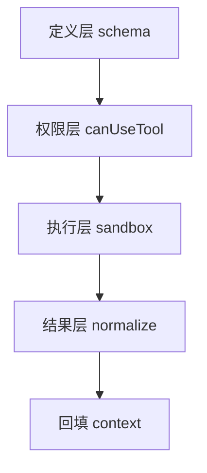

这一章把焦点放到 Claude Code 最核心、也最容易被表面化理解的一层：**tool system**。

如果前几章已经把 query loop、message/context assembly、hooks、memory、config/state/governance 这些外围骨架拆开了，那么这一章要回答的是更靠近 agent “手和脚”的问题：

1. Claude Code 里的 tool 到底是什么抽象？
2. tool 是怎样被注册、暴露给模型、执行、回填结果的？
3. tool system 和 command、hooks、skills、MCP 分别是什么关系？
4. 执行边界是画在 tool 定义、tool registry、permission pipeline，还是 query loop 里？

这一章不重讲前面已经讨论过的 permission 治理全景，也不展开具体 UI 交互，而是重点回答：

- **tool 在 runtime 中是什么单位**
- **tool call 怎样从模型输出变成真实执行**
- **tool system 的边界在哪里**
- **Claude Code 为什么没有把“一切可执行能力”都混成同一种插件**

---

### 一、先给出总体判断

如果只基于当前源码做判断，我会把 Claude Code 的工具系统概括成：

> 一套由 tool schema 暴露、tool registry 组织、query loop 调度、permission system 裁决、以及 tool result 回填共同组成的受控执行子系统；它既是模型可调用能力的统一入口，又被刻意限制在清晰的执行边界内。

更具体地说，它至少可以拆成五层：

1. **tool 定义层**：每个工具的名称、输入 schema、执行函数、元信息  
2. **tool registry / aggregation 层**：把可用工具收集成当前 query 可暴露的集合  
3. **model exposure 层**：把工具描述转成 API 可见的 tool schema  
4. **execution orchestration 层**：query loop 中对 tool use / tool result 的调度  
5. **governance / boundary 层**：permissions、mode、trust、headless 约束

这意味着 Claude Code 的 tool system 并不是：

- 一个随便塞函数的函数表
- 一个开放式“任意插件执行器”
- 或者把 shell、skills、hooks、MCP 全部揉成一个统一黑箱

而更像：

- **模型可调用执行面的标准化子系统**

---

### 二、tool 在 Claude Code 中首先是什么，不是什么

#### 1. tool 是“模型可见的受约束能力单元”

在 Claude Code 里，tool 最核心的特征不是“能执行代码”，而是：

- 有稳定名字
- 有输入结构
- 有暴露给模型的 schema
- 有运行时实现
- 有权限/模式约束
- 有结果回填格式

因此 tool 更接近：

- **agent runtime 中可被模型调用的标准能力接口**

而不是简单的内部 helper function。

这点很关键，因为很多系统会误把“任何内部函数”都视作潜在 tool；Claude Code 的做法明显更克制：只有进入 tool contract 的能力，才算真正的 tool。

#### 2. tool 不等于 command

前面章节已经能看到 queued commands、slash commands、SDK/system messages、skills 等概念。它们和 tool 有交集，但不是一回事。

比较稳妥的区分是：

- **tool**：模型调用的执行接口
- **command**：用户或系统发起的命令式入口
- **skill**：高层工作流/提示资产
- **hook**：runtime 某阶段的挂接点
- **MCP**：外部能力提供机制

也就是说，tool system 是 Claude Code 的“执行接口层”，但不是整个扩展系统的总称。

---

### 三、tool system 的核心职责

#### 1. 向模型声明“你可以调用什么”

tool system 的第一职责，不是执行，而是**暴露能力面**。

这包括：

- 当前有哪些工具可用
- 每个工具叫什么
- 参数长什么样
- 参数需要满足什么约束
- 哪些工具在当前 query 中被启用

也就是说，在真正运行之前，tool system 先解决的是：

- 模型能看到什么操作面

这是一个很重要的边界，因为 Claude Code 并不是让模型直接访问内部 runtime API，而是先通过 tool schema 做一层能力投影。

#### 2. 把模型生成的 tool use 转成可控执行

第二职责才是执行。

这一步通常包括：

- 接收模型输出中的 tool use
- 解析 tool name 和 input
- 在 registry 中找到对应实现
- 经过 permission / mode 判断
- 执行工具
- 生成 tool result 消息
- 送回主消息流

因此 tool execution 不是“模型说了就跑”，而是一个 runtime adjudication 过程。

#### 3. 把执行结果重新纳入消息状态机

第三职责是回填。

Claude Code 的 agent loop 不是“跑个工具然后在外面自己拼字符串”，而是把工具输出重新纳入：

- message state
- follow-up 判断
- 后续模型轮次上下文

这说明 tool system 不只是 side effect executor，它还是主状态机的一部分。

---

### 四、tool registry 的位置与意义

#### 1. registry 是 execution surface 的组织层

在任何像 Claude Code 这样的 agent runtime 里，工具数量一旦变多，就必须有某种 registry / aggregation 层；否则 query loop 根本无法稳定地回答：

- 当前哪些工具可用？
- 哪些是内建工具？
- 哪些来自额外来源？
- 哪些当前 query 应该隐藏？
- 同名/冲突如何处理？

因此 registry 的意义不是“好看地列个表”，而是：

- **把离散工具实现收敛成当前 query 的执行面**

它解决的是能力组织问题。

#### 2. registry 是 model exposure 和 runtime implementation 之间的桥

tool 定义本身可能带有很多内部信息，但不是所有内部信息都应暴露给模型。

所以 registry / aggregation 往往起到桥接作用：

- 向内连接具体实现
- 向外输出 API-compatible tool schema

这层如果没有，系统就容易出现两个问题：

1. 模型看到的工具描述和真实实现不一致  
2. runtime 无法根据 query 条件裁剪暴露面  

Claude Code 的整体架构明显更偏向后者：让 tool system 在 query 入口处形成“当前可见工具集合”。

---

### 五、tool execution 为什么不能直接等同于 Bash

#### 1. Bash 只是 tool 的一种，不是 tool system 本身

从整个仓库脉络看，Bash 工具虽然重要，但 Claude Code 从来没有把“有 Bash 就等于 agent 会执行”这件事当成系统全貌。

因为 tool system 里至少还包括：

- 文件读写工具
- 搜索工具
- 编辑工具
- 计划/任务管理工具
- 浏览/抓取类工具
- 调度类工具
- 可能的 MCP 暴露工具

这说明 Bash 很强，但它只是统一工具面中的一个成员。

#### 2. 如果把执行全都退化成 Bash，边界会立刻变坏

为什么 Claude Code 要保留大量专门工具，而不是让模型用 Bash 做一切？架构上最核心的原因有三个：

- **可审计性**：专门工具比 Bash 更容易理解和审查  
- **权限颗粒度**：不同工具可以挂接不同治理策略  
- **结果结构化**：专门工具的输入输出更可控  

所以 Claude Code 的 tool system 并不是在追求“最强大的万能执行器”，而是在追求：

- **模型能力面尽量强，同时执行边界尽量窄**

---

### 六、tool 与 permission system 的关系

#### 1. tool system 提供能力，permission system 决定能否落地

前一章已经说明，权限系统不是 schema 注释，而是 runtime 执行裁决层。放到工具系统语境里，这意味着：

- tool system 负责“可以调用哪些能力”
- permission system 负责“当前这次能不能真的执行”

因此两者不是重复关系，而是上下游关系。

#### 2. permission 不只是前置检查，也是 execution path 的塑形器

权限判断不仅会决定 allow / deny / ask，还会改变执行路径本身：

- 是否弹出确认
- 是否进入 classifier 分支
- 是否在 headless 下直接拒绝
- 是否允许 bypass
- 是否要求更高信任来源

所以更准确地说：

- permission system 不只是工具系统前面的一道门
- 它还是工具执行路径的分叉器

这意味着 Claude Code 的工具系统本质上是：

- **带治理分叉的执行系统**

---

### 七、tool 与 query loop 的关系

#### 1. tool execution 属于主状态机，而不是外部插件回调

这是理解 Claude Code tool system 的关键点之一。

在很多粗糙的 agent 设计里，tool call 只是“模型吐出一个 JSON，然后外部跑一下，再把结果拼回去”。Claude Code 更明显不是这种风格。

从前面章节已经能确定：

- query loop 负责 assistant → tool → tool_result → continue / stop 的主推进
- tool result 回到消息状态
- 后续是否继续由主循环决定

这说明 tool execution 不是外挂，而是主状态机的一部分。

#### 2. tool result 不是普通日志，而是状态转移输入

工具执行后的结果之所以重要，不只是因为它告诉用户发生了什么，而是因为它会影响：

- 后续模型是否继续
- 后续模型看到什么上下文
- recovery / stop-hook / attachments 等后续机制

因此 tool result 在 Claude Code 中更接近：

- **消息状态机中的结构化反馈节点**

而不是单纯日志输出。

---

### 八、tool system 和 hooks / skills / MCP 的边界

#### 1. 和 hooks 的边界：tool 是执行面，hook 是阶段挂点

tool 是模型明确调用的能力接口；hook 是 runtime 在特定生命周期阶段自动触发的挂接点。

所以：

- tool 更偏显式执行
- hook 更偏阶段化旁路

二者都能“做事”，但语义完全不同。

#### 2. 和 skills 的边界：tool 是低层能力，skill 是高层工作流资产

skills 更像：

- prompt 资产
- 工作流模板
- 指导 agent 怎样组织任务

tool 则更像：

- 真正落地动作的原子/半原子执行接口

因此 skill 不应直接等同于 tool；更准确地说，skill 往往会引导模型去使用 tool。

#### 3. 和 MCP 的边界：MCP 更像能力来源，tool 是最终暴露形态之一

从架构上看，MCP 更适合理解成：

- 外部能力如何接入 Claude Code runtime

而 tool system 关心的是：

- 当前 query 最终给模型呈现什么能力面

所以 MCP 和 tool 并不互斥。更合理的关系是：

- MCP server 提供能力来源
- tool system 决定这些能力如何进入模型可调用面

---

### 九、Claude Code 的 tool system 为什么显得“克制”

#### 1. 它没有把所有 side-channel 都升级成 tool

从前面几章已经看到，Claude Code 有很多 runtime 机制：

- relevant memory prefetch
- post-sampling hooks
- stop hooks
- skill improvement
- auto dream
- prompt suggestion

但这些并没有全都被包装成 tool。

这说明团队有一个很明确的边界意识：

- 不是所有能执行逻辑的东西都适合变成模型显式调用接口

这很重要，因为 tool 一旦暴露给模型，就意味着：

- 成为主执行面的一部分
- 进入权限与上下文预算问题
- 需要稳定 schema 和结果语义

#### 2. 它更偏“把工具面做稳”，而不是“把一切都做成工具”

这是一种成熟取舍。

如果系统把任何内部机制都改成 tool，短期看很统一，长期往往会变成：

- 暴露面膨胀
- 模型决策负担变重
- 权限治理变复杂
- 调试成本升高

Claude Code 当前更像在坚持：

- tool 是重要但受限的能力面
- 不是系统中唯一的动作形态

---

### 十、源码链路下几个更稳的判断

#### 1. tool 是模型可调用能力的标准 contract，而不是随意函数暴露

从整体结构看，Claude Code 明显把 tool 当作正式 contract 对待：有 schema、有执行面、有治理面、有回填路径。

#### 2. tool registry 的真正作用是形成“当前 query 的可执行表面”

不是简单收集，而是把多来源能力裁剪、整理、转换成 query 当前能用的那一层 surface。

#### 3. tool execution 与 query loop 强耦合，但与内部其他 side-channel 有明显边界

也就是说：

- tool execution 是主路径
- hook / prefetch / extraction 更像旁路或尾部机制

这让主状态机保持清晰。

#### 4. tool system 的核心价值之一是把能力治理嵌进执行面

如果没有 tool-level contract，就很难把：

- schema 暴露
- permission gating
- result normalization
- auditability

稳定地装进同一套运行时结构里。

## 本章小结

如果把这一章压缩成一句话，可以说：

> Claude Code 的 tool system 不是一个简单的函数调度器，而是一套由 tool contract、registry、模型暴露、主循环调度、权限裁决与结果回填共同组成的受控执行子系统；它既承担模型操作面的核心职责，又通过清晰边界避免把所有 runtime 机制都混成同一种“工具”。

从源码脉络能得出的倾向性结论包括：

- tool 是模型可调用能力的标准 contract，而不是任意内部函数；
- registry 的关键作用是形成当前 query 的可执行表面；
- tool execution 属于 query loop 主状态机的一部分，而不是外置回调；
- permission system 不是附属检查，而是工具执行路径的重要塑形器；
- Claude Code 刻意保留了 tool、hook、skill、MCP 等不同能力形态的边界，没有为追求表面统一而全部工具化。

## 源码证据索引

- `src/query.ts` — tool use / tool_result 的主循环推进与回填
- tool 相关模块 — tool contract、registry、执行实现
- `src/utils/permissions/permissions.ts` — tool 执行前的 permission 决策与模式分叉
- `src/hooks/useCanUseTool.tsx` — permission pipeline 的 UI/interaction bridge

## 相关章节

- [第 02 章：commands 与 tools 总览](/claude-code-architecture/02-commands-and-tools/)
- [第 16 章：tool orchestration 与 concurrency](/claude-code-architecture/16-tool-orchestration-and-concurrency/)
- [第 21 章：config/state/governance 边界](/claude-code-architecture/21-config-state-and-governance-boundaries/)
- [第 23 章：streaming / protocol / SDK boundary](/claude-code-architecture/23-streaming-output-event-protocol-and-sdk-boundary/)
- [第 27 章：总体运行时架构图](/claude-code-architecture/27-runtime-architecture-map/)
- [第 29 章：术语表与核心区分](/claude-code-architecture/29-glossary-and-core-distinctions/)


