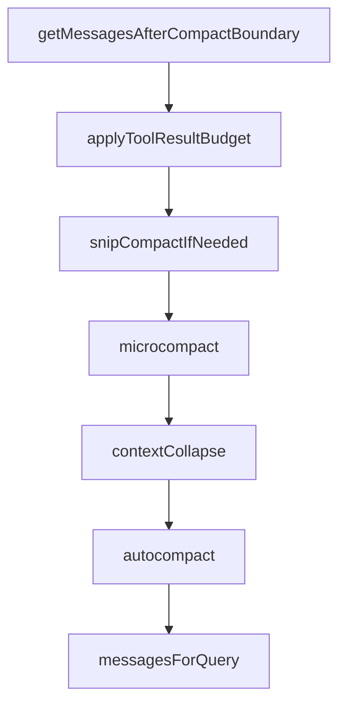

这一章专门研究 Claude Code 长会话里另一个非常核心的运行时子系统：

- **会话压缩**
- **上下文收缩**
- **compact boundary**
- **恢复边界**

如果前面几章已经把 query loop、message/context assembly、hooks、memory、tool system、streaming protocol 拆开了，那么这一章要回答的是：

1. Claude Code 在上下文变长后，如何避免主消息历史无限膨胀？
2. compact、snip、microcompact、collapse 这些机制在架构上分别扮演什么角色？
3. 被压缩后的历史和后续 query 之间，是怎样通过 boundary 连接的？
4. “恢复”在这里意味着重新拿回完整历史，还是在压缩后的边界上继续推进？

这一章的重点不是一般性地说“上下文太长会压缩”，而是从运行时结构去理解：

- **什么东西被保留**
- **什么东西被裁掉**
- **哪些边界被显式编码**
- **压缩后系统如何继续保持一致性**

---

### 一、先给出总体判断

如果只基于当前源码做判断，我会把 Claude Code 的会话压缩与上下文收缩系统概括成：

> 一套由 compact boundary、snip/microcompact/collapse 等历史裁剪机制、压缩后消息投影、以及后续 query 在边界之后继续推进的恢复式上下文管理子系统；它的目标不是保留全部原始历史，而是在有限上下文预算内维持会话连续性与状态一致性。

更具体地说，可以稳定拆成四层：

1. **原始历史层**：完整的 assistant / user / tool / result 交互序列  
2. **压缩/裁剪层**：compact、snip、collapse、microcompact 等机制  
3. **boundary 投影层**：后续 query 实际看到的是 boundary 之后的有效历史  
4. **恢复推进层**：系统在压缩后的状态上继续执行，而不是要求完整历史重放

这一点很关键，因为它说明 Claude Code 的 compact system 并不是：

- 一个单纯的 transcript summarize 按钮
- 或者把旧消息全删掉再硬接着聊
- 更不是对完整历史的透明无损保留

而是：

- **显式边界化的上下文收缩系统**

---

### 二、为什么 Claude Code 必须有 compact boundary

#### 1. 长会话里真正稀缺的不是历史，而是可用上下文预算

agent runtime 一旦进入长会话，真正的问题并不是“有没有历史”，而是：

- 当前 query 能带多少历史进模型
- 哪些历史还值得继续保留
- 哪些历史已经可以通过摘要/边界替代
- 继续硬塞原始消息会不会拖垮 token 预算和稳定性

因此 compact system 的核心目标不是存档，而是：

- **为后续推理让出可用上下文空间**

#### 2. 如果没有 boundary，压缩就会语义失控

很多系统会做一种模糊压缩：历史“被总结了一下”，但后续 runtime 并没有一个明确边界告诉你：

- 哪部分仍然是原始消息
- 哪部分已经变成 summary
- 后续 query 应该从哪里继续
- 某条旧 tool result 是否还应被视为真实可依赖输入

Claude Code 更成熟的地方在于，它不是只做“压缩结果”，而是做：

- **compact boundary**

这意味着压缩不只是内容操作，还是状态机结构操作。

---

### 三、`getMessagesAfterCompactBoundary(...)` 说明了什么

#### 1. 后续 query 并不总是基于完整历史

前面已经看到 `src/utils/messages.ts` 里的：

- `getMessagesAfterCompactBoundary(...)`

以及 `src/query.ts` 中的：

- `let messagesForQuery = [...getMessagesAfterCompactBoundary(messages)]`

这两个点已经足够说明一个重要事实：

- Claude Code 在后续 query 中，默认关注的是 **compact boundary 之后的消息投影**
- 而不是原始历史的无条件全量重放

这说明 compact boundary 不是“文档里的概念”，而是实际影响 query 输入构造的 runtime 机制。

#### 2. boundary 是历史语义重置点，而不只是截断点

如果它只是简单截断，那么它的意义不过是“从第 N 条以后开始取消息”。但从 Claude Code 的整体语义看，boundary 更像：

- 一次会话上下文的阶段切换点
- 原始历史与压缩后继续推进之间的分界
- 之后消息被视为当前有效工作集
- 之前消息不再以原始形态进入当前 query

因此它更接近：

- **语义边界**
- 而不仅是数组切片位置

---

### 四、compact、snip、microcompact、collapse 分别像什么

这一组概念前面已经多次出现，但放在统一视角下，可以做出更稳妥的分工判断。

#### 1. compact：显式的阶段性历史压缩

compact 最像的是：

- 把会话推进到一个新阶段
- 用更短表示替代一部分先前历史
- 并明确留下后续运行所依赖的边界

它通常不是局部小修，而更像：

- 一次面向会话连续性的阶段性收缩

#### 2. snip：更局部、更直接的裁剪动作

snip 更像：

- 对历史中的某些部分做局部切除或标记
- 不一定意味着整个会话进入新压缩阶段
- 更偏细粒度裁剪

所以 snip 在语义上比 compact 更“小刀式”。

#### 3. microcompact：更轻量的即时收缩

从命名就能看出，microcompact 大概率代表：

- 比完整 compact 更轻的上下文回收动作
- 更适合在 runtime 中频繁或局部触发
- 目标是避免会话在达到大压缩前就先失控膨胀

因此它更像：

- 小步快跑式的上下文预算管理

#### 4. collapse：结构压平或聚合，而不一定等于完整 compact

collapse 更像一种结构整形语义：

- 把某些中间消息/链条压平成更紧凑形式
- 减少历史展开层次
- 不一定等于一次完整的 compact 周期

也就是说，这几个词虽然都和“收缩”相关，但并不完全同义：

- compact 偏阶段切换
- snip 偏局部裁剪
- microcompact 偏轻量收缩
- collapse 偏结构压平

---

### 五、压缩之后，系统到底保留了什么

#### 1. 保留的是继续工作的有效上下文，不是完整过去

Claude Code 的 compact system 最重要的一点，是它并不试图让后续模型始终“记得全部过去原文”。

它真正想保留的是：

- 当前任务还能继续推进所需的信息
- 必要的阶段摘要
- compact boundary 之后的有效工作集
- 与当前 runtime 一致的后续消息序列

因此压缩后的目标不是历史保真，而是：

- **工作连续性保真**

#### 2. 工具链路的一致性比逐字保留更重要

在 agent runtime 里，真正危险的不是“少带了一句旧聊天”，而是：

- tool/result 关系失真
- 后续 assistant 对当前状态理解错位
- 恢复时把已结束阶段重新当成未完成
- 历史边界不清导致重复行动

所以 compact system 更强调：

- 结构一致性
- 阶段边界清晰
- 当前任务可继续

而不是所有原始文本都可重新展开。

---

### 六、“恢复”在这里到底是什么意思

#### 1. 恢复不是回到完整未压缩过去

“恢复”这个词很容易让人误以为：一旦压缩后出了问题，系统应该重新拿回完整历史继续跑。

但从当前源码脉络看，更稳妥的理解是：

- 恢复主要发生在 **压缩后的 runtime 继续推进** 语境里
- 系统关心的是如何在现有边界后恢复一致执行
- 而不是总能回到原始未压缩历史的完美重演

也就是说，恢复更像：

- **在边界后重建稳定工作态**

而不是：

- 回溯到压缩前世界。

#### 2. recovery 和 compact boundary 一起定义了“当前有效现实”

前面关于 recovery / error handling 的章节已经指出，Claude Code 对恢复的处理一直很 runtime-oriented。放到 compact system 里也是一样：

- compact boundary 之前的内容已经属于过去阶段
- 当前 query 和后续恢复都围绕 boundary 之后的现实展开

这意味着 boundary 一旦成立，就重新定义了：

- 什么算当前有效上下文
- 什么算可继续依赖的历史
- 什么已经退化成摘要背景而不是原始输入

---

### 七、为什么会话压缩不是 memory system 的替代品

#### 1. compact 解决的是当前长会话预算，memory 解决的是跨会话长期上下文

第 17 章已经说明，memory system 关注的是：

- durable memory
- relevant memory retrieval
- prompt injection
- stop-hook extraction

而 compact system 关注的是：

- 当前消息历史太长怎么办
- 如何在本次会话内继续推进
- 如何在上下文预算限制下保住连续性

所以二者不是一回事。

#### 2. compact 更偏“当前 runtime 的历史管理”

更准确地说：

- memory 更像长期协作上下文基础设施
- compact 更像当前 session runtime 的历史收缩机制

它们会协同，但不能互相替代。

如果把 compact 误认为 memory，就会误以为：

- 压缩后的摘要天然就是长期记忆  
但 Claude Code 明显不是这么建模的。

---

### 八、为什么 compact system 也不是简单 summarize

#### 1. summarize 是内容变短；compact 是 runtime 边界重组

单纯 summarize 只回答一个问题：

- “能不能把这段话说短一点？”

但 compact system 还要回答：

- 之后的 query 从哪里继续？
- 哪些消息仍算当前工作集？
- tool/result 结构如何保持一致？
- boundary 怎么表示？

因此 compact 的本质是：

- **状态结构重组**
- 而不只是文本压缩

#### 2. 没有 boundary 的 summarize 很难支撑 agent loop

如果 agent loop 只拿到一段模糊 summary，却没有清楚知道：

- 历史在哪断开
- 新阶段从哪开始
- 旧消息哪些还有效

那后续执行很容易混乱。

Claude Code 明显已经把这个问题工程化了：压缩必须配套 boundary 才能成为 runtime 能用的机制。

---

### 九、compact system 和前面章节的关系

#### 1. 与第 20 章的关系：20 讲消息装配，本章讲历史怎样被裁成可装配输入

第 20 章里，message/context assembly 关心的是：

- query 提交前最终送进模型的消息怎么构造

本章进一步说明：

- 在构造之前，历史本身已经经过 compact boundary 投影

所以：

- `20` 更偏“怎么装配”
- 本章更偏“装配之前历史怎么被收缩”

#### 2. 与第 19 章恢复/error 处理的关系：本章聚焦上下文恢复边界，而不是 API error recovery 本体

第 19 章的恢复主要讨论：

- query 失败怎么恢复
- tool / API / loop 中断后的处理

本章讨论的是：

- 历史压缩之后如何维持连续性
- compact boundary 如何定义后续可恢复现实

所以它们相关，但关注点不同。

#### 3. 与第 17 章 memory system 的关系：本章是 session-level history management，不是 durable memory

这一点必须保持清楚，否则很容易把“会话压缩”误认成“长期记忆”。

---

### 十、源码链路下几个更稳的判断

#### 1. Claude Code 的上下文收缩不是隐式发生的，而是通过 compact boundary 显式编码的

`getMessagesAfterCompactBoundary(...)` 已经足以说明 boundary 是 runtime 真正依赖的结构，而不是分析者后加的概念。

#### 2. 后续 query 依赖的是 boundary 之后的有效历史投影，而不是全量原始 transcript

这一点是整个 compact system 最核心的 runtime 事实。

#### 3. compact system 的目标是保持工作连续性，而不是历史逐字保真

这比“总结一下旧消息”要成熟得多，也更适合 agent runtime。

#### 4. 恢复语义是在压缩后边界上继续推进，而不是总能回到压缩前世界

因此 compact boundary 也是恢复边界。

## 本章小结

如果把这一章压缩成一句话，可以说：

> Claude Code 的会话压缩与上下文收缩系统，不是简单把旧消息总结一下，而是通过 compact boundary、snip/microcompact/collapse 等机制，把长会话历史重组为一个可继续工作的有效上下文；后续 query 和恢复都围绕这个边界之后的现实继续推进。

从源码脉络能得出的倾向性结论包括：

- compact boundary 是实际参与 query 输入构造的显式 runtime 结构；
- 后续 query 依赖的是 boundary 之后的有效历史投影；
- compact 的目标是工作连续性，而不是历史逐字保真；
- 恢复语义主要是在压缩后的边界上继续推进；
- compact system、summary 和 durable memory 应被视为不同层级的问题。

## 源码证据索引

- `src/utils/messages.ts` — `getMessagesAfterCompactBoundary(...)` 与 effective history 相关处理
- `src/query.ts` — boundary 之后消息如何进入 query 输入
- compact / collapse 相关实现 — 历史收缩与边界化逻辑

## 相关章节

- [第 17 章：memory system and persistence](/claude-code-architecture/17-memory-system-and-persistence/)
- [第 19 章：recovery and error handling](/claude-code-architecture/19-recovery-and-error-handling-deep-dive/)
- [第 20 章：message and context assembly](/claude-code-architecture/20-message-and-context-assembly-deep-dive/)
- [第 27 章：总体运行时架构图](/claude-code-architecture/27-runtime-architecture-map/)
- [第 29 章：术语表与核心区分](/claude-code-architecture/29-glossary-and-core-distinctions/)


