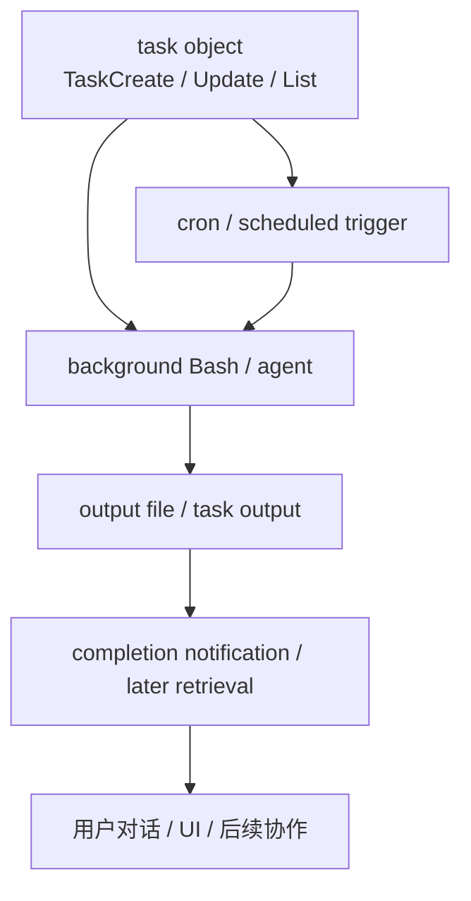

这一章聚焦 Claude Code 里另一个很有代表性的运行时能力：

- **任务管理**
- **调度**
- **后台执行**
- **异步结果回收**

如果前面几章已经把 query loop、tool system、streaming protocol、compact system 等核心路径拆开了，那么这一章要回答的是：

1. Claude Code 怎样在一次会话里管理多个任务，而不是只盯着单轮 query？
2. 后台 Bash、后台 agent、定时任务、任务输出回收在运行时里分别属于什么？
3. 这些机制是主状态机的一部分，还是外围的任务基础设施？
4. Claude Code 为什么没有把所有异步行为都塞进 query loop 本体？

这一章的重点不在某个单独工具，而在更大的 runtime 能力：

- **如何让 agent 拥有跨轮次、跨时刻的工作推进能力**
- **如何在不阻塞当前对话的前提下维持任务生命周期**
- **如何把异步工作重新接回用户可见交互流**

---

### 一、先给出总体判断

如果只基于当前源码和工具能力表做判断，我会把 Claude Code 的任务管理与后台执行系统概括成：

> 一套围绕任务对象、后台执行句柄、定时触发、输出回收与用户可见进度管理构成的异步工作基础设施；它服务于 query/runtime，但并不等于 query loop 本身。

更具体地说，可以稳定分出五层：

1. **任务表示层**：当前会话里的 task item、状态、依赖、完成度  
2. **后台执行层**：后台 Bash、后台 agent 等长时运行工作  
3. **调度层**：cron/定时任务与延迟触发  
4. **结果回收层**：任务输出读取、完成通知、后续衔接  
5. **交互桥接层**：把异步任务重新接回用户对话与 UI

这意味着 Claude Code 的任务系统不是：

- 单纯的 todo list
- 也不是只给用户看的 UI 装饰
- 更不是把 query loop 改造成一个总任务调度器

而更像：

- **围绕会话协作建立的一套异步工作支撑层**

---

### 二、为什么 agent runtime 需要任务基础设施

#### 1. 现实中的工作常常比一次 query 更长

一次 query 很适合处理：

- 解释代码
- 做一次短编辑
- 跑一个即时命令
- 生成一小段计划

但很多真实任务都超出单轮同步交互：

- 测试跑很久
- 构建要等待
- 调查任务需要并行搜索
- 提醒/定时动作发生在稍后
- 多步骤实现需要跨多轮维护进度

因此，如果 Claude Code 只有 query loop 而没有任务基础设施，就会出现一个问题：

- agent 会很会“说”，但不太会“持续工作”

#### 2. 异步任务不能强行塞回主 query loop

主 query loop 的核心职责是：

- 当前 turn 的消息推进
- assistant/tool/result 的同步状态转移
- stop / follow-up 判断

如果把所有后台工作都塞进去，会马上遇到：

- 长阻塞
- 多任务状态混乱
- 结果回收时机复杂化
- 用户当前对话与后台工作耦死

所以更成熟的做法，是像 Claude Code 这样额外建立：

- 会话级任务层
- 后台执行句柄
- 定时/回收机制

---

### 三、任务系统首先解决的是什么问题

#### 1. 把“正在做什么”从瞬时对话里提取成持久会话对象

`TaskCreate`、`TaskUpdate`、`TaskList`、`TaskGet` 这类能力说明，Claude Code 里的 task 不是一句自然语言备注，而是正式对象。

它至少承担这些职责：

- 给工作项一个稳定身份
- 记录状态：pending / in_progress / completed
- 保存描述与责任边界
- 支持依赖关系
- 让后续步骤不必完全依赖聊天上下文记忆

所以 task system 本质上解决的是：

- **把工作推进从“聊天里提过”升级为“运行时可追踪对象”**

#### 2. 任务对象是会话协作的中层结构

任务不是最底层执行单元，也不是最高层设计文档。

它更像中层结构，连接：

- 用户目标
- 当前执行步骤
- 后台工作
- 进度展示
- 后续恢复

因此 task 在 Claude Code 里的角色很像：

- **会话级工作协调节点**

---

### 四、后台 Bash 和后台 agent 属于什么

#### 1. 它们是异步执行载体，不是 task 本身

后台 Bash、后台 agent 都有自己的 task ID / output file / 生命周期，但从架构上看，它们更适合理解成：

- **执行载体**
- 而不是用户层任务本身

因为“跑一个后台 Bash”只是在执行某个任务步骤，比如：

- 运行测试
- 启动构建
- 跑搜索
- 获取远程信息

因此更准确的关系是：

- task 描述工作目标
- background Bash / agent 承担执行动作

#### 2. 后台执行的核心价值是把长时工作移出当前 turn

这点非常关键。

如果某条命令需要几分钟，Claude Code 不会要求当前 query 一直卡在那里等它跑完，而是：

- 启动后台执行
- 返回 task/output handle
- 在完成时通知
- 允许后续再读取输出

这使 runtime 从“同步问答器”变成了：

- **可并行推进工作的 agent 环境**

---

### 五、定时任务说明了什么

#### 1. Claude Code 不只支持“现在做”，还支持“以后再做”

`CronCreate`、`CronList`、`CronDelete` 的存在，说明 Claude Code 的任务系统已经超出了单纯即时执行。

它还支持：

- 一次性提醒
- 周期性任务
- durable 或 session-only 调度
- 空闲时触发 prompt

这意味着 Claude Code 运行时承认一种更广义的工作流：

- 当前对话不是唯一时间轴
- 未来某个时刻也可能成为 agent 再次行动的入口

#### 2. cron 不是 query loop 的自然延伸，而是会话层调度能力

这点和前面章节的边界很像。

query loop 负责当前 turn；cron 负责未来触发。

因此 cron 更属于：

- **session/workflow scheduling layer**

而不是消息状态机本身。

这也是为什么 durable cron 会写入 `.claude/scheduled_tasks.json`：它强调的是跨当前即时交互的生命周期。

---

### 六、任务输出回收为什么单独重要

#### 1. 异步系统真正难的不是“启动”，而是“收口”

很多系统都能把后台任务启动起来，但真正麻烦的是：

- 完成后怎么通知
- 输出存在哪里
- 怎么重新纳入对话
- 用户回来时怎么接上
- 失败和中途停止怎么处理

`TaskOutput`、任务完成通知、直接读取 output file 的模式，说明 Claude Code 在这方面已经意识到：

- 后台执行必须有明确回收面

否则后台工作只是“放飞了”，并没有真正成为 agent runtime 的一部分。

#### 2. 输出文件路径是异步工作与后续对话的接缝

任务完成后，系统不是神奇地“记住所有后台打印内容”，而是把结果落到明确 output path，再由后续读取。

这很重要，因为它意味着：

- 异步结果是可引用、可追踪、可延后消费的
- 回收动作和执行动作可以解耦
- 当前 turn 不必背负完整后台输出

这是很成熟的异步架构选择。

---

### 七、为什么任务系统不是简单 UI 功能

#### 1. 它直接改变 agent 的工作方式

如果没有任务系统，Claude Code 只能靠：

- 聊天上下文
- 临时说明
- 用户自己记住进度

而有了 task system 之后，agent 就可以：

- 显式拆工作
- 标记开始/完成
- 建依赖
- 回来继续
- 把并发或长时工作接入当前会话

这显然不是界面装饰，而是 runtime 能力增强。

#### 2. 它是长工作流 agent 的必要支撑层

尤其当 Claude Code 不只是回答问题，而是要：

- 调研
- 实现
- 跑测试
- 回看输出
- 多轮推进

这套 task infrastructure 就变成了会话连续性的基础设施之一。

---

### 八、任务系统与前面章节的边界

#### 1. 与 tool system 的边界：tool 是动作接口，task 是工作组织对象

第 22 章里 tool 更像：

- 被模型调用的受控动作单元

而本章的 task 更像：

- 工作组织与进度对象

所以二者关系是：

- tool 负责做事
- task 负责组织“要做哪些事、做到哪了”

#### 2. 与 streaming protocol 的边界：任务系统更偏长期工作，streaming 更偏当前输出投影

第 23 章讲的是当前 query 运行中的对外事件流；本章讲的是：

- 跨 query 的工作项和后台生命周期

所以 streaming 是当前输出面，task system 是会话工作管理面。

#### 3. 与 compact/memory 的边界：任务让会话连续性不必完全依赖长历史

这也是一个很重要的作用。

有了 task system，即使历史被 compact，当前工作推进也不必完全靠模型从长消息里重新推断，因为部分推进状态已经外化成了 task objects。

---

### 九、Claude Code 为什么没有把任务系统做成“所有事情的唯一容器”

#### 1. 因为不是所有动作都值得升格为任务

如果把每一个小动作都建成 task，会立刻带来：

- 噪声膨胀
- 管理成本上升
- 用户界面过载
- session coordination 反而更乱

Claude Code 当前更合理的方向是：

- 复杂、多步骤、跨轮次工作才进入 task system
- 单步即时动作仍然留在普通 query/tool 语义里

#### 2. 任务层是中层抽象，不该吞掉底层执行或高层设计

前面几章已经分别看到：

- spec / plan 是更高层的设计资产
- tool / Bash / agent 是更低层的执行面
- task 是中间协调层

如果 task 吞掉上下两头，整个系统反而会失去层次。

---

### 十、源码/接口脉络下几个更稳的判断

#### 1. Claude Code 明确把“工作项”与“执行载体”分开了

`TaskCreate/Update/List` 负责工作对象；后台 Bash/agent 负责具体异步执行。这是很清楚的分层。

#### 2. 后台执行系统的价值在于把长时工作从当前 turn 中解耦出来

这使 Claude Code 可以同时保持交互流畅和工作持续推进。

#### 3. cron 说明调度是会话层能力，而不是即时 query 附属物

这让 Claude Code 有了“将来再行动”的结构化入口。

#### 4. 输出回收层是异步任务真正闭环的关键

没有回收面，后台执行就只是临时进程；有了回收面，它才成为协作 runtime 的正式成员。

## 本章小结

如果把这一章压缩成一句话，可以说：

> Claude Code 的任务管理、调度与后台执行系统，是一套独立于即时 query loop 但服务于整个会话协作的异步工作基础设施：task object 负责组织工作，后台 Bash/agent 负责长时执行，cron 负责未来触发，输出回收负责把异步结果重新接回用户可见交互流。

从当前接口与运行时脉络能得出的倾向性结论包括：

- task system 不是 UI 装饰，而是会话级工作协调层；
- 后台 Bash/agent 是执行载体，不等于任务本身；
- cron 体现了 Claude Code 的时间维度调度能力；
- 异步任务真正的关键在于结果回收与重新接入对话；
- 这套基础设施让 Claude Code 不必把所有长期工作都硬塞进单轮 query 或长消息历史里。

## 源码证据索引

- 任务相关工具接口 — `TaskCreate` / `TaskUpdate` / `TaskList` / `TaskGet`
- 后台执行与输出相关接口 — background Bash / agent / `TaskOutput`
- 调度相关接口 — `CronCreate` / `CronList` / `CronDelete`

## 相关章节

- [第 22 章：tool system 与执行边界](/claude-code-architecture/22-tool-system-and-execution-boundaries/)
- [第 23 章：streaming / protocol / SDK boundary](/claude-code-architecture/23-streaming-output-event-protocol-and-sdk-boundary/)
- [第 24 章：compact / effective history](/claude-code-architecture/24-compact-context-collapse-and-recovery-boundary/)
- [第 26 章：subagents / parallel exploration / isolation](/claude-code-architecture/26-subagents-parallel-exploration-and-isolation/)
- [第 27 章：总体运行时架构图](/claude-code-architecture/27-runtime-architecture-map/)
- [第 29 章：术语表与核心区分](/claude-code-architecture/29-glossary-and-core-distinctions/)




