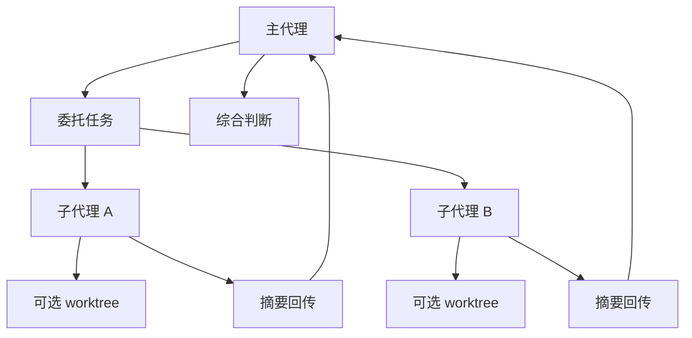

这一章聚焦 Claude Code 里一个非常具有“agent runtime”味道的能力：

- **subagent**
- **并行探索**
- **上下文隔离**
- **委托与回收**

如果前面几章已经把 query loop、tool system、streaming、compact、task/background execution 拆开了，那么这一章要回答的是：

1. Claude Code 为什么要引入子代理，而不是让主会话自己做完所有事情？
2. subagent 和普通工具调用、本地任务、后台 Bash 有什么本质区别？
3. 并行 agent 的价值到底在“更快”，还是“更少污染主上下文”？
4. worktree isolation、fresh context、continue/SendMessage 这些能力在架构上说明了什么？

这一章的重点不是把 Agent tool 当成某个单独功能，而是把它放回整体 runtime 里理解：

- **主代理什么时候委托**
- **子代理解决了什么系统性问题**
- **并行与隔离为什么同时重要**
- **Claude Code 如何避免 delegate 之后主会话失控**

---

### 一、先给出总体判断

如果只基于当前工具能力、运行时指令和前面章节的结构去判断，我会把 Claude Code 的子代理系统概括成：

> 一套围绕受控委托、上下文隔离、可选并行、结果回收与会话协调构成的二级 agent 执行子系统；它既扩展了主代理的工作吞吐，又保护了主会话不被大规模探索与执行细节污染。

更具体地说，可以稳定拆成五层：

1. **委托层**：主代理决定何时把任务交给子代理  
2. **隔离层**：每个子代理以独立上下文运行，必要时进入 worktree 隔离  
3. **并行层**：多个独立查询/研究任务可同时推进  
4. **回收层**：子代理以单条结果消息回传摘要或成果  
5. **协调层**：主代理负责综合、判断、继续或再委托

这说明 Claude Code 的 subagent system 不是：

- 把主代理简单复制几份
- 也不是把普通工具执行套个 agent 名字
- 更不是让 delegate 后主会话失去控制

而更像：

- **带明确上下文边界与协调责任的受控多代理执行框架**

---

### 二、为什么主代理不能什么都自己做

#### 1. 主上下文是稀缺资源，不该被一切搜索细节污染

Claude Code 主会话要承担很多职责：

- 理解用户意图
- 维持长期协作上下文
- 追踪当前工作目标
- 综合多个来源的结论
- 决定下一步行动

如果它还要亲自完成所有：

- 广泛代码搜索
- 多轮文件排查
- 并行调查
- 大量外部抓取
- 长篇中间推理

那么主上下文会迅速被淹没。

所以子代理首先解决的不是“能力不足”，而是：

- **主上下文预算不足**

#### 2. 不是所有工作都值得占用主会话注意力

很多任务本质上是：

- 机械性搜索
- 某个局部文件群探索
- 某个特定问题的独立调查
- 某个实现步骤的局部执行

这些工作当然重要，但不一定值得把全部过程都塞回主对话。

因此更成熟的结构是：

- 主代理保留目标与综合
- 子代理承担局部调查或执行

---

### 三、subagent 和 tool call 的本质区别

#### 1. tool call 是原子/半原子动作；subagent 是小型独立工作单元

前面章节已经说明，tool 更像受控动作接口：

- 读文件
- 搜索
- 编辑
- 跑命令
- 创建任务

但 subagent 不只是调用一两个动作，它能：

- 自主搜索
- 多步推理
- 多次调用工具
- 根据局部发现调整路径
- 最后汇总成结果返回

所以两者的本质区别在于：

- **tool call 是动作**
- **subagent 是工作单元**

#### 2. subagent 最大的价值不在“更强工具”，而在“独立上下文”

子代理通常并没有神奇的新工具集；它真正带来的新增能力是：

- 新上下文窗口
- 独立任务焦点
- 与主会话隔离的中间推理和搜索噪声
- 可丢弃/可总结的局部工作空间

这说明 subagent system 的本质不是功能扩展，而是：

- **认知与上下文管理扩展**

---

### 四、并行到底解决了什么

#### 1. 并行首先提升的是等待隐藏和吞吐

当多个任务彼此独立时，比如：

- 搜两个不同模块
- 跑两个独立调查
- 同时取状态与日志
- 两个 reviewer 分头看不同问题

并行显然可以减少总等待时间。

但这只是第一层收益。

#### 2. 更深层的收益是把问题拆成彼此不干扰的小世界

如果主代理自己串行做这些任务，即使时间上还能接受，上下文上也会迅速变混：

- 这个搜索结果和那个问题混在一起
- 不同文件群的中间判断互相干扰
- 主会话必须记住更多未完成线索

而并行子代理让每个问题在自己的小上下文里推进，最后只返回：

- 需要主代理知道的结论

所以并行真正厉害的地方，不只是“更快”，而是：

- **让多个问题在彼此隔离的语义空间中推进**

---

### 五、Explore、Plan、general-purpose 等子代理类型说明了什么

#### 1. Claude Code 没把所有子代理视为同一种 worker

从工具说明能看出，至少存在这些子代理类型：

- `Explore`
- `Plan`
- `general-purpose`
- `claude-code-guide`
- `statusline-setup`
- `superpowers:code-reviewer`

这说明 Claude Code 的 subagent system 并不是一个“裸 agent process”，而是：

- 带有角色化分工的受控代理类型体系

#### 2. 子代理类型本质上是在约束任务形态

例如：

- `Explore` 更适合做代码搜索和定位
- `Plan` 负责实现计划设计
- `code-reviewer` 负责审查已完成实现
- `claude-code-guide` 专门处理 Claude Code / API / SDK 文档问题

这带来的好处是：

- 降低主代理提示成本
- 提高子代理任务聚焦度
- 避免把每个子代理都当万能体使用

因此 agent type 不是表面分类，而是：

- **对子代理职责边界的编码**

---

### 六、上下文隔离为什么比表面上更重要

#### 1. 隔离保护主会话不被局部错误假设污染

当子代理做开放式探索时，难免会经历：

- 搜错关键词
- 读到无关文件
- 形成中间假设
- 推翻先前判断

如果这些全都直接进入主对话，主会话会积累大量低价值噪声。

隔离让这些试探都留在子代理内部，主代理只接收相对收敛后的结果。

#### 2. 隔离也保护子代理不被主会话历史拖累

反过来，子代理也不该继承主会话全部历史，因为那会导致：

- 无关上下文占窗口
- 任务目标变模糊
- 容易把主会话里的长期话题带进局部任务
- 成本和延迟升高

因此上下文隔离是双向保护：

- 保护主会话不被局部探索污染
- 保护子代理不被主历史过载

---

### 七、worktree isolation 说明了什么

#### 1. Claude Code 承认“上下文隔离”有时还不够，必须做文件系统隔离

Agent tool 支持：

- `isolation: "worktree"`

这非常关键，因为它说明 Claude Code 认识到某些任务不只是认知隔离问题，还涉及：

- 文件修改冲突
- git 工作树污染
- 并发实现互相踩踏
- 实验性改动不应污染主工作区

这时单纯子代理上下文隔离不够，需要：

- **VCS / filesystem 级隔离**

#### 2. worktree 是委托的物理安全边界

一旦进入 worktree，子代理获得的是：

- 独立文件副本
- 独立分支上下文
- 与主工作区相隔离的修改面

因此 worktree isolation 是子代理系统的重要扩展：

- 把“上下文隔离”从 prompt/runtime 层延伸到了代码工作区层

这是一种非常成熟的 agent execution 设计。

---

### 八、为什么主代理仍然必须保留综合责任

#### 1. delegate 不等于放弃理解

Agent 工具说明里有一句很关键的原则：

- **Never delegate understanding**

也就是说，主代理不能把“理解问题本身”整个甩给子代理。

子代理可以负责：

- 搜
- 查
- 局部实现
- 局部审查

但最终：

- 问题是否被回答
- 结果是否足够可信
- 多个子结果如何拼起来
- 下一步是否继续

这些仍然是主代理责任。

#### 2. 这让 subagent system 变成“分工”，而不是“转包”

这是 Claude Code 架构中非常成熟的一点。

如果主代理只会转包，系统最后会变成：

- 上下文分裂
- 责任漂移
- 子代理输出没人真正校验
- 主代理只会复述结果

Claude Code 明显在防这个问题，所以它把子代理设计成：

- 主代理的受控延伸
- 而不是独立替代者

---

### 九、SendMessage / continuation 说明了什么

#### 1. 子代理不是一次性脚本，而是可继续会话的次级主体

Agent tool 允许：

- 启动子代理
- 再通过 `SendMessage` 继续同一个 agent

这意味着子代理不是“跑完即扔的纯函数”，而是：

- 有自己上下文延续能力的次级会话体

#### 2. continuation 让局部工作可以逐步逼近，而不必一次做完

这对实际研究/实现任务很重要。因为很多时候第一次子代理返回的只是：

- 初步发现
- 局部结果
- 某个待补充方向

主代理可以根据结果再继续追问，而不必重新开一个全新子代理丢失上下文。

这说明 Claude Code 的 subagent system 不是单轮 map-reduce，而是：

- **支持局部持续协作的分层会话结构**

---

### 十、子代理与前面章节的边界

#### 1. 与 task/background execution 的边界：subagent 是认知工作单元，后台 Bash 是进程执行单元

第 25 章讲的后台 Bash/cron 更偏执行基础设施；本章的子代理更偏：

- 有目标、有推理、有工具使用能力的认知 worker

所以：

- background execution 解决“工作跑起来”
- subagent 解决“局部问题由谁来想和查”

#### 2. 与 tool system 的边界：subagent 组织多步工具使用

tool 是原子/半原子动作；subagent 是多步工具组合与局部推理框架。

#### 3. 与 plan/review 的边界：这些其实可以被子代理专门承担

`Plan`、`code-reviewer` 之类类型说明，Claude Code 甚至把某些高层工作流本身也托管给专门子代理，也就是说子代理系统是一个横跨多层任务类型的执行框架。

---

### 十一、Claude Code 为什么没有默认“凡事都起子代理”

#### 1. 因为子代理也有成本

虽然子代理很好用，但它们并不是零成本的：

- 需要额外提示构造
- 有启动延迟
- 结果需要主代理综合
- 错误委托会制造额外复杂度

所以 Claude Code 并没有把所有简单问题都默认扔给子代理，而是更偏：

- 开放式探索、多步研究、隔离收益明显时才用

#### 2. 主会话仍然适合处理简单、直达、低噪声任务

比如：

- 直接读一个文件
- 改一处明确代码
- 回答一个简单问题
- 查一个明确函数位置

这些都更适合主代理直接完成。

这说明 subagent system 被设计成：

- **高价值隔离工具**
- 不是默认一切都外包的机制

---

### 十二、源码/接口脉络下几个更稳的判断

#### 1. 子代理系统的核心价值不是新增工具，而是新增独立上下文与受控委托能力

这是它区别于普通工具调用的根本。

#### 2. 并行的真正价值既包括吞吐，也包括语义隔离

多个问题分布在多个小上下文里推进，能显著减轻主会话压力。

#### 3. worktree isolation 把 agent 隔离从上下文层扩展到了文件系统层

这说明 Claude Code 对多代理修改冲突有很明确的工程意识。

#### 4. 主代理仍然是综合与责任中心

子代理输出应被综合、判断、必要时继续追问，而不是未经理解地直接转述。

## 本章小结

如果把这一章压缩成一句话，可以说：

> Claude Code 的子代理、并行探索与上下文隔离系统，本质上是一套受控委托框架：主代理把局部研究、规划、审查或实现工作交给独立上下文中的次级代理处理，必要时再加上 worktree 级文件系统隔离；子代理负责局部推进，主代理负责综合理解与最终决策。

从当前接口与运行时脉络能得出的倾向性结论包括：

- 子代理的核心价值在于独立上下文，而不只是更多工具；
- 并行带来的不只是速度提升，还有语义空间隔离；
- worktree isolation 表明 Claude Code 把隔离扩展到了代码修改层；
- 子代理类型体系是在编码不同任务角色；
- 主代理始终是理解、综合与责任中心，不能把问题本身整个委托出去。

## 源码证据索引

- Agent tool 接口 — subagent 启动、agent type、并行、continuation、worktree isolation
- `SendMessage` continuation 机制 — 同一子代理上下文延续

## 相关章节

- [第 22 章：tool system 与执行边界](/claude-code-architecture/22-tool-system-and-execution-boundaries/)
- [第 25 章：tasks / scheduling / background execution](/claude-code-architecture/25-tasks-scheduling-and-background-execution/)
- [第 27 章：总体运行时架构图](/claude-code-architecture/27-runtime-architecture-map/)
- [第 29 章：术语表与核心区分](/claude-code-architecture/29-glossary-and-core-distinctions/)
- [第 30 章：运行时综合与设计原则](/claude-code-architecture/30-runtime-synthesis-and-design-principles/)




