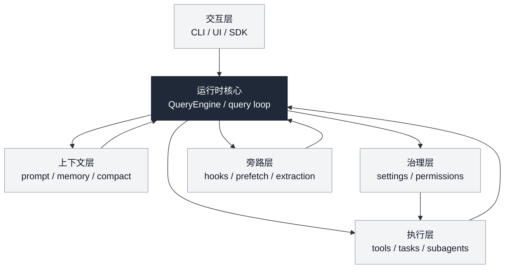

## 本章目标

前面的章节已经分别拆过 Claude Code 的很多局部系统：

- entrypoints 与 startup
- commands 与 tools
- QueryEngine 与 query loop
- UI / interaction
- integrations / extensibility
- state / config / permissions
- skills
- hooks / side-channels
- memory
- recovery
- message/context assembly
- tool system
- streaming / SDK boundary
- compact / context collapse
- tasks / background execution
- subagents / isolation

但这些章节越写越多之后，一个问题会越来越明显：

- 单章都很强
- 局部判断也越来越稳
- 但如果没有一张足够清晰的总图，读者很容易“每章都懂，整体不成形”

所以这一章的目标不是补充新的局部事实，而是把前面已经建立起来的判断**重新装配成一张总体架构图**，回答四个问题：

1. Claude Code 整体上可以拆成哪些 plane / layer？
2. 每一层分别负责什么，不负责什么？
3. 主要源码文件大致落在哪些层？
4. 前面各章各自研究的，其实是这张大图里的哪一块？

本章的重点不是“重讲所有章节”，而是给这套研究建立一个后续可以持续引用的统一母框架。

---

## 一、先给出总体判断

如果只基于当前源码链路与前面章节结论做判断，我会把 Claude Code 的总体架构概括成：

> 一套围绕用户交互、query runtime、执行能力、上下文管理、治理控制以及 side-channel 机制共同组织起来的 agent runtime；它不是单一主循环包打天下，而是多个 plane 在清晰边界下协同工作的分层系统。

如果再压缩成最核心的架构图，可以拆成六个 plane：

1. **Interaction Plane**
2. **Runtime Core**
3. **Execution Plane**
4. **Context Plane**
5. **Governance Plane**
6. **Side-Channel Plane**

这六层不是“从上到下调用一次就结束”的传统请求栈，而更像：

- 主循环负责推进
- 上下文层负责喂给模型什么
- 执行层负责 agent 真正能做什么
- 治理层负责哪些能力可以用、怎么受控
- side-channel 层负责在主路径之外并行预取、分析、收尾、提炼
- interaction 层负责把这些运行时行为暴露给用户和外部集成

因此 Claude Code 最稳妥的总体定位不是“一个聊天程序带几个工具”，而是：

- **一个分层明确的 agent runtime / harness**

---

## 二、先给出总图

可以先用一个文字化总图来固定整体感：

这张图里最重要的不是层数，而是两个原则：

1. **Claude Code 的主路径并不等于全部系统**
2. **很多重要能力刻意不塞进主循环，而是挂在相邻 plane 上**

这一点决定了它为什么既复杂，又还算可控。

---

## 三、Interaction Plane：用户与外部系统真正接触到的面

## 1. 这一层负责什么

Interaction Plane 负责的是：

- 用户如何发起请求
- CLI / UI 如何呈现状态
- SDK / protocol 如何消费运行时输出
- 对外可见事件如何被组织

它的职责包括：

- 输入入口
- 输出呈现
- 协议边界
- 用户交互桥接

换句话说，它不负责“系统内部怎么推理”，而负责：

- **系统如何被看到、被使用、被集成**

## 2. 主要对应什么内容

这一层对应前面研究中的几类内容：

- 第 01 章：entrypoints and startup
- 第 04 章：UI and interaction
- 第 23 章：streaming output / event protocol / SDK boundary

如果看关键角色，这一层里最重要的不是某一个单独文件，而是几个边界事实：

- 用户并不直接面对 `query.ts`
- 外部 SDK 看到的是 protocol stream，不是内部 message history
- `system/init` 属于对外交互协议，不属于模型上下文本身

## 3. 这一层不应和什么混淆

Interaction Plane 不应和下面几层混淆：

- 不等于 Runtime Core  
  因为它不负责主状态机推进。
- 不等于 Context Plane  
  因为它不决定模型最终看到什么上下文。
- 不等于 Governance Plane  
  因为它不做权限裁决。

所以这一层更像：

- **agent runtime 的皮肤、接口与外部边界**

---

## 四、Runtime Core：Claude Code 真正的推进骨架

## 1. 这一层负责什么

Runtime Core 是 Claude Code 的中心骨架，核心职责是：

- 接住一次用户 turn
- 组装 query 入口
- 推进 assistant -> tool -> tool_result 的循环
- 判断 continue / stop / follow-up
- 在合适时机接入旁路机制
- 把内部状态推进成可对外投影的结果

这一层最核心的结构前面已经多次出现：

- `QueryEngine`
- `query()`
- `query loop`
- message state machine

## 2. 主要文件

从前面几章已经能稳定确定，这一层的核心文件包括：

- `src/QueryEngine.ts`
- `src/query.ts`

如果再细一点，配套文件还包括：

- `src/utils/messages.ts`
- `src/utils/api.ts`
- `src/utils/messages/systemInit.ts`

但严格说，后面这几个更接近 Context / Interaction 边界层；真正的 core 仍然是：

- QueryEngine
- query loop

## 3. 这一层为什么是“核心”，但不是“全部”

Claude Code 最值得注意的一点，就是它并没有把一切都塞进 Runtime Core。

Runtime Core 当然是骨架，但：

- memory retrieval 不完全属于它
- permission source merge 不完全属于它
- stop-hook 内很多行为也不是它本体
- tasks / cron / subagents 更不是它的一部分

因此它是：

- **状态推进中心**
- 但不是所有能力的总仓库

这和很多“一个巨型 agent loop 文件包打天下”的实现非常不同。

---

## 五、Execution Plane：Claude Code 真正能做事的地方

## 1. 这一层负责什么

Execution Plane 负责的是：

- 模型可以调用哪些能力
- 这些能力如何被组织、执行、回填
- 当前会话如何推进长时工作
- 如何把部分工作委托给其他执行单元

它包含的不是一种机制，而是一组相关能力面：

- tools
- tool orchestration
- background execution
- tasks
- scheduling
- subagents

## 2. 这一层内部还可以再分

为了避免它看起来过大，可以再分成三个子块：

### a. Tool Execution
- 模型显式调用的受控能力接口
- 第 02、16、22 章

### b. Async Work Infrastructure
- task objects
- background Bash / background agent
- cron / scheduling
- 第 25 章

### c. Delegated Execution
- subagents
- parallel exploration
- worktree isolation
- 第 26 章

这样看会更清楚：Execution Plane 不是只有工具，而是 Claude Code 的整个“行动面”。

## 3. 这一层不应和什么混淆

Execution Plane 很容易被混淆成：

- Runtime Core  
  其实它更多是“能力面”，不是推进骨架。
- Governance Plane  
  它提供能做什么，不负责最后裁决能不能做。
- Side-Channel Plane  
  它更偏主行动面，而不是旁路分析/收尾。

所以更准确地说：

- Runtime Core 决定“现在怎么推进”
- Execution Plane 提供“推进时有哪些行动可调用”

---

## 六、Context Plane：模型真正看到什么，从来不是自然给定的

## 1. 这一层负责什么

Context Plane 负责的是：

- system prompt 怎样形成
- user/system context 怎样注入
- attachments 怎样进入当前 query
- memory 怎样以 prompt 或 attachment 的形式参与
- compact boundary 怎样决定有效历史
- 最终发送给 API 的消息怎样被规范化

这是 Claude Code 中非常关键、但又特别容易被低估的一层。

因为很多人会本能地以为：

- “消息历史就是上下文”

但前面章节已经反复说明，Claude Code 真实情况不是这样。  
真正送进模型的上下文，是一条经过多次变换后的结果。

## 2. 这一层主要由哪些内容组成

这层已经被几章分别拆过：

- 第 17 章：memory system and persistence
- 第 20 章：message and context assembly
- 第 24 章：compact / context collapse / effective history

其核心文件包括：

- `src/utils/messages.ts`
- `src/utils/api.ts`
- `src/utils/attachments.ts`
- memory 相关加载与提取链路
- QueryEngine 中的 system prompt assembly 逻辑

## 3. 这一层为什么必须独立出来

因为它既不是 Runtime Core，也不是 Interaction Plane。

- Runtime Core 解决的是状态推进
- Interaction Plane 解决的是用户/SDK 看到什么
- Context Plane 解决的是模型在这一轮到底看到了什么

这三者完全不是一回事。

Claude Code 成熟的地方就在于，它没有把这三者糊成一个“message system”。

---

## 七、Governance Plane：谁能决定系统能做什么

## 1. 这一层负责什么

Governance Plane 负责的是：

- settings source merge
- config persistence
- trust acceptance
- permission rules
- policy / managed settings
- allow / deny / ask
- mode gating
- 某些高风险能力是否允许被项目局部配置影响

这是 Claude Code 最体现“工程产品”而不仅是“agent demo”的一层。

因为这一层明确回答了：

- 谁能配置系统
- 哪些来源更可信
- 哪些能力受组织控制
- 工具使用如何被裁决

## 2. 这一层的核心内容

前面章节里，这一层主要由：

- 第 06 章：state / config / permissions 总览
- 第 21 章：config / settings / governance boundaries

共同承载。

关键文件包括：

- `src/utils/config.ts`
- `src/utils/settings/settings.ts`
- `src/utils/settings/types.ts`
- `src/utils/settings/constants.ts`
- `src/utils/permissions/permissions.ts`
- `src/hooks/useCanUseTool.tsx`
- `src/bootstrap/state.ts`
- `src/state/AppState.tsx`

## 3. 为什么这一层不能只算“配置系统”

如果把 Governance Plane 理解成普通 config，就会严重低估它。

因为它不只回答：

- 设置值是什么

还回答：

- 哪些设置来源有资格生效
- 哪些项目局部设置不能决定高风险能力
- 权限判断在 runtime 中怎样落地
- trust、managed settings、policy 如何塑造工具面

所以它更接近：

- **控制面**
- 而不是普通的偏好设置层

---

## 八、Side-Channel Plane：Claude Code 最容易被忽略、也最体现成熟度的层

## 1. 这一层负责什么

Side-Channel Plane 负责的是：

- 在主路径旁边并行做有益工作
- 在 sampling 结束后做受限分析
- 在 turn 结束时统一收口
- 在不污染主状态机的前提下做提炼、建议、写回、改进

典型机制包括：

- prefetch
- post-sampling hooks
- stop hooks
- memory extraction
- prompt suggestion
- auto dream
- skill improvement

## 2. 为什么它是独立一层

这是 Claude Code 架构里特别值得强调的一点。

这些能力都和主路径密切相关，但又不该完全塞进 Runtime Core。  
它们的共同特征是：

- 依赖主循环
- 服务主循环
- 但不是主状态转移本身

所以把它们单独视为 Side-Channel Plane 非常合理。

## 3. 对应哪些章节

前面主要对应：

- 第 15 章：hooks and side-channels
- 第 17 章：memory extraction/writeback 的 side-channel 一面
- 第 19 章：部分 recovery / tail behavior
- 第 24 章：与 compact 后收口/恢复边界的关系

## 4. 这一层的架构价值

如果没有这层，Claude Code 会很容易走向两个极端：

- 要么主循环越来越胖
- 要么旁路机制散落成一堆无组织外挂

它现在更接近一种成熟折中：

- 主循环仍是核心
- 旁路机制有清楚挂点
- fail-open / restricted execution / non-blocking 被刻意强调

这就是为什么 Side-Channel Plane 虽然不显眼，却是成熟度很高的一层。

---

## 九、六个 plane 之间是怎样连接的

现在可以把六层之间的关系再串起来。

## 1. Interaction Plane 连接用户与系统
用户输入从这里进入，输出也从这里离开。  
它向下连接 Runtime Core，但不直接决定内部如何推进。

## 2. Runtime Core 负责一次 turn 的主状态推进
它是骨架。  
它会调用 Execution Plane 的能力、吸收 Context Plane 提供的上下文、受 Governance Plane 约束，并在合适阶段接 Side-Channel Plane。

## 3. Execution Plane 提供行动能力
Runtime Core 推进时，会通过这一层真正“做事”：
- 用工具
- 跑后台任务
- 调子代理

## 4. Context Plane 决定模型看到什么
它不是输出面，而是输入面。  
Runtime Core 在提交 query 时依赖它构造有效上下文。

## 5. Governance Plane 约束能力如何被开启
Execution Plane 有能力，不代表当前就能执行。  
Governance Plane 决定：
- 允许什么
- 拒绝什么
- 需要确认什么
- 哪些策略来源优先

## 6. Side-Channel Plane 在主路径旁边提供增益、提炼和收尾
它不接管主循环，但不断在旁边：
- 预取
- 分析
- 收尾
- 提炼
- 写回

可以把这张关系再压缩成一句话：

> Interaction 暴露系统，Runtime Core 推进系统，Execution 让系统能做事，Context 决定模型看见什么，Governance 决定哪些事能做，Side-Channel 在主路径之外持续为系统增益与收口。

---

## 十、主要章节放回这张总图里

为了让前面章节在读者脑中真正归位，可以做一个章节映射表。

| 章节 | 主要归属 Plane | 次级关联 Plane |
|---|---|---|
| 01 EntryPoints and Startup | Interaction Plane | Runtime Core |
| 02 Commands and Tools | Execution Plane | Interaction Plane |
| 03 Query Engine and Execution Loop | Runtime Core | Context Plane |
| 04 UI and Interaction | Interaction Plane | Governance Plane |
| 05 Integrations and Extensibility | Interaction Plane | Execution Plane |
| 06 State, Config, and Permissions | Governance Plane | Runtime Core |
| 07 Build Flags and Product Shaping | Governance Plane | Interaction Plane |
| 13 Agent Loop Deep Dive | Runtime Core | Side-Channel Plane |
| 14 Skills System Deep Dive | Execution Plane | Side-Channel Plane |
| 15 Hooks and Side-Channels | Side-Channel Plane | Runtime Core |
| 16 Tool Orchestration and Concurrency | Execution Plane | Runtime Core |
| 17 Memory System and Persistence | Context Plane | Side-Channel Plane |
| 18 Runtime Cross-Cutting Synthesis | Cross-plane synthesis | - |
| 19 Recovery and Error Handling | Runtime Core | Side-Channel / Context |
| 20 Message and Context Assembly | Context Plane | Runtime Core |
| 21 Config, State, and Governance Boundaries | Governance Plane | Interaction Plane |
| 22 Tool System and Execution Boundaries | Execution Plane | Governance Plane |
| 23 Streaming, Event Protocol, and SDK Boundary | Interaction Plane | Runtime Core |
| 24 Compact, Context Collapse, and Recovery Boundary | Context Plane | Runtime Core |
| 25 Tasks, Scheduling, and Background Execution | Execution Plane | Interaction Plane |
| 26 Subagents, Parallel Exploration, and Isolation | Execution Plane | Context / Governance |

这个表非常重要，因为它提醒读者：

- 这些章节不是并列散点
- 它们其实都在围绕同一张总图的不同面向展开

---

## 十一、主要源码文件放回这张总图里

再做一个文件映射表，会让总图更具操作性。

| Plane | 核心文件/模块 |
|---|---|
| Interaction Plane | `src/QueryEngine.ts`（对外流桥接的一面）、`src/utils/messages/systemInit.ts`、UI/interaction 相关模块 |
| Runtime Core | `src/QueryEngine.ts`, `src/query.ts` |
| Execution Plane | tool 相关模块、任务/后台执行工具、子代理工具、调度工具 |
| Context Plane | `src/utils/messages.ts`, `src/utils/api.ts`, `src/utils/attachments.ts`, memory 相关模块 |
| Governance Plane | `src/utils/config.ts`, `src/utils/settings/settings.ts`, `src/utils/settings/types.ts`, `src/utils/settings/constants.ts`, `src/utils/permissions/permissions.ts`, `src/bootstrap/state.ts`, `src/state/AppState.tsx`, `src/hooks/useCanUseTool.tsx` |
| Side-Channel Plane | hooks 相关模块、memory extraction 相关模块、post-sampling / stop-hook 相关实现 |

这里有一个需要特别强调的点：

- 同一个文件可能跨多个 plane  
  例如 `src/QueryEngine.ts` 既属于 Runtime Core，也沾到 Interaction / Context 边界。

所以这张总图不是说“每个文件只能归一个盒子”，而是说：

- **每个 plane 有自己的主职责重心**
- 文件只是围绕这些重心分布

---

## 十二、这张总图最重要的三个结论

## 1. Claude Code 不是“一个 loop + 一堆工具”
很多表面分析会把 Claude Code 理解成：

- 一个会话循环
- 外加若干工具调用

但从这张图看，更稳妥的理解是：

- loop 只是骨架
- tools 只是执行面的一部分
- 真正把系统做成熟的是 context/governance/side-channel 这些层

## 2. Claude Code 的成熟度，很大程度来自“边界被刻意分开”
它没有把：

- config 和 state 混掉
- tools 和 hooks 混掉
- memory 和 compact 混掉
- model context 和 SDK protocol 混掉
- 主路径和旁路机制混掉

这正是它比很多 demo 型 agent 更成熟的原因。

## 3. 这套系统更像长期协作 runtime，而不只是一次 prompt executor
一旦把 tasks、subagents、memory、governance、compact、SDK 协议一起看，Claude Code 的产品目标就很清楚：

- 它不是只想“回答一次问题”
- 而是想成为一个可持续协作、可扩展、可治理、可恢复的 agent runtime

---

## 十三、Harness 视角

从 harness engineering 的角度看，这张总图最值得学的地方有四个。

## 1. 把主状态机和其他 plane 分开
主循环必须清楚，但又不能承担全部系统责任。Claude Code 明显在努力控制这一点。

## 2. 把输入面、输出面和执行面分开
- Context Plane 决定模型看到什么
- Interaction Plane 决定外部看到什么
- Execution Plane 决定系统能做什么

很多系统会把这三件事混在一起，Claude Code 相对分得更清楚。

## 3. 把治理面做成独立控制层
settings、permissions、trust、policy 被当作一等架构对象，而不是“后面补点安全逻辑”。

## 4. 为 side-channel 预留正式位置
这非常重要。  
prefetch、post-sampling、stop-hook、extraction 这些能力不是临时外挂，而是被看作正式 runtime 架构的一部分。

---

## 十四、工程化启发

## 1. 做 agent runtime 时，先画 plane，再谈模块
与其一开始按文件组织，不如先问：

- 交互面是什么
- 核心推进面是什么
- 执行面是什么
- 上下面文面是什么
- 治理面是什么
- 旁路面是什么

Claude Code 最值得借鉴的就是这种“先分面，再分模块”的思路。

## 2. 不要把“上下文”“协议”“状态”“权限”都揉成一个系统
它们相关，但不相同。  
Claude Code 当前最大的长处之一就是承认这些层必须分开。

## 3. 长期协作型 agent 一定需要主路径之外的正式机制
memory、compact、tasks、subagents、hooks，这些都在说明：

- 长期协作不是单轮 query loop 自己就能解决的

## 4. 成熟 agent runtime 的关键不是功能多，而是边界清楚
Claude Code 当前最值得学的，不是它有多少功能，而是：

- 每种功能被放在什么层
- 它和其他层如何连接
- 它为什么不该被混成别的东西

---

## 本章小结

如果把这一章压缩成一句话，可以说：

> Claude Code 的总体架构可以稳定地理解成六个协同 plane：Interaction 负责输入输出与外部边界，Runtime Core 负责主状态机推进，Execution 负责行动能力，Context 负责模型上下文构造，Governance 负责能力治理与权限控制，Side-Channel 负责主路径之外的预取、分析、收尾与提炼；这六层共同组成了一套成熟的 agent runtime / harness。

从这张总图能稳妥得出的结论包括：

- Claude Code 的核心不只是一个 query loop，而是一组边界清楚的协同 plane；
- QueryEngine / query 是骨架，但不是全部；
- tool、memory、compact、tasks、subagents、permissions、SDK protocol 各自属于不同 plane；
- Side-Channel Plane 是理解 Claude Code 成熟度的关键；
- 这套系统的真正价值，在于把长期协作、治理控制、上下文管理与主状态机推进组织成了可持续演化的 runtime 结构。

## 源码证据索引

- `src/QueryEngine.ts` — Runtime Core 的 turn 入口、system prompt 装配、SDK 流桥接
- `src/query.ts` — 主 query loop、tool/result 推进、prefetch、stop hooks、continue/stop 判定
- `src/utils/messages.ts` — message normalization、compact boundary、有效历史投影
- `src/utils/api.ts` — system/user context 注入边界
- `src/utils/attachments.ts` — attachments、relevant memory prefetch、skill discovery attachments
- `src/utils/config.ts` — durable config / project config / trust 记录
- `src/utils/settings/settings.ts` — settings source merge、policy/managed settings 处理
- `src/utils/permissions/permissions.ts` — permission execution pipeline
- `src/bootstrap/state.ts` — session-scoped runtime substrate
- `src/state/AppState.tsx` — UI/reactive app state
- `src/hooks/useCanUseTool.tsx` — permission pipeline 的 UI bridge
- hooks / extraction 相关模块 — Side-Channel Plane 的主要挂接点

## 相关章节

- [第 03 章：QueryEngine 与执行循环总览](/claude-code-architecture/03-query-engine-and-execution-loop/)
- [第 06 章：state / config / permissions 总览](/claude-code-architecture/06-state-config-and-permissions/)
- [第 13 章：agent loop 深挖](/claude-code-architecture/13-agent-loop-deep-dive/)
- [第 15 章：hooks 与 side-channels](/claude-code-architecture/15-hooks-and-side-channels-deep-dive/)
- [第 17 章：memory system](/claude-code-architecture/17-memory-system-and-persistence/)
- [第 20 章：message/context assembly](/claude-code-architecture/20-message-and-context-assembly-deep-dive/)
- [第 21 章：config/state/governance 边界](/claude-code-architecture/21-config-state-and-governance-boundaries/)
- [第 22 章：tool system 与执行边界](/claude-code-architecture/22-tool-system-and-execution-boundaries/)
- [第 23 章：streaming / protocol / SDK boundary](/claude-code-architecture/23-streaming-output-event-protocol-and-sdk-boundary/)
- [第 24 章：compact / context collapse / recovery boundary](/claude-code-architecture/24-compact-context-collapse-and-recovery-boundary/)
- [第 25 章：tasks / scheduling / background execution](/claude-code-architecture/25-tasks-scheduling-and-background-execution/)
- [第 26 章：subagents / parallel exploration / isolation](/claude-code-architecture/26-subagents-parallel-exploration-and-isolation/)



